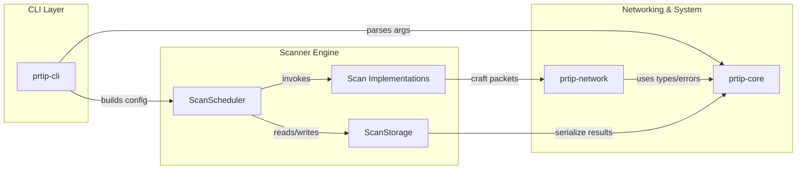
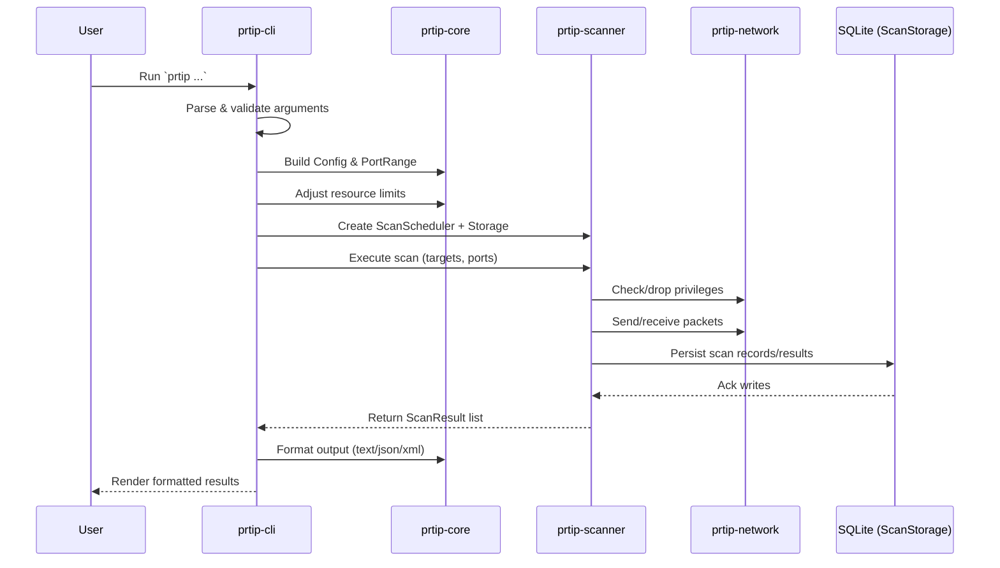
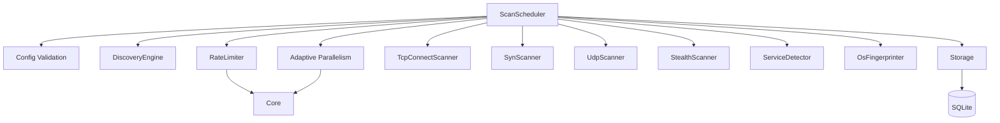
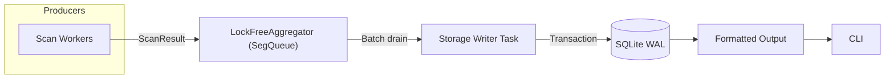
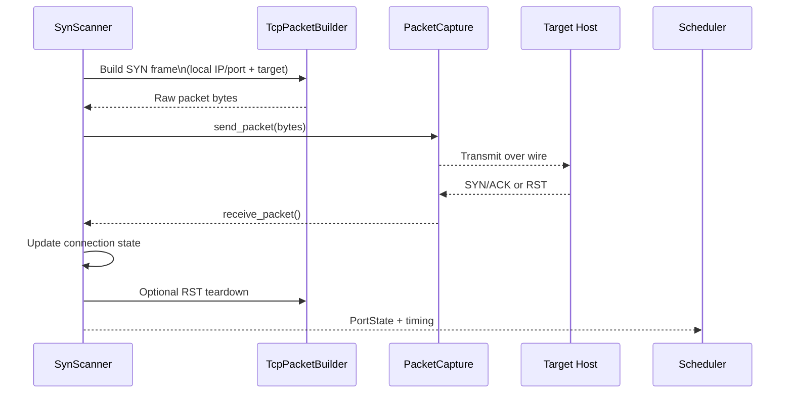

# ProRT-IP Architecture Diagrams

This document captures high-level relationships and runtime flows inside the ProRT-IP WarScan workspace. All diagrams use Mermaid syntax so they can be previewed in compatible renderers.

## Workspace Module Relationships

## CLI Execution Flow

## Scan Scheduler Orchestration

## Result Aggregation Pipeline

## Packet Lifecycle (SYN Scan Path)

