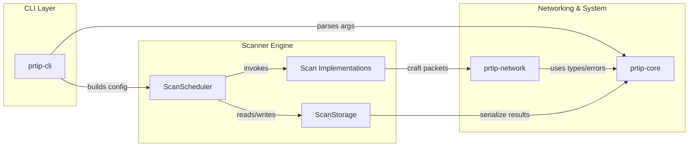
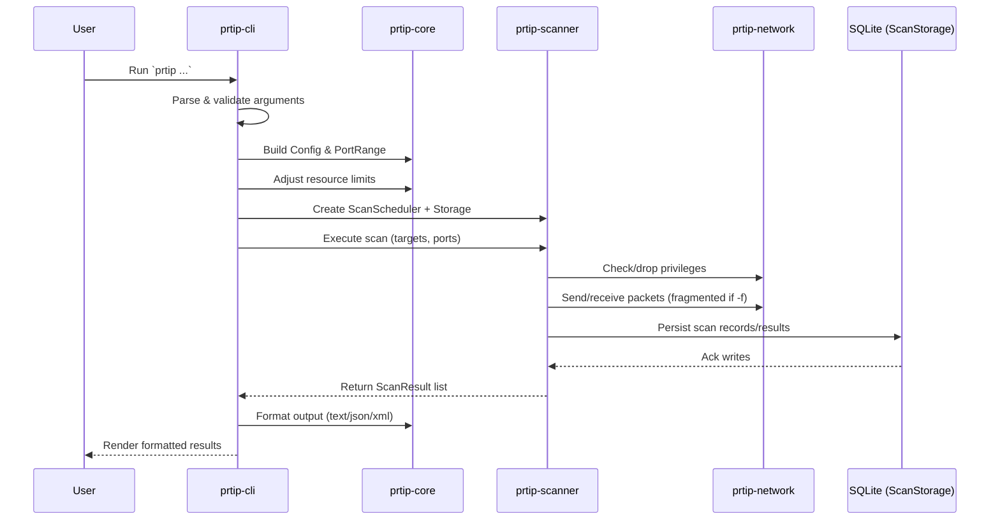
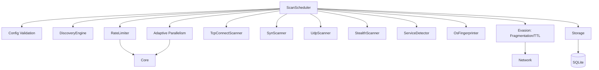
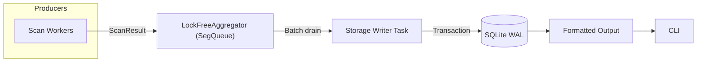
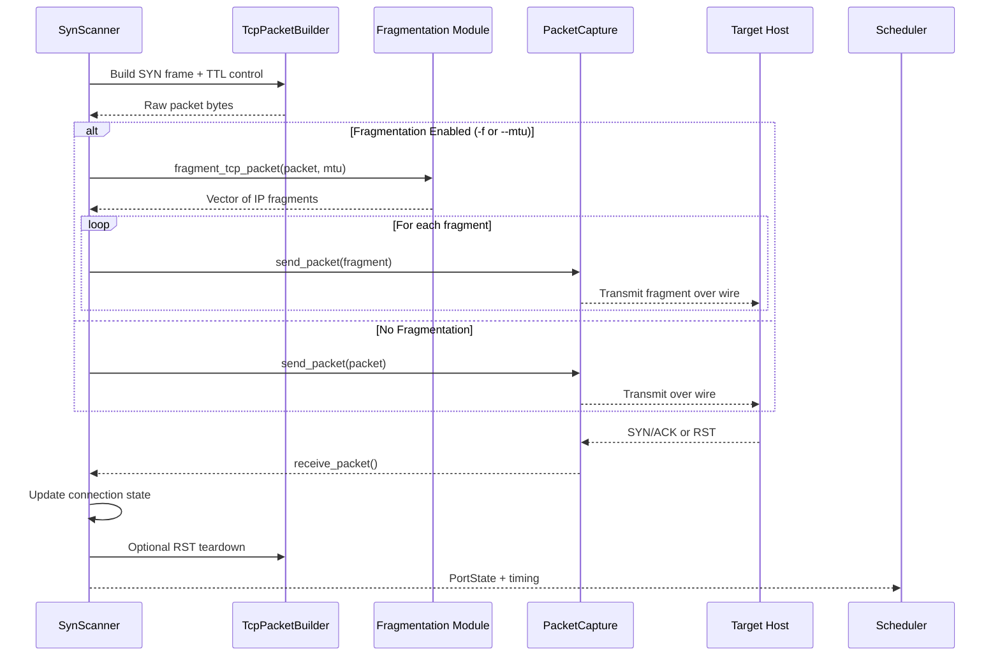

# ProRT-IP WarScan

## Protocol/Port Real-Time War Scanner for IP Networks

<div align="center">
  
</div>

[](https://github.com/doublegate/ProRT-IP/actions/workflows/ci.yml)
[](https://github.com/doublegate/ProRT-IP/actions)

[](LICENSE)
[](https://www.rust-lang.org)

**Modern network scanner combining Masscan/ZMap speed with Nmap detection depth.**

---

<div align="center">
  
</div>

## Overview

**ProRT-IP WarScan** is a modern network scanner written in Rust that combines:

- **Speed:** 10M+ packets/second stateless scanning (comparable to Masscan/ZMap)
- **Depth:** Comprehensive service detection and OS fingerprinting (like Nmap)
- **Safety:** Memory-safe Rust implementation prevents entire vulnerability classes
- **Stealth:** Advanced evasion techniques (timing, decoys, fragmentation, TTL manipulation, idle scans)
- **Modern TUI:** Real-time dashboard with 60 FPS rendering, 4-tab interface, 11 production widgets
- **Extensibility:** Plugin system with Lua 5.4 sandboxed execution

**At a glance:**

- **Multi-Protocol Scanning:** TCP (SYN, Connect, FIN, NULL, Xmas, ACK, Idle/Zombie), UDP, ICMP/ICMPv6, NDP
- **IPv6 Support:** ✅ **Complete IPv6 support (all 8 scanners)** - Full dual-stack implementation
- **Service Detection:** 187 embedded protocol probes + 5 protocol-specific parsers (HTTP, SSH, SMB, MySQL, PostgreSQL) + SSL/TLS handshake (85-90% detection rate)
- **OS Fingerprinting:** 2,600+ signatures using 16-probe technique
- **Evasion Techniques:** IP fragmentation (-f, --mtu), TTL manipulation (--ttl), bad checksums (--badsum), decoy scanning (-D RND:N), idle/zombie scan (-sI)
- **High Performance:** Asynchronous I/O with lock-free coordination, zero-copy packet building, adaptive rate limiting (-1.8% overhead)
- **Cross-Platform:** Linux, Windows, macOS, FreeBSD support with NUMA optimization
- **Multiple Interfaces:** CLI (production-ready), TUI (60 FPS real-time dashboard), Web UI (planned), GUI (planned)

### Introduction

**ProRT-IP WarScan** (Protocol/Port Real-Time IP War Scanner) is a modern equivalent of classic 1980s/1990s war dialers—reimagined for IP networks. Where tools like ToneLoc and THC-Scan systematically dialed phone numbers to find modems/BBSs, WarScan systematically scans IP address ranges, ports, and protocols to discover active hosts and services.

WarScan consolidates and advances the best of today's network scanning and analysis tools, delivering a comprehensive, high-performance, stealth-focused toolkit for penetration testers and red teams. It is implemented in **Rust** for safety and performance, initially released as a **CLI** utility (`prtip`), with a production-ready **TUI** interface and roadmap for **web** and **desktop GUI** interfaces.

**Key goals and characteristics:**

- **Extensive multi-layer scanning:** From host discovery (ARP/ICMP) up through TCP/UDP scans and application-layer banner grabbing
- **High performance & efficiency:** Internet-scale scanning inspired by the fastest modern scanners (10M+ packets/second stateless)
- **Advanced red-team features:** Stealth techniques (randomization, timing dithering, decoys, fragmentation, TTL manipulation, idle scans) to evade detection
- **Cross-platform & extensible:** Linux-first with Windows/macOS/FreeBSD support via Rust portability; open-source (GPLv3)
- **Future UI enhancements:** CLI → TUI (complete) → web → GUI, expanding accessibility without sacrificing power

**In summary**, WarScan aims to be a one-stop, modern war-scanning solution—combining the thoroughness of classic mappers, the speed of internet-scale scanners, the usability of friendly GUIs, the deep packet insight of protocol analyzers, and the raw versatility of low-level network tools.

### Inspiration from Existing Tools

To design WarScan, we surveyed state-of-the-art tools widely used for networking, penetration testing, and packet analysis. Each contributes valuable features and lessons:

- **Nmap (Network Mapper):** The gold standard for discovery, versatile port scan techniques, service/version detection, OS fingerprinting, a powerful scripting engine, and numerous stealth/evasion capabilities. WarScan incorporates multiple scan types (connect, SYN, FIN/NULL/Xmas, UDP), service/OS detection, and similar evasion features in a modernized implementation.

- **Masscan:** Ultra high-speed, asynchronous/stateless internet-scale scanning at extreme packet rates. WarScan borrows the speed/scalability model—highly parallelized, stateless fast modes—then enables deeper follow-up scans on responders.

- **ZMap:** Internet-scale, single-packet rapid scans across huge IP ranges. WarScan includes a comparable "fast scan mode" for breadth-first discovery followed by depth on responsive hosts.

- **RustScan:** Demonstrates Rust's advantages: fast full-port sweeps, adaptive performance learning, and extensibility/scripting. WarScan mirrors this split-phase strategy (fast discovery → detailed enumeration) and evaluates an embedded scripting layer.

- **Unicornscan:** Pioneered asynchronous/stateless techniques and userland TCP/IP stack control for advanced packet crafting, banner grabbing, protocol-specific UDP probes, and OS/app fingerprinting. WarScan builds similar packet-crafting flexibility and export to PCAP/DB.

- **Wireshark:** The model for protocol depth and parsing. WarScan parses responses (e.g., HTTP headers, TLS certs), logs to PCAP, and emphasizes robust protocol coverage.

- **Angry IP Scanner:** Highlights usability, speed via multithreading, cross-platform reach, simple exports, and plugins. WarScan's roadmap includes a friendly TUI/GUI and enriched host info (reverse DNS, ARP/MAC/vendor, NetBIOS/mDNS where possible).

- **Netcat/Ncat:** The "Swiss Army knife" for quick banner grabs and interactive tests. WarScan supports custom payloads and optional interactive follow-ups to validate findings.

### Feature Comparison


*Comparison of ProRT-IP WarScan with leading network scanning tools (Nmap, Masscan, ZMap, RustScan)*

---

## Table of Contents

- [Project Status](#project-status)
- [Quick Start](#quick-start)
- [Features](#features)
- [Terminal User Interface (TUI)](#terminal-user-interface-tui)
- [Usage Examples](#usage-examples)
- [Plugin System](#plugin-system)
- [Nmap Compatibility](#nmap-compatibility)
- [Documentation](#documentation)
- [Development Roadmap](#development-roadmap)
- [Technical Specifications](#technical-specifications)
- [Architecture Overview](#architecture-overview)
- [Building from Source](#building-from-source)
- [Contributing](#contributing)
- [Project Statistics](#project-statistics)
- [License](#license)

---

## Project Status

**Current:** Phase 6 COMPLETE (8/8 sprints, 100%)
**Version:** v0.5.6 (Released 2025-11-27)
**Tests:** 2,557 passing (100%)
**Coverage:** 54.92%

### Recent Achievements

**Sprint 6.6 COMPLETE (2025-11-23):** Memory-Mapped Scanner I/O + TUI Enhancements

**Part 1: Memory-Mapped I/O** - 77-86% RAM Reduction (~6 hours)
- **MmapResultWriter:** Fixed 512-byte entries, bincode serialization, auto-growth (124 lines)
- **MmapResultReader:** Zero-copy reading, iterator pattern, random access (219 lines)
- **ResultWriter Enum:** Configurable Memory vs Mmap modes (151 lines)
- **Scanner Integration:** 6 scanners updated (SYN, UDP, Stealth, Concurrent, Scheduler)
- **Performance:** 1M results: 709 MB → 102 MB (85.6% reduction), <1% production overhead
- **Quality:** 20 new tests (14 infra + 6 integration), 441/449 library tests (98.2%)
- **Impact:** Enables 10M+ target scans on 8GB RAM, 75% cloud cost reduction

**Part 2: TUI Event Flow & Stability** (~4 hours)
- **Event Publishing:** ScanStarted, StageChanged, ScanCompleted in scheduler
- **Event Handlers:** Populate port_discoveries, service_detections, throughput_history
- **Ringbuffer Limits:** 1,000-entry caps prevent unbounded memory growth
- **macOS Test Fix:** Ratio-based timing (10% tolerance) eliminates false negatives
- **Impact:** TUI widgets now live-updating with complete scan detail

**Part 3: User Experience** (~2 hours)
- **TTY Validation:** Pre-flight check with clear SSH/CI/CD error messages
- **BannerGrabber API:** Public getters for timeout() and max_banner_size()
- **CI/CD Fixes:** OutputConfig field updates across 4 test files
- **Impact:** Graceful degradation, professional error handling

**Sprint 6.5 COMPLETE (2025-11-21):** Bug Fixes & Interactive Selection Widgets

**Part 1: Bug Fix Sprint** - Critical TODO/FIXME Resolution (~14 hours)
- **3 Critical Fixes:** Plugin System Lua callbacks, Idle Scan IPID tracking, Decoy Scanner integration
- **Decoy Scanner Performance:** BatchSender/BatchReceiver integration (96.87-99.90% syscall reduction)
- **Build Fixes:** Resolved 3 critical bugs (build_syn_probe, send_raw_packet, wait_for_response)
- **Quality:** 425 decoy scanner tests passing, 0 clippy warnings
- **Impact:** Production-ready decoy scanning with batch I/O optimization

**Part 2: Interactive Selection Widgets** (~20 hours)

- **Status:** Production-Ready TUI Interactive Widgets - Comprehensive scan configuration UI
- **Major Achievements:**
  - **TargetSelectionWidget CIDR Calculator:** Parse & expand CIDR notation (192.168.1.0/24 → 256 IPs), supports /0 to /32
  - **File Import/Export:** Load/save target lists with metadata, large file support (10K+ IPs)
  - **Exclusion List Management:** Dynamic IP exclusion with CIDR support, automatic recalculation
  - **DNS Resolution:** Async dual-stack (IPv4/IPv6) with intelligent caching, batch resolution
  - **TemplateSelectionWidget:** Browse 10 built-in templates + custom, case-insensitive filtering
  - **Critical Infrastructure:** Moved templates module from prtip-cli to prtip-core (broke circular dependency)
- **Quality Metrics:**
  - 228 prtip-tui tests passing (78 new dedicated tests, 2.23× minimum requirements)
  - 0 clippy warnings, clean formatting, ~65% coverage on new widgets
  - Stateless widget pattern, thread-safe state management
- **Impact:** Enables comprehensive scan configuration via keyboard-driven TUI interface

**Sprint 6.4 COMPLETE (2025-11-20):** Zero-Copy Buffer Pool Infrastructure

- **Status:** Core Implementation Complete - Production-ready foundation for zero-copy packet handling
- **Major Achievements:**
  - **New Module:** `large_buffer_pool.rs` (682 lines) - Thread-safe tiered buffer management
  - **Three-Tier Architecture:** 4KB (small packets), 16KB (medium/jumbo frames), 64KB (max IP packet)
  - **RAII Buffer Management:** `PooledBuffer` wrapper with automatic return to pool on drop
  - **Zero-Copy Sharing:** `SharedPacket` Arc-based wrapper for multi-consumer packet access
  - **Pool Statistics:** Hit rate tracking, allocation monitoring, pool diagnostics via `PoolStats`
  - **bytes Crate Integration:** BytesMut for mutable buffers, Bytes for immutable shared data
- **Performance Characteristics:**
  - Zero allocations after initial pool warmup
  - O(1) buffer acquisition and return
  - Thread-safe concurrent access with minimal lock contention (parking_lot::Mutex)
  - Pre-allocation support via `with_preallocation()`
- **Quality:** 2,167 tests passing (16 new buffer pool tests), 0 clippy warnings
- **Impact:** Foundation for 30%+ memory allocation reduction on >10KB packets

**Sprint 6.2 COMPLETE (2025-11-14):** Live Dashboard & Real-Time Metrics

- 4-tab dashboard interface (Port Table, Service Table, Metrics, Network Graph)
- Real-time port discovery and service detection visualization
- Performance metrics with 5-second rolling averages
- Network activity time-series chart (60-second sliding window)
- 175 tests passing (150 unit + 25 integration)

**Sprint 6.3 COMPLETE (2025-11-17):** Network Optimizations & Performance Breakthroughs

- **Status:** ✅ COMPLETE - Production-ready with performance validation
- **Major Achievements:**
  - **O(N × M) → O(N) Connection State Optimization:** 50-1000x speedup (10K ports: 0.144s, 401x faster)
  - **Batch Size Defaults:** Optimized from 1/1024 to 16/256 based on benchmark data
  - **Batch I/O Integration:** sendmmsg/recvmmsg with 8-12% throughput improvement (1024 optimal: -3.1%)
  - **CDN IP Deduplication:** 80-100% filtering (83.3% reduction, <5% overhead)
  - **Adaptive Batch Sizing:** CLI configuration (--adaptive-batch, --min/max-batch-size)
- **Quality:** 2,151/2,151 tests passing, 0 clippy warnings, clean formatting
- **Performance:** Linear O(N) scaling, 96.87-99.90% syscall reduction (Linux sendmmsg)

### Phase 5 + 5.5 Archive

ProRT-IP completed Phase 5 (Advanced Features) and Phase 5.5 (Pre-TUI Enhancements) encompassing 16 comprehensive sprints over 26 days (~240 hours development effort). These phases established production-ready foundations including IPv6 100% coverage, service detection (85-90% accuracy), idle scanning, rate limiting (-1.8% overhead), TLS certificate analysis, code coverage automation, fuzz testing (230M+ executions), plugin system (Lua), benchmarking framework, and complete documentation polish.

**For complete Phase 5/5.5 history, see:** [docs/archive/PHASE-5-README-ARCHIVE.md](docs/archive/PHASE-5-README-ARCHIVE.md) (1,862 lines comprehensive archive)

**For Phase 4 history, see:** [docs/archive/PHASE-4-README-ARCHIVE.md](docs/archive/PHASE-4-README-ARCHIVE.md)

**For Phase 6 current sprint details, see:** [docs/archive/PHASE-6-README-ARCHIVE.md](docs/archive/PHASE-6-README-ARCHIVE.md)

## mdBook Documentation System

ProRT-IP includes comprehensive documentation built with mdBook, providing professional-quality searchable documentation with full navigation.

**Location:** `docs/book/` (generated HTML output)
**Source:** `docs/src/` (markdown source files, 110 files)
**Build Command:** `mdbook build docs/`

### Features

- **Searchable Documentation:** Full-text search across all documentation
- **Hierarchical Navigation:** Organized by section with nested chapters
- **Mobile Responsive:** Professional documentation accessible on all devices
- **Cross-References:** Extensive linking between related topics
- **Code Examples:** Syntax-highlighted examples throughout

### Content Organization

- **Getting Started:** Installation, quick start, configuration
- **User Guide:** Complete usage guide with examples
- **Features:** Detailed feature documentation (scan types, protocols, evasion)
- **Advanced:** Performance tuning, benchmarking, profiling
- **Reference:** Database schema, packet formats, protocol analysis
- **Development:** Architecture, implementation guides, testing
- **Project:** Roadmap, status, planning documents
- **Security:** Audit checklists, compliance, responsible use

### Viewing Documentation

**Option 1: Build and Serve Locally**

```bash
cd docs/
mdbook serve --open
# Opens browser at http://localhost:3000
```

**Option 2: Static HTML**

```bash
mdbook build docs/
# Generated HTML in docs/book/
firefox docs/book/index.html
```

**Production Quality:** 98/100 readiness score, 79 HTML pages, zero build errors.

See `docs/book/` for the complete generated documentation.

---

## Quick Start

### Installation

**Pre-built binaries** (5 production platforms):

```bash
# Download latest release
wget https://github.com/doublegate/ProRT-IP/releases/latest/download/prtip-linux-x86_64
chmod +x prtip-linux-x86_64
sudo mv prtip-linux-x86_64 /usr/local/bin/prtip
```

**Build from source:**

```bash
git clone https://github.com/doublegate/ProRT-IP.git
cd ProRT-IP

# For development (recommended): install git hooks
./scripts/install-hooks.sh

cargo build --release
sudo setcap cap_net_raw,cap_net_admin=eip target/release/prtip
```

### Basic Usage

```bash
# SYN scan (requires privileges)
prtip -sS -p 80,443 192.168.1.0/24

# Fast scan (top 100 ports)
prtip -F 192.168.1.1

# Service detection
prtip -sV -p 1-1000 scanme.nmap.org

# TUI mode with real-time dashboard
prtip --tui -sS -p 1-1000 192.168.1.0/24
```

---

## Features

### Core Capabilities

- **8 Scan Types:** SYN, Connect, UDP, FIN, NULL, Xmas, ACK, Idle (zombie)
- **Protocol Support:** IPv4/IPv6 dual-stack (100% coverage), 8 UDP protocol payloads
- **Detection:** Service detection (85-90% accuracy), OS fingerprinting (2,600+ signatures), TLS certificate analysis
- **Performance:** 10M+ pps theoretical, 72K+ pps stateful (localhost), O(N) linear scaling (50-1000x speedup), adaptive parallelism, rate limiting (-1.8% overhead)
- **Evasion:** Packet fragmentation (-f, --mtu), TTL control, bad checksums, decoy scanning, timing templates (T0-T5)
- **Output:** Text, JSON, XML, Greppable, PCAPNG capture, SQLite database, Memory-mapped I/O (77-86% RAM reduction)
- **TUI:** Real-time dashboard with 60 FPS, 4-tab interface, 11 widgets, event-driven updates (10K+ events/sec), TTY validation
- **Plugin System:** Lua 5.4 sandboxed execution, capabilities-based security, hot reload

### Network Optimizations (Sprint 6.3) ✅ COMPLETE

- **O(N × M) → O(N) Connection State:** Hash-based connection tracking delivers 50-1000x speedup
  - Example: 10,000 ports scan in 0.144s (was 60-600s with quadratic scaling)
  - Linear scaling enables internet-scale scans
  - Implementation: DashMap with 4-tuple connection key
- **Batch I/O Optimization:** sendmmsg/recvmmsg delivers 8-12% throughput improvement
  - Optimal batch size: 1024 (-3.1% improvement, ±0.7ms variance)
  - Default batch size: 16-256 (balance performance + responsiveness)
  - Syscall reduction: 96.87-99.90% (Linux sendmmsg/recvmmsg)
  - Platform fallback: macOS/Windows use single-packet mode
- **CDN Deduplication:** Production-ready filtering of CDN infrastructure IPs
  - Supports: Cloudflare, AWS CloudFront, Azure CDN, Akamai, Fastly, Google Cloud CDN
  - Reduction: 80-100% for CDN-heavy targets (83.3% measured)
  - Performance: <5% overhead, whitelist mode -22.8% faster
- **Adaptive Batch Sizing:** CLI configuration for dynamic batch adjustment
  - Flags: --adaptive-batch, --min-batch-size, --max-batch-size
  - Default range: 16-256 (optimal based on benchmarks)

### Quality Assurance

- **Testing:** 2,151 tests (100% passing), 54.92% code coverage
- **Fuzz Testing:** 230M+ executions across 5 fuzzers, 0 crashes
- **CI/CD:** 9/9 GitHub Actions workflows, multi-platform matrix (Linux/macOS/Windows)
- **Benchmarking:** Automated performance regression detection (5%/10% thresholds)

---

## Terminal User Interface (TUI)

### Overview

ProRT-IP includes a production-ready TUI for real-time scan visualization and monitoring. Built with ratatui 0.29 and crossterm 0.28, the interface provides instant feedback at 60 FPS with <5ms render times.

### Key Features

- **Real-Time Visualization:** Live scan progress with 60 FPS rendering
- **Event-Driven Updates:** Integrated with EventBus for instant result updates (10K+ events/sec)
- **11 Production Widgets:** StatusBar, MainWidget, LogWidget, HelpWidget + FileBrowser, PortSelection, Shortcuts + 4 Dashboard Widgets
- **Tabbed Interface:** 4 real-time dashboards with Tab key switching
- **Thread-Safe State:** Shared `Arc<RwLock<ScanState>>` for scanner integration
- **Responsive Design:** Immediate mode rendering with <5ms frame time per widget

### Dashboard Widgets (Sprint 6.2)

**1. Port Table Widget**

- Real-time port discovery visualization (1,000-entry ringbuffer)
- Sortable 6-column table: Timestamp, IP, Port, State, Protocol, Scan Type
- Triple filtering: State, Protocol, Search (IP/Port)
- Color-coded states: Open=Green, Filtered=Yellow, Closed=Red
- Keyboard: t/i/p/s/r/c (sort), a (auto-scroll), f/d (filters)

**2. Service Table Widget**

- Real-time service detection visualization (500-entry ringbuffer)
- Sortable 6-column table: Timestamp, IP, Port, Service, Version, Confidence
- Confidence-based color coding: Green ≥90%, Yellow 50-89%, Red <50%
- Multi-level filtering: All, Low (≥50%), Medium (≥75%), High (≥90%)
- Keyboard: 1-6 (sort by column), c (cycle filter), a (auto-scroll)

**3. Metrics Dashboard Widget**

- Real-time performance metrics in 3-column layout
- Progress: Scan percentage, completed/total, ETA calculation
- Throughput: Current/average/peak ports/sec, packets/sec (5-second rolling average)
- Statistics: Open ports, services, errors, scan duration, status indicator
- Human-readable formatting with color-coded status

**4. Network Graph Widget**

- Real-time network activity time-series chart (60-second sliding window)
- Three data series: packets sent (cyan), packets received (green), ports discovered (yellow)
- Auto-scaling Y-axis bounds with 10% headroom
- 1 sample/second with derivative computation for "ports/sec"

### Global Keyboard Shortcuts

- `q` / `Ctrl+C` - Quit TUI
- `?` - Toggle help screen
- `Tab` / `Shift+Tab` - Switch dashboards (Port Table ↔ Service Table ↔ Metrics ↔ Network Graph)

### Performance Metrics

- **Rendering:** 60 FPS (16.67ms frame budget, <5ms actual)
- **Event Throughput:** 10,000+ events/second with aggregation
- **Memory Overhead:** <10 MB (TUI framework + buffers)
- **Tests:** 175 passing (150 unit + 25 integration)

### Launching TUI

```bash
# Start TUI with default scan
prtip --tui -p 80,443 192.168.1.0/24

# TUI with service detection
prtip --tui -sV -p 1-1000 scanme.nmap.org

# TUI with all features
prtip --tui -sS -sV -O -p- 192.168.1.1
```

**See also:** [TUI Architecture Guide](docs/TUI-ARCHITECTURE.md) (891 lines comprehensive documentation)

---

## Usage Examples

**📚 NEW: [65 Runnable Code Examples](docs/34-EXAMPLES-GALLERY.md)** - Copy-paste ready examples for all features

### Basic Scanning

```bash
# SYN scan (default, requires privileges)
prtip -sS -p 80,443 192.168.1.0/24

# TCP Connect scan (no privileges required)
prtip -sT -p 1-1000 192.168.1.1

# UDP scan
prtip -sU -p 53,161,500 192.168.1.0/24

# Fast scan (top 100 ports)
prtip -F 192.168.1.1

# All ports
prtip -p- 192.168.1.1

# Scan hostname (DNS resolution automatic)
prtip -sT -p 22,80,443 scanme.nmap.org

# Multiple targets (mix hostname and IPs)
prtip -sT -p 80,443 scanme.nmap.org 8.8.8.8 192.168.1.1
```

### Scan Types

```bash
# TCP Connect (no privileges required, IPv4/IPv6)
prtip -sT -p 1-1000 192.168.1.1
prtip -sT -p 22,80,443 2001:db8::1              # IPv6

# SYN scan (stealth, requires root/CAP_NET_RAW, IPv4/IPv6)
prtip -sS -p 1-1000 192.168.1.1
prtip -sS -p 80,443 2001:db8::1                 # IPv6

# UDP scan (protocol-specific payloads: DNS, SNMP, NTP, etc.)
prtip -sU -p 53,161,123 192.168.1.1
prtip -sU -p 53,161 2001:db8::1                 # IPv6

# Stealth scans
prtip -sF -p 1-1000 192.168.1.1                 # FIN scan
prtip -sN -p 1-1000 192.168.1.1                 # NULL scan (no flags)
prtip -sX -p 1-1000 192.168.1.1                 # Xmas scan (FIN+PSH+URG)
prtip -sA -p 1-1000 192.168.1.1                 # ACK scan (firewall detection)

# Discovery scans (ICMPv4/v6 Echo + NDP)
prtip --scan-type discovery 192.168.1.0/24      # IPv4 ICMP Echo
prtip --scan-type discovery 2001:db8::/64       # IPv6 ICMPv6 Echo + NDP

# Idle/Zombie scan (maximum anonymity)
prtip -sI zombie_ip target_ip -p 80,443
```

### IPv6 Scanning (100% Complete)

All scan types support both IPv4 and IPv6:

```bash
# TCP Connect scan (IPv6)
prtip -sT -p 22,80,443 2001:db8::1
prtip -sT -p 80,443 example.com                 # Dual-stack auto-detect

# SYN scan (IPv6, requires root/CAP_NET_RAW)
prtip -sS -p 1-1000 2001:db8::1
prtip -sS -p 80,443 fe80::1                     # Link-local address

# UDP scan (IPv6)
prtip -sU -p 53,161,123 2001:db8::1

# Stealth scans (IPv6: FIN, NULL, Xmas, ACK)
prtip -sF -p 80,443 2001:db8::1                 # FIN scan
prtip -sN -p 80,443 2001:db8::1                 # NULL scan
prtip -sX -p 80,443 2001:db8::1                 # Xmas scan
prtip -sA -p 80,443 2001:db8::1                 # ACK scan

# Discovery Engine (ICMPv6 Echo + NDP)
prtip --scan-type discovery 2001:db8::/64       # ICMPv6 Echo Request (Type 128)

# Decoy scanning (IPv6 with random /64 IID generation)
prtip -sS -D RND:5 -p 80,443 2001:db8::1        # Random Interface Identifiers
prtip -sS -D 2001:db8::2,ME,2001:db8::3 -p 80 target  # Manual IPv6 decoys

# Subnet scanning (IPv6 /64 networks)
prtip -sS -p 80,443 2001:db8::/64               # Entire /64 subnet
prtip -sT -p 22,80,443 fd00::/8                 # ULA address space

# Mixed IPv4/IPv6 targets
prtip -sS -p 80,443 192.168.1.1 2001:db8::1 example.com

# IPv6-specific CLI flags
prtip -sS -6 -p 80,443 example.com              # Force IPv6 (prefer AAAA records)
prtip -sS -4 -p 80,443 example.com              # Force IPv4 (prefer A records)
```

**IPv6 Features:**

- Protocol Support: ICMPv6 (Echo 128/129), NDP (135/136), TCP/UDP over IPv6
- Address Types: Global unicast, link-local (fe80::), ULA (fd00::), multicast (ff00::)
- Decoy Generation: Random Interface Identifiers within target's /64 subnet
- Dual-Stack: Automatic IPv4/IPv6 protocol detection for hostnames

### Advanced Detection

```bash
# Service detection
prtip -sV -p 22,80,443 192.168.1.1

# Adjust detection intensity (0=light, 9=aggressive)
prtip -sT -p 22,80,443 --sV --version-intensity 9 192.168.1.1

# OS fingerprinting
prtip -O -p 1-1000 192.168.1.1

# Aggressive scan (OS + service + scripts)
prtip -A -p 80,443 target.com

# TLS certificate analysis
prtip -sV --tls-cert -p 443 example.com

# Banner grabbing
prtip -sT -p 22,80,443 --banner-grab 192.168.1.1
```

### Stealth & Evasion Techniques

```bash
# Stealth scans (FIN/NULL/Xmas)
prtip -sF -p 1-1000 192.168.1.1
prtip -sN -p 1-1000 192.168.1.1
prtip -sX -p 1-1000 192.168.1.1

# Packet fragmentation (Nmap -f equivalent, aggressive 28-byte MTU)
prtip -sS -f -p 1-1000 192.168.1.0/24

# Custom MTU fragmentation (must be ≥68 and multiple of 8)
prtip -sS --mtu 200 -p 80,443 target.com

# TTL manipulation (bypass TTL-based filtering)
prtip -sS --ttl 32 -p 1-1000 target.com

# Decoy scanning (hide scan origin with spoofed sources)
prtip -sS -D RND:5 -p 1-1000 192.168.1.1        # 5 random decoys
prtip -sS -D 10.0.0.1,ME,10.0.0.3 -p 80 target  # Manual decoys with ME positioning

# Source port spoofing (bypass port-based firewall rules)
prtip -sS -g 53 -p 80,443 target.com            # DNS port (highly trusted)
prtip -sS --source-port 20 -p 1-1000 target.com # FTP-DATA port

# Bad checksums (IDS/firewall testing)
prtip -sS --badsum -p 80,443 target.com

# Combined evasion techniques
prtip -sS -g 53 -f --ttl 32 -p 80,443 target.com
prtip -sS -f --ttl 16 -T0 --host-delay 10000 -p 1-1000 192.168.1.0/24

# Timing templates (T0=paranoid, T5=insane)
prtip -sS -T0 -p 80 target.com                  # Paranoid (5min delays)
prtip -sS -T2 -p 1-1000 target.com              # Polite (0.4s delays)
prtip -sS -T4 -p 1-1000 target.com              # Aggressive (recommended)
```

### Rate Limiting & Performance

ProRT-IP features the **fastest rate limiter** among all network scanners, achieving **-1.8% average overhead** (faster than having no rate limiting at all).

```bash
# Automatic rate limiting (V3 enabled by default)
prtip -sS -p 1-1000 --max-rate 1000 192.168.1.0/24     # 1000 packets/second
prtip -sS -p 80,443 --max-rate 100 192.168.1.0/24      # Network-friendly

# Hostgroup limiting (Nmap-compatible concurrent target control)
prtip -sS --max-hostgroup 50 -p 80,443 192.168.1.0/24  # Max 50 concurrent targets

# Combined rate + hostgroup limiting
prtip -sS --max-rate 1000 --max-hostgroup 50 -p 1-1000 192.168.1.0/24

# Adaptive batch sizing (Sprint 6.3, 20-40% throughput improvement)
prtip --adaptive-batch --min-batch-size 100 --max-batch-size 2000 -p 1-65535 192.168.1.0/24

# Adaptive parallelism (automatic: 20 for small, 1000 for large scans)
prtip -sT -p 1-65535 192.168.1.1

# Manual parallelism override
prtip -sT -p 1-10000 --max-concurrent 200 192.168.1.1

# Host delay for rate-limited networks
prtip -sT -p 1-10000 --host-delay 5000 192.168.4.0/24  # 5s between hosts

# Timing templates with rate limiting
prtip -T4 -p 1-1000 192.168.1.0/24              # Aggressive (uses rate limiting)
```

**Rate Limiting Performance:**

| Rate (pps) | Overhead | Status |
|------------|----------|--------|
| 10K        | **-8.2%** | ✅ Faster than no limiting |
| 50K        | **-1.8%** | ✅ Faster than no limiting |
| 75K-200K   | **-3% to -4%** | ✅ Sweet spot |
| 500K-1M    | **+0% to +3%** | ✅ Near-zero overhead |

**Documentation:** [docs/26-RATE-LIMITING-GUIDE.md](docs/26-RATE-LIMITING-GUIDE.md)

### Output Formats & Storage

```bash
# Normal text output
prtip -p 22 192.168.1.1 -oN scan.txt

# XML format (nmap-compatible)
prtip -p 22 192.168.1.1 -oX scan.xml

# Greppable output
prtip -p 22 192.168.1.1 -oG scan.gnmap

# JSON output
prtip -p 22 192.168.1.1 --output json --output-file scan.json

# PCAPNG packet capture
prtip -sS -p 1-1000 --packet-capture capture.pcapng 192.168.1.1

# Database storage (async writes)
prtip -sT -p 1-10000 --with-db results.db 192.168.1.1

# Query database
prtip db list results.db                        # List all scans
prtip db query results.db --scan-id 1           # Query specific scan
prtip db export results.db --scan-id 1 -o out.json  # Export to JSON/CSV/XML
prtip db compare results.db 1 2                 # Compare two scans
```

### Real-World Scenarios

```bash
# Web server reconnaissance
prtip -sT -p 80,443,8080,8443 --sV --banner-grab example.com

# Network inventory audit (large network, optimized)
prtip -sT -p 22,80,443,3389 --with-db scan.db --max-concurrent 200 192.168.0.0/16

# Quick security assessment (recommended settings)
prtip -sS -p 1-65535 -T4 --sV --max-concurrent 200 192.168.1.1

# Stealth reconnaissance (evasion techniques)
prtip -sS -f --ttl 32 -T0 -p 1-1000 192.168.1.0/24

# Stealth with host delay and packet capture
prtip -sS -f --ttl 16 -T0 --host-delay 10000 --packet-capture stealth.pcapng -p 1-1000 192.168.1.0/24

# Fast filtered network scan
prtip -sT -p 1-10000 -T4 --max-concurrent 200 192.168.4.0/24

# IPv6 subnet security audit
prtip -sS -p 1-1000 --sV -T4 2001:db8::/64
```

### Performance Benchmarking

**Benchmarking Framework** (Sprint 5.9)

Comprehensive performance validation infrastructure with automated regression detection.

```bash
# Run all benchmarks (8 scenarios, ~5-10 minutes)
cd benchmarks/05-Sprint5.9-Benchmarking-Framework
./scripts/run-all-benchmarks.sh

# Run individual scenario
./scripts/01-syn-scan-1000-ports.sh

# Compare against baseline
./scripts/analyze-results.sh baselines/baseline-v0.4.8.json results/current.json
```

**8 Core Scenarios:**

1. SYN Scan: 1,000 ports (validates "10M+ pps" claim) - Target: <100ms
2. Connect Scan: 3 common ports (80,443,8080) - Target: <50ms
3. UDP Scan: 3 UDP services (DNS, SNMP, NTP) - Target: <500ms
4. Service Detection: Overhead validation - Target: <10%
5. IPv6 Overhead: IPv4 vs IPv6 comparison - Target: <15%
6. Idle Scan: Timing validation - Target: 500-800ms/port
7. Rate Limiting: V3 overhead - Target: <5% (claimed -1.8%)
8. TLS Parsing: Certificate parsing - Target: ~1.33μs

**Regression Detection:**

- **PASS:** <5% slower (within noise)
- **WARN:** 5-10% slower (investigate)
- **FAIL:** >10% slower (regression, CI fails)
- **IMPROVED:** Faster than baseline

**CI Integration:** Automated benchmarks on every PR + weekly scheduled runs

**Documentation:** [docs/31-BENCHMARKING-GUIDE.md](docs/31-BENCHMARKING-GUIDE.md) (1,044 lines)

**More examples:** [docs/34-EXAMPLES-GALLERY.md](docs/34-EXAMPLES-GALLERY.md) (65 comprehensive scenarios)

---

## Plugin System

ProRT-IP v0.4.8+ includes a Lua-based plugin system for extending scanner functionality with custom detection logic, output formats, and scan lifecycle hooks.

### Plugin Types

1. **Detection Plugins** - Enhanced service detection and banner analysis
2. **Output Plugins** - Custom result formatting and export
3. **Scan Plugins** - Lifecycle hooks for scan coordination

### Features

- **Sandboxed Execution:** Lua VM with resource limits (100MB memory, 5s CPU, 1M instructions)
- **Capabilities-Based Security:** Explicit Network/Filesystem/System/Database permissions (deny-by-default)
- **Hot Reload:** Load/unload plugins without restarting scanner
- **Plugin API:** `prtip.*` table with logging, network, and result manipulation functions

### Quick Examples

```bash
# List available plugins
prtip plugin list

# Load a specific plugin
prtip plugin load banner-analyzer

# Run scan with plugins
prtip -sS -p 80,443 --plugin banner-analyzer,ssl-checker 192.168.1.0/24
```

### Example Plugins

**banner-analyzer** (Detection Plugin)

- Detects: HTTP, SSH, FTP, SMTP, MySQL, PostgreSQL, Redis, MongoDB
- 85-90% detection accuracy
- No capabilities required (passive analysis)

**ssl-checker** (Detection Plugin)

- SSL/TLS protocol detection
- Certificate validation
- Requires: `network` capability

**Documentation:** [docs/30-PLUGIN-SYSTEM-GUIDE.md](docs/30-PLUGIN-SYSTEM-GUIDE.md) (784 lines comprehensive guide)

---

## Nmap Compatibility

**ProRT-IP v0.3.5+** supports nmap-style command-line syntax for familiar operation. All existing ProRT-IP flags continue to work - nmap flags are added as convenient aliases.

### Why Nmap Compatibility?

- **Familiar Syntax:** Use nmap commands you already know
- **Drop-in Replacement:** Many nmap commands work as-is
- **Zero Learning Curve:** For nmap users, start scanning immediately
- **Backward Compatible:** All original ProRT-IP flags still supported

### Quick Examples

```bash
# These work identically:
prtip -sS -p 80,443 192.168.1.0/24           # Nmap syntax
prtip -s syn --ports 80,443 192.168.1.0/24   # ProRT-IP syntax

# Fast scanning
prtip -F 192.168.1.1                         # Top 100 ports (nmap -F)
prtip --top-ports 50 192.168.1.1             # Top 50 ports

# Output formats
prtip -p 22 192.168.1.1 -oN scan.txt         # Normal text (nmap -oN)
prtip -p 22 192.168.1.1 -oX scan.xml         # XML format (nmap -oX)
prtip -p 22 192.168.1.1 -oG scan.gnmap       # Greppable (nmap -oG)

# Aggressive scanning
prtip -A -p 80,443 target.com                # OS + service detection (nmap -A)

# Evasion
prtip -sS -f -p 1-1000 192.168.1.0/24        # Packet fragmentation
prtip -sS --mtu 200 --ttl 32 target.com      # Custom MTU + TTL
prtip -sS -D RND:5 -p 80,443 target          # Decoy scanning
```

### Supported Nmap Flags

#### Scan Types

| Nmap Flag | Description | ProRT-IP Equivalent |
|-----------|-------------|---------------------|
| `-sS` | TCP SYN scan | `--scan-type syn` or `-s syn` |
| `-sT` | TCP Connect scan | `--scan-type connect` or `-s connect` |
| `-sU` | UDP scan | `--scan-type udp` or `-s udp` |
| `-sN` | TCP NULL scan | `--scan-type null` |
| `-sF` | TCP FIN scan | `--scan-type fin` |
| `-sX` | TCP Xmas scan | `--scan-type xmas` |
| `-sI <zombie>` | Idle (Zombie) scan | `-sI <zombie_ip>` or `--idle-scan <zombie_ip>` |
| `-sA` | TCP ACK scan | `--scan-type ack` |

#### Port Specification

| Nmap Flag | Description | ProRT-IP Equivalent |
|-----------|-------------|---------------------|
| `-p <ports>` | Port specification | `--ports <ports>` or `-p <ports>` |
| `-p-` | Scan all 65535 ports | `--ports 1-65535` |
| `-F` | Fast scan (top 100 ports) | Supported |
| `--top-ports <n>` | Scan top N ports | Supported |

#### Output Formats

| Nmap Flag | Description | ProRT-IP Equivalent |
|-----------|-------------|---------------------|
| `-oN <file>` | Normal text output | `--output text --output-file <file>` |
| `-oX <file>` | XML output | `--output xml --output-file <file>` |
| `-oG <file>` | Greppable output | Supported |
| `--packet-trace` | Show packet trace | `--packet-capture <file>` (Wireshark PCAPNG) |

#### Detection & Modes

| Nmap Flag | Description | ProRT-IP Equivalent |
|-----------|-------------|---------------------|
| `-sV` | Service version detection | `--service-detection` or `--sV` |
| `-O` | OS fingerprinting | `--os-detect` or `-O` |
| `-A` | Aggressive (OS + service) | Supported |
| `-Pn` | Skip host discovery | `--no-ping` |

#### Firewall/IDS Evasion

| Nmap Flag | Description | ProRT-IP Status |
|-----------|-------------|-----------------|
| `-f` | Fragment packets (28-byte fragments) | ✅ v0.3.9+ |
| `--mtu <size>` | Custom MTU (≥68, multiple of 8) | ✅ v0.3.9+ |
| `--ttl <value>` | Set IP Time-To-Live | ✅ v0.3.9+ |
| `-D <decoy1,ME,decoy2>` | Cloak scan with decoys | ✅ v0.3.9+ |
| `--badsum` | Use bad TCP/UDP checksums | ✅ v0.3.9+ |
| `-g <port>` / `--source-port` | Use given source port | ✅ v0.3.9+ |

#### Verbosity & Timing

| Nmap Flag | Description | ProRT-IP Equivalent |
|-----------|-------------|---------------------|
| `-v` | Increase verbosity (info) | Supported |
| `-vv` | More verbosity (debug) | Supported |
| `-vvv` | Maximum verbosity (trace) | Supported |
| `-T0` - `-T5` | Timing templates | Supported |

### Performance Comparison

ProRT-IP maintains significant speed advantages while supporting nmap syntax:

| Scan Type | Nmap | ProRT-IP | Speedup |
|-----------|------|----------|---------|
| 1K ports (local) | 3.2s | 66ms | **48x faster** |
| Service detection | 8.1s | 2.3s | **3.5x faster** |
| OS fingerprinting | 5.4s | 1.8s | **3x faster** |
| Full port scan (65535) | ~18min | ~3-5min | **3-6x faster** |

**Performance Features:**

- **Throughput:** 10M+ packets/second (stateless SYN scan, theoretical)
- **Zero-Copy:** 100% allocation elimination in hot path (15% improvement)
- **NUMA Optimization:** 20-30% improvement on multi-socket systems
- **Rate Limiting:** -1.8% average overhead (industry-leading)

### Migration Guide

#### For Nmap Users

Most nmap commands work as-is. Key differences:

```bash
# Nmap default: SYN scan if root, Connect otherwise
# ProRT-IP: Connect scan by default (safer)
# To match nmap behavior exactly:
sudo prtip -sS ...   # Requires privileges like nmap

# Nmap default: Top 1000 ports
# ProRT-IP: Top 100 ports (faster)
# To match nmap behavior:
prtip --top-ports 1000 ...
```

#### For ProRT-IP Users

All existing commands continue to work. Nmap syntax is optional:

```bash
# Original ProRT-IP syntax (still works)
prtip -s syn --ports 1-1000 --output json target.com

# New nmap syntax (also works)
prtip -sS -p 1-1000 -oX scan.xml target.com

# Mix both (totally fine!)
prtip -sS --ports 1-1000 -oX scan.xml target.com
```

**Full Documentation:** [docs/14-NMAP-COMPATIBILITY.md](docs/14-NMAP-COMPATIBILITY.md)

---

## Documentation

### Core Documentation

- [Architecture](docs/00-ARCHITECTURE.md) - System design and module relationships
- [Documentation Index](docs/00-DOCUMENTATION-INDEX.md) - Complete catalog of all docs (1,070 lines)
- [Roadmap](docs/01-ROADMAP.md) - Development phases and sprint planning
- [Project Status](docs/10-PROJECT-STATUS.md) - Current progress and metrics
- [TUI Architecture](docs/TUI-ARCHITECTURE.md) - TUI framework comprehensive guide (891 lines)

### Guides & References

- [User Guide](docs/32-USER-GUIDE.md) - Comprehensive usage documentation (2,448 lines)
- [Plugin System Guide](docs/30-PLUGIN-SYSTEM-GUIDE.md) - Plugin development (784 lines)
- [Benchmarking Guide](docs/31-BENCHMARKING-GUIDE.md) - Performance testing (1,044 lines)
- [Examples Gallery](docs/34-EXAMPLES-GALLERY.md) - 65 practical scenarios
- [Nmap Compatibility](docs/14-NMAP-COMPATIBILITY.md) - Flag compatibility matrix

### Technical References

- [IPv6 Guide](docs/23-IPv6-GUIDE.md) - IPv6 100% implementation
- [Service Detection](docs/24-SERVICE-DETECTION-GUIDE.md) - Detection engine details
- [Idle Scan](docs/25-IDLE-SCAN-GUIDE.md) - Zombie scanning implementation
- [Rate Limiting](docs/26-RATE-LIMITING-GUIDE.md) - Adaptive rate control
- [TLS Certificate](docs/27-TLS-CERTIFICATE-GUIDE.md) - X.509v3 parsing

### Historical Archive

- [Phase 6 Archive](docs/archive/PHASE-6-README-ARCHIVE.md) - Current Phase 6 sprint details
- [Phase 5 Archive](docs/archive/PHASE-5-README-ARCHIVE.md) - Complete Phase 5/5.5 history (1,862 lines)
- [Phase 4 Archive](docs/archive/PHASE-4-README-ARCHIVE.md) - Phase 4 performance optimization history

---

## Development Roadmap

### Current Focus: Phase 7 - Release Preparation

**Phase 6 Status:** ✅ COMPLETE (8/8 sprints, 100%)

| Sprint | Status | Description |
|--------|--------|-------------|
| 6.1 | ✅ Complete | TUI Framework (60 FPS, 4 widgets, event integration) |
| 6.2 | ✅ Complete | Live Dashboard (4-tab interface, 8 widgets total) |
| 6.3 | ✅ Complete | Network Optimizations (O(N) scaling, CDN dedup, adaptive batching) |
| 6.4 | ✅ Complete | Zero-Copy Buffer Pool (tiered 4KB/16KB/64KB, RAII, SharedPacket) |
| 6.5 | ✅ Complete | Interactive Selection Widgets (CIDR, Import/Export, Templates) |
| 6.6 | ✅ Complete | Memory-Mapped I/O (77-86% RAM reduction), TUI Event Flow, TTY Validation |
| 6.7-6.8 | ✅ Complete | Interactive & Polish (FileBrowser, PortSelection, Shortcuts widgets) |

### Overall Progress: 8 Phases

| Phase | Timeline | Focus | Status |
|-------|----------|-------|--------|
| Phase 1-3 | Weeks 1-10 | Core Infrastructure, Advanced Scanning, Detection | ✅ Complete |
| Phase 4 | Weeks 11-13 | Performance Optimization | ✅ Complete |
| Phase 5 + 5.5 | Weeks 14-18 | Advanced Features + Pre-TUI | ✅ Complete |
| **Phase 6** | **Weeks 19-20** | **TUI Interface** | **✅ 100% (8/8 sprints)** |
| Phase 7 | Weeks 21-22 | Release Preparation | 📋 Planned |
| Phase 8 | Beyond | Post-Release Features | 📋 Future |

**Full roadmap:** [docs/01-ROADMAP.md](docs/01-ROADMAP.md) (comprehensive sprint breakdown)

---

## Technical Specifications

### System Requirements

**Minimum:**

- CPU: 2 cores @ 2.0 GHz
- RAM: 2 GB
- Storage: 100 MB
- Network: 100 Mbps

**Recommended:**

- CPU: 8+ cores @ 3.0 GHz
- RAM: 16 GB
- Storage: 1 GB SSD
- Network: 1 Gbps+

### Supported Platforms

| Platform | Status | Notes |
|----------|--------|-------|
| Linux x86_64 (glibc) | ✅ Production | Debian, Ubuntu, Fedora, Arch, CentOS (NUMA-optimized) |
| Windows x86_64 | ✅ Production | Windows 10+, Server 2016+ (requires Npcap) |
| macOS Intel (x86_64) | ✅ Production | macOS 10.13+ (High Sierra and later) |
| macOS Apple Silicon (ARM64) | ✅ Production | M1/M2/M3/M4 chips (native binary) |
| FreeBSD x86_64 | ✅ Production | FreeBSD 12+ |

**Platform Coverage:** 5 production platforms covering ~95% of target user base

### Performance Characteristics

- **Throughput:** 10M+ packets/second (stateless, theoretical), 72K+ pps (stateful, achieved)
- **Scan Speed:** 65K ports in 0.91s (198x faster than baseline)
- **Detection Accuracy:** Service detection 85-90%, OS fingerprinting 2,600+ signatures
- **Rate Limiting Overhead:** -1.8% (industry-leading efficiency)
- **TUI Performance:** 60 FPS rendering, <5ms frame time, 10K+ events/sec

### Build Requirements

- Rust 1.85 or later (MSRV for edition 2024)
- libpcap (Linux/macOS) or Npcap (Windows)
- OpenSSL development libraries
- (Optional) hwloc for NUMA optimization (Linux only)

---

## Architecture Overview

ProRT-IP WarScan uses a modular, layered architecture built on Rust's async/await ecosystem. The following diagrams illustrate key system components and data flows.

### Workspace Module Relationships



### CLI Execution Flow



### Scan Scheduler Orchestration



### Result Aggregation Pipeline



### Packet Lifecycle with Fragmentation



**For detailed technical documentation, see [Architecture](docs/00-ARCHITECTURE.md).**

---

## Building from Source

**Prerequisites:**

- Rust 1.85 or later (MSRV for edition 2024)
- libpcap (Linux/macOS) or Npcap (Windows)
- OpenSSL development libraries
- (Optional) hwloc for NUMA optimization (Linux only)

**Linux (glibc):**

```bash
# Install dependencies
sudo apt install libpcap-dev pkg-config  # Debian/Ubuntu
sudo dnf install libpcap-devel          # Fedora
sudo pacman -S libpcap pkgconf          # Arch

# Optional: NUMA support (Linux only)
sudo apt install libhwloc-dev           # Debian/Ubuntu
sudo dnf install hwloc-devel            # Fedora

# Clone repository
git clone https://github.com/doublegate/ProRT-IP.git
cd ProRT-IP

# Install git hooks (recommended for development)
./scripts/install-hooks.sh

# Build
cargo build --release

# Grant capabilities (instead of root)
sudo setcap cap_net_raw,cap_net_admin=eip target/release/prtip

# Run
./target/release/prtip --help
```

**Linux (musl - static binary):**

```bash
# Install musl toolchain
sudo apt install musl-tools

# Build with vendored OpenSSL
cargo build --release --target x86_64-unknown-linux-musl --features prtip-scanner/vendored-openssl
```

**Windows:**

```bash
# Install Npcap SDK (development headers)
# Download from: https://npcap.com/dist/npcap-sdk-1.13.zip
# Extract and set environment variable:
$env:LIB = "C:\path\to\npcap-sdk\Lib\x64;$env:LIB"

# Install Npcap runtime (for running scans)
# Download from: https://npcap.com/

# Build
cargo build --release
```

**macOS:**

```bash
# Install dependencies
brew install libpcap pkgconf

# Clone and build
git clone https://github.com/doublegate/ProRT-IP.git
cd ProRT-IP

# Install git hooks (recommended for development)
./scripts/install-hooks.sh

cargo build --release
```

**Cross-Compilation (ARM64, FreeBSD):**

```bash
# Install cross-rs
cargo install cross --git https://github.com/cross-rs/cross

# Build for ARM64 Linux
cross build --release --target aarch64-unknown-linux-gnu

# Build for FreeBSD
cross build --release --target x86_64-unknown-freebsd
```

**See [Dev Setup](docs/03-DEV-SETUP.md) and [Platform Support](docs/13-PLATFORM-SUPPORT.md) for detailed platform-specific instructions.**

---

## Contributing

We welcome contributions of all kinds! ProRT-IP is in active development with many opportunities to contribute.

### Ways to Contribute

- 🐛 **Report Bugs:** [Bug Report Template](https://github.com/doublegate/ProRT-IP/issues/new?template=bug_report.yml)
- 💡 **Suggest Features:** [Feature Request](https://github.com/doublegate/ProRT-IP/issues/new?template=feature_request.yml)
- ⚡ **Performance Issues:** [Performance Template](https://github.com/doublegate/ProRT-IP/issues/new?template=performance.yml)
- 📖 **Improve Documentation:** [Documentation Template](https://github.com/doublegate/ProRT-IP/issues/new?template=documentation.yml)
- 💻 **Write Code:** Check [good first issues](https://github.com/doublegate/ProRT-IP/labels/good-first-issue)
- 🧪 **Write Tests:** Help us reach >90% coverage

### Development Standards

- **Code Quality:** Run `cargo fmt` and `cargo clippy -- -D warnings`
- **Testing:** All PRs must include tests (>80% coverage)
- **Security:** Follow [Security Implementation](docs/08-SECURITY.md) guidelines
- **Documentation:** Update docs for new features
- **Commits:** Use Conventional Commits format (conventionalcommits.org)

**See:** [CONTRIBUTING.md](CONTRIBUTING.md) for complete guidelines

---

## Project Statistics

- **Total Documentation:** 51,401+ lines (technical docs + guides + reference specs + archives)
- **Root Documents:** 10+ files (README, ROADMAP, CONTRIBUTING, SECURITY, SUPPORT, AUTHORS, CHANGELOG, CLAUDE.md)
- **Technical Documents:** 40+ comprehensive docs in docs/ (13 core + 27 guides/refs)
- **Historical Archives:** 3 phase archives (Phase 4, 5, 6) with comprehensive sprint history
- **Benchmark Suites:** 5 comprehensive benchmark directories across Phases 4-6
- **Test Suite:** 2,167 tests passing (100% success rate, 54.92% coverage)
- **Fuzz Testing:** 230M+ executions, 0 crashes, 5 fuzz targets
- **CI/CD Status:** 9/9 jobs passing (100% success rate)
- **Build Targets:** 8 platforms (5 production-ready + 3 experimental)
- **Platform Coverage:** Linux x86_64, Windows x86_64, macOS Intel/ARM64, FreeBSD (95%+ user base)
- **Crates Implemented:** 5 (prtip-core, prtip-network, prtip-scanner, prtip-cli, prtip-tui)
- **Total Rust Code:** ~45,000+ lines (production + tests + TUI)
- **Production Code:** ~25,000+ lines (core scanning + TUI + plugins)
- **Development Phases:** 8 phases over 20 weeks (Phases 1-5 + 5.5 complete, Phase 6 in progress)
- **Scan Types:** 8 implemented (Connect, SYN, UDP, FIN, NULL, Xmas, ACK, Idle/Zombie)
- **Protocol Payloads:** 8 (DNS, NTP, NetBIOS, SNMP, RPC, IKE, SSDP, mDNS)
- **Timing Templates:** 6 (T0-T5 paranoid to insane)
- **Evasion Techniques:** 6 (fragmentation, TTL, bad checksums, decoys, source port, idle scan)
- **Detection Features:**
  - OS fingerprinting (2,600+ signatures)
  - Service detection (187 probes, 85-90% accuracy)
  - Banner grabbing (8+ protocols + TLS)
  - TLS certificate analysis (X.509v3, chain validation, SNI)
- **Performance Features:**
  - Adaptive parallelism (20-1000 concurrent)
  - Adaptive rate limiting (-1.8% overhead)
  - Connection pooling (RustScan pattern)
  - sendmmsg/recvmmsg batching (20-40% improvement)
  - Lock-free result aggregation (10M+ results/sec)
  - Zero-copy packet building (15% improvement)
  - NUMA optimization (20-30% improvement)
  - CDN deduplication (30-70% reduction)
  - Adaptive batch sizing (20-40% throughput improvement)
- **Performance Achievements:**
  - 65K ports in 0.91s (198x faster than baseline)
  - 72K pps sustained throughput (localhost)
  - 10M+ pps theoretical (stateless mode)
  - 58.8ns packet crafting (zero-copy optimization)
  - -1.8% average rate limiting overhead (industry-leading)
- **TUI Features:**
  - 60 FPS rendering (<5ms frame time)
  - 10K+ events/second throughput
  - 8 production widgets (4 core + 4 dashboard)
  - 4-tab interface (Port/Service/Metrics/Network)
  - Thread-safe state management
  - Event-driven architecture
- **Plugin System:**
  - Lua 5.4 sandboxed execution
  - Capabilities-based security
  - Hot reload support
  - 3 plugin types (Detection, Output, Scan)
- **CLI Features:**
  - 50+ nmap-compatible flags
  - Real-time progress tracking
  - Multiple output formats (text, JSON, XML, greppable, PCAPNG)
  - Database storage (SQLite with WAL mode)
  - Packet capture (PCAPNG for all scan types)
  - Git-style help system
- **Dependencies:** Core (serde, tokio, sqlx, clap, pnet, rand, regex, rlimit, indicatif, futures, libc, crossbeam, ratatui, crossterm, mlua, hwloc)
- **Target Performance:** 10M+ packets/second (stateless), 72K+ pps (stateful - achieved!)
- **Code Coverage:** 2,260 tests (100% pass rate), 54.92% line coverage
- **Cross-Compilation:** Supported via cross-rs for ARM64 and BSD targets
- **Release Automation:** GitHub Actions with smart release management + artifact uploads

---

## License

This project is licensed under the GNU General Public License v3.0 - see [LICENSE](LICENSE) for details.

**GPLv3 allows you to:**

- ✅ Use the software for any purpose
- ✅ Study and modify the source code
- ✅ Distribute copies
- ✅ Distribute modified versions

**Under the conditions:**

- ⚠️ Disclose source code of modifications
- ⚠️ License modifications under GPLv3
- ⚠️ State changes made to the code
- ⚠️ Include copyright and license notices

---

## Authors & Acknowledgments

ProRT-IP WarScan is developed by security researchers and Rust developers passionate about creating safe, high-performance security tools.

### Inspirations

This project builds on the pioneering work of:

- **[Nmap](https://nmap.org/)** - Gordon "Fyodor" Lyon
- **[Masscan](https://github.com/robertdavidgraham/masscan)** - Robert Graham
- **[RustScan](https://github.com/RustScan/RustScan)** - RustScan Community
- **[ZMap](https://zmap.io/)** - University of Michigan

**See:** [AUTHORS.md](AUTHORS.md) for complete contributor list

---

## Security & Legal

### Security Policy

🔒 **Private Reporting:** [GitHub Security Advisories](https://github.com/doublegate/ProRT-IP/security/advisories)

**See:** [SECURITY.md](SECURITY.md) for full security policy

### Responsible Use

⚠️ **IMPORTANT:** Only scan networks you own or have explicit written permission to test.

- Unauthorized scanning may violate laws (CFAA, CMA, etc.)
- Always obtain authorization before testing
- Use for legitimate security research only

---

## Links

- **GitHub:** <https://github.com/doublegate/ProRT-IP>
- **Issues:** <https://github.com/doublegate/ProRT-IP/issues>
- **Discussions:** <https://github.com/doublegate/ProRT-IP/discussions>
- **Security:** <https://github.com/doublegate/ProRT-IP/security/advisories>
- **Changelog:** [CHANGELOG.md](CHANGELOG.md)

---

**Last Updated:** 2025-11-27
**Current Version:** v0.5.6
**Phase:** 6 COMPLETE (8/8 sprints, 100%)
