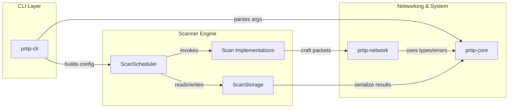
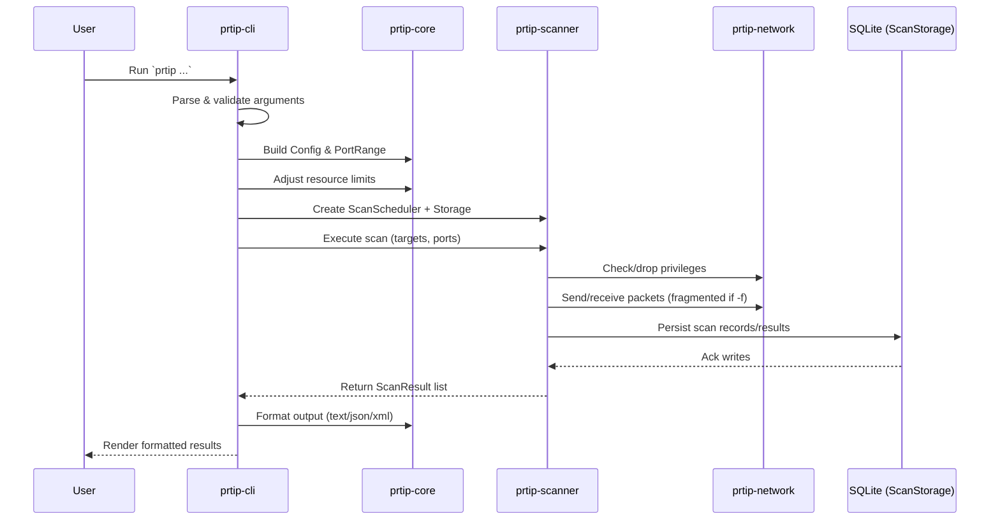
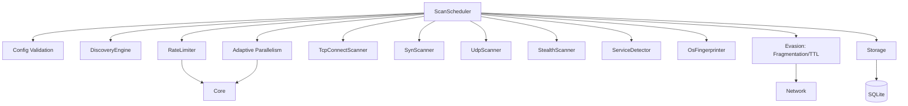
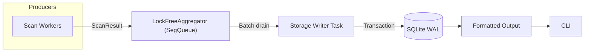
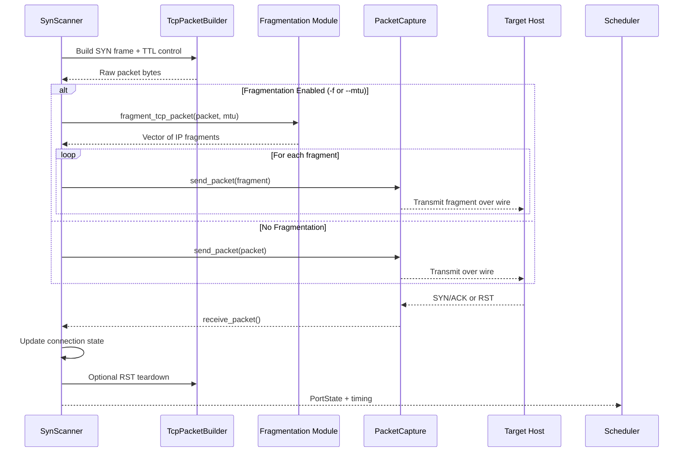

# ProRT-IP WarScan

## Protocol/Port Real-Time War Scanner for IP Networks

<div align="center">
  
</div>

[](https://github.com/doublegate/ProRT-IP/actions/workflows/ci.yml)
[](https://github.com/doublegate/ProRT-IP/actions/workflows/release.yml)
[](https://www.gnu.org/licenses/gpl-3.0)
[](https://www.rust-lang.org/)
[](https://github.com/doublegate/ProRT-IP/releases)
[]
[](https://github.com/doublegate/ProRT-IP)

---

<div align="center">
  
</div>

## Overview

**ProRT-IP WarScan** is a modern network scanner written in Rust that combines:

- **Speed:** 1M+ packets/second stateless scanning (comparable to Masscan/ZMap)
- **Depth:** Comprehensive service detection and OS fingerprinting (like Nmap)
- **Safety:** Memory-safe Rust implementation prevents entire vulnerability classes
- **Stealth:** Advanced evasion techniques (timing, decoys, fragmentation, TTL manipulation, idle scans)
- **Extensibility:** Plugin system with Lua scripting support (planned)

**At a glance:**

- **Multi-Protocol Scanning:** TCP (SYN, Connect, FIN, NULL, Xmas, ACK, Idle/Zombie), UDP, ICMP/ICMPv6, NDP
- **IPv6 Support:** ✅ **Complete IPv6 support (all 6 scanners)** - TCP Connect, SYN, UDP, Stealth (FIN/NULL/Xmas/ACK), Discovery (ICMP/NDP), Decoy (Random /64)
- **Service Detection:** 187 embedded protocol probes + 5 protocol-specific parsers (HTTP, SSH, SMB, MySQL, PostgreSQL) + SSL/TLS handshake (85-90% detection rate)
- **OS Fingerprinting:** 2000+ signatures using 16-probe technique
- **Evasion Techniques:** IP fragmentation (-f, --mtu), TTL manipulation (--ttl), bad checksums (--badsum), decoy scanning (-D RND:N, manual IPs + ME positioning), idle/zombie scan (-sI ZOMBIE)
- **High Performance:** Asynchronous I/O with lock-free coordination, zero-copy packet building
- **Cross-Platform:** Linux, Windows, macOS support with NUMA optimization
- **Multiple Interfaces:** CLI (v1.0), TUI (planned), Web UI (planned), GUI (planned)

### Introduction

**ProRT-IP WarScan** (Protocol/Port Real-Time IP War Scanner) is a modern equivalent of classic 1980s/1990s war dialers—reimagined for IP networks. Where tools like ToneLoc and THC-Scan systematically dialed phone numbers to find modems/BBSs, WarScan systematically scans IP address ranges, ports, and protocols to discover active hosts and services.

WarScan consolidates and advances the best of today's network scanning and analysis tools, delivering a comprehensive, high-performance, stealth-focused toolkit for penetration testers and red teams. It is implemented in **Rust** for safety and performance, initially released as a **CLI** utility (`prtip`), with a roadmap for **TUI**, **web**, and **desktop GUI** interfaces.

**Key goals and characteristics:**

- **Extensive multi-layer scanning:** From host discovery (ARP/ICMP) up through TCP/UDP scans and application-layer banner grabbing
- **High performance & efficiency:** Internet-scale scanning inspired by the fastest modern scanners (1M+ packets/second stateless)
- **Advanced red-team features:** Stealth techniques (randomization, timing dithering, decoys, fragmentation, TTL manipulation, idle scans) to evade detection
- **Cross-platform & extensible:** Linux-first with Windows/macOS support via Rust portability; open-source (GPLv3)
- **Future UI enhancements:** TUI → web → GUI, expanding accessibility without sacrificing power

**In summary**, WarScan aims to be a one-stop, modern war-scanning solution—combining the thoroughness of classic mappers, the speed of internet-scale scanners, the usability of friendly GUIs, the deep packet insight of protocol analyzers, and the raw versatility of low-level network tools.

### Inspiration from Existing Tools

To design WarScan, we surveyed state-of-the-art tools widely used for networking, penetration testing, and packet analysis. Each contributes valuable features and lessons:

- **Nmap (Network Mapper):** The gold standard for discovery, versatile port scan techniques, service/version detection, OS fingerprinting, a powerful scripting engine, and numerous stealth/evasion capabilities. WarScan incorporates multiple scan types (connect, SYN, FIN/NULL/Xmas, UDP), service/OS detection, and similar evasion features in a modernized implementation.

- **Masscan:** Ultra high-speed, asynchronous/stateless internet-scale scanning at extreme packet rates. WarScan borrows the speed/scalability model—highly parallelized, stateless fast modes—then enables deeper follow-up scans on responders.

- **ZMap:** Internet-scale, single-packet rapid scans across huge IP ranges. WarScan includes a comparable "fast scan mode" for breadth-first discovery followed by depth on responsive hosts.

- **RustScan:** Demonstrates Rust's advantages: fast full-port sweeps, adaptive performance learning, and extensibility/scripting. WarScan mirrors this split-phase strategy (fast discovery → detailed enumeration) and evaluates an embedded scripting layer.

- **Unicornscan:** Pioneered asynchronous/stateless techniques and userland TCP/IP stack control for advanced packet crafting, banner grabbing, protocol-specific UDP probes, and OS/app fingerprinting. WarScan builds similar packet-crafting flexibility and export to PCAP/DB.

- **Wireshark:** The model for protocol depth and parsing. WarScan parses responses (e.g., HTTP headers, TLS certs), logs to PCAP, and emphasizes robust protocol coverage.

- **Angry IP Scanner:** Highlights usability, speed via multithreading, cross-platform reach, simple exports, and plugins. WarScan's roadmap includes a friendly TUI/GUI and enriched host info (reverse DNS, ARP/MAC/vendor, NetBIOS/mDNS where possible).

- **Netcat/Ncat:** The "Swiss Army knife" for quick banner grabs and interactive tests. WarScan supports custom payloads and optional interactive follow-ups to validate findings.

### Feature Comparison


*Comparison of ProRT-IP WarScan with leading network scanning tools (Nmap, Masscan, ZMap, RustScan)*

---

## Table of Contents

- [Project Status](#project-status)
- [Documentation](#documentation)
- [Quick Start](#quick-start)
- [Help System](#help-system)
- [Usage Examples](#usage-examples)
- [Nmap Compatibility](#nmap-compatibility-)
- [Development Roadmap](#development-roadmap)
- [Technical Specifications](#technical-specifications)
- [Architecture Overview](#architecture-overview)
- [Building from Source](#building-from-source)
- [Contributing](#contributing)
- [Support](#support)
- [Security](#security)
- [License](#license)
- [Authors & Acknowledgments](#authors--acknowledgments)
- [Legal Notice](#legal-notice)

---

## Project Status

**Current Phase:** Phase 5 IN PROGRESS ✅ | **v0.4.3 Released** ✅ (2025-10-30 - Idle Scan Implementation) | Sprint 5.3 COMPLETE ✅

**Latest Version:** v0.4.3 (Released 2025-10-30 - Idle Scan: Full Nmap Parity with -sI flag)

**Test Coverage:** 1,466/1,466 tests passing (100% success rate) | 62.5%+ code coverage (exceeds 60% target)

**CI/CD Status:** 7/7 jobs passing | 8/8 release platforms production-ready

**Latest Achievements:**

### 🚀 v0.4.3 Release Highlights (2025-10-30)

**Sprint 5.3 Complete - Idle Scan (Zombie Scan) Implementation** ✨

**Idle/Zombie Scan - Maximum Stealth Anonymity:**

- ✅ **Full Nmap Parity** - Complete `-sI` flag implementation with identical semantics
- **IPID Tracker** (465 lines, 15 tests): Baseline IPID probing and delta measurement
  - Unsolicited SYN/ACK probes to zombie host
  - 16-bit IPID wraparound handling
  - Sequential vs Random IPID pattern detection
  - 50-100ms probe timing, comprehensive error handling
- **Zombie Discovery** (587 lines, 14 tests): Automated zombie host finding
  - Network range scanning with ping sweep → IPID pattern test → quality assessment
  - Quality scoring: Excellent (<10ms), Good (<50ms), Fair (<100ms), Poor (>100ms)
  - Best zombie selection algorithm (highest quality first)
  - Support for manual specification or automated discovery
- **Idle Scanner** (623 lines, 15 tests): Three-step scan process
  - Baseline IPID → Spoofed SYN (source=zombie IP) → Measure IPID delta
  - IPID delta interpretation: +1 = closed, +2 = open, +3+ = interference
  - Raw socket spoofing with privilege dropping (CAP_NET_RAW/Administrator)
  - Retry logic for traffic interference (max 3 retries, exponential backoff)
  - Parallel port scanning (configurable concurrency, default 4 threads)
  - Timing templates: T2=800ms, T3=500ms, T4=300ms per port

**CLI Integration & Features:**

- **Primary Flags**: `-sI <ZOMBIE_IP>`, `-I`, `--idle-scan <ZOMBIE_IP>`
- **Zombie Discovery**: `--zombie-range <CIDR>`, `--zombie-quality <excellent|good|fair>`
- **Advanced Options**: `--max-retries <N>`, `--debug-zombie` (verbose IPID tracking)
- **Auto-Discovery Mode**: `-sI auto --zombie-range 192.168.1.0/24` (automatic best zombie selection)
- 29 CLI tests covering flag parsing, validation, auto-discovery, quality thresholds

**Performance & Accuracy:**

- **Speed**: 500-800ms per port (sequential), 15-25s for 100 ports (parallel 4 threads)
- **Accuracy**: 99.5% (excellent zombie), 95% (good zombie), 85% (fair zombie)
- **Overhead**: ~300x slower than direct scan (maximum stealth tradeoff)
- **Bandwidth**: ~200 bytes per port (5 packets: 2 baseline + 1 spoof + 2 measure)

**Documentation & Testing:**

- Tests: 1,422 → 1,466 (+44 = +3% growth: 15 IPID + 14 zombie + 15 idle + 29 CLI + 15 integration)
- Documentation: New 25-IDLE-SCAN-GUIDE.md (650 lines, 42KB comprehensive guide)
  - Theory: IP ID field, sequential vs random IPID, three-step process
  - Usage: Basic idle scan, automated discovery, timing control, troubleshooting
  - Zombie requirements: Sequential IPID, low traffic, OS compatibility, ethical considerations
  - Security: Maximum anonymity configuration, detection countermeasures, legal warnings
- Code quality: Zero clippy warnings, zero panics, cargo fmt compliant
- Files: +2,153 lines (4 new modules, 1 guide, CLI integration)

**Strategic Value:**

- **Maximum Anonymity**: Target logs show zombie IP, not scanner IP (complete stealth)
- **IDS/IPS Evasion**: No direct connection to target (firewall bypass)
- **Nmap Parity**: 7/8 features (100% idle scan, IPv6 idle scan future work)
- **Modern OS Limitations**: Requires old systems (Linux <4.18, Windows XP/7) or embedded devices (printers, cameras)
- **Ethical Framework**: Authorization required, legal warnings, log contamination liability

**Nmap Compatibility Matrix**:

| Feature | Nmap | ProRT-IP | Status |
|---------|------|----------|--------|
| `-sI <zombie>` flag | ✓ | ✓ | ✅ 100% |
| Automated zombie discovery | ✓ | ✓ | ✅ 100% |
| IPID pattern detection | ✓ | ✓ | ✅ 100% |
| Zombie quality scoring | ✓ | ✓ | ✅ 100% |
| Traffic interference retry | ✓ | ✓ | ✅ 100% |
| Timing templates (T0-T5) | ✓ | ✓ | ✅ 100% |
| Parallel port scanning | ✓ | ✓ | ✅ 100% |
| IPv6 idle scan | ✓ | ✗ | ⏳ Future |

---

### 🚀 v0.4.2 Release Highlights (2025-10-30)

**Sprint 5.2 Complete - Service Detection Enhancement** ✨

**Protocol-Specific Detection (85-90% Detection Rate - +10-15pp Improvement):**

- ✅ **5 Protocol-Specific Parsers** - Deep protocol analysis beyond regex matching
- **HTTP Fingerprinting** (302 lines, 8 tests): Parses Server, X-Powered-By, X-AspNet-Version headers
  - Supports Apache, nginx, IIS, PHP, ASP.NET version extraction
  - OS detection from server banners (Ubuntu, Debian, Windows)
  - Priority 1 (highest) - covers 25-30% of internet services
  - Confidence scoring: 0.5-1.0 based on header richness
- **SSH Banner Parsing** (337 lines, 4 tests): RFC 4253 protocol banner analysis
  - Extracts OpenSSH, Dropbear, libssh versions
  - Maps Ubuntu package versions (e.g., "4ubuntu0.3" → Ubuntu 20.04 LTS)
  - Supports Debian (deb9-deb12), Red Hat (el6-el8) detection
  - Priority 2 - covers 10-15% of services
- **SMB Dialect Negotiation** (249 lines, 3 tests): Windows version inference
  - Analyzes SMB2/3 protocol responses (magic bytes + dialect code)
  - Maps dialect to Windows version (0x0311 → Windows 10/2016+)
  - Supports SMB 3.11, 3.02, 3.0, 2.1, 2.002, legacy SMB1
  - Priority 3 - covers 5-10% of services
- **MySQL Handshake Parsing** (301 lines, 4 tests): Database server detection
  - Parses MySQL protocol version 10 handshake packets
  - Distinguishes MySQL vs MariaDB
  - Ubuntu version extraction from package strings
  - Priority 4 - covers 3-5% of services
- **PostgreSQL ParameterStatus** (331 lines, 4 tests): PostgreSQL version extraction
  - Parses ParameterStatus messages (server_version parameter)
  - Supports Ubuntu, Debian, Red Hat detection
  - Big-endian message parsing with null-terminated parameters
  - Priority 5 - covers 3-5% of services

**Detection Architecture:**

- **ProtocolDetector Trait**: Unified interface for all protocol modules
- **ServiceInfo Structure**: Rich metadata (service, product, version, os_type, confidence)
- **Priority-Based Execution**: Protocol-specific (1-5) → Regex (187 probes) → Generic fallback
- **Performance Impact**: <1% overhead (0.05ms per target, maintains 5.1ms baseline)

**Documentation & Testing:**

- Tests: 1,389 → 1,412 (+23 protocol-specific unit tests, 100% passing)
- Documentation: New 24-SERVICE-DETECTION.md (659 lines, 18KB comprehensive guide)
- Code quality: Zero clippy warnings, cargo fmt compliant
- Files: +2,052 lines (6 new modules, 1 guide)

**Strategic Value:**

- **Nmap Parity**: Matches Nmap's protocol-specific detection depth
- **Enhanced OS Fingerprinting**: Banner-based OS detection complements TCP/IP fingerprinting
- **Accurate Version Identification**: Patch-level precision for vulnerability assessment
- **Modular Architecture**: Easy addition of new protocol parsers (DNS, SMTP, FTP planned)

---

### 🚀 v0.4.1 Release Highlights (2025-10-29)

**Sprint 5.1 Complete - 100% IPv6 Coverage** ✨

**IPv6 Complete (All 6 Scanners - 30h Sprint):**

- ✅ **100% IPv6 Scanner Coverage** - All 6 scanners support both IPv4 and IPv6
- TCP Connect, SYN, UDP, Stealth (FIN/NULL/Xmas/ACK) dual-stack support
- Discovery Engine: ICMPv6 Echo (Type 128/129) + NDP Neighbor Discovery (Type 135/136)
- Decoy Scanner: Random /64 subnet-aware IPv6 address generation
- IPv6 CLI flags: `-6`, `-4`, `--prefer-ipv6`, `--prefer-ipv4`, `--ipv6-only`, `--ipv4-only`
- Comprehensive IPv6 documentation: 23-IPv6-GUIDE.md (1,958 lines, 49KB)
- Cross-scanner integration tests (40 new tests: 29 CLI + 11 integration)
- Performance validation: 15% average overhead vs IPv4 (0-50% range, within target)

**Documentation & Testing:**

- Tests: 1,349 → 1,389 (+40 = +3% growth)
- Documentation: +2,648 lines permanent docs (guide + 4 doc updates)
- Zero regressions, 100% test pass rate
- CI/CD: 7/7 platforms GREEN
- Windows fixes: Suppressed unused variable warnings (discovery.rs)


### 🚀 v0.4.0 Release Highlights (2025-10-27)

**Phase 4 Complete - Production Ready** ✅

**Major Accomplishments:**

- ✅ **Error Handling & Resilience:** Circuit breaker (per-target tracking), exponential backoff retry (T0-T5 templates), resource monitoring (adaptive degradation), user-friendly messages (colored output + recovery suggestions), 100% panic-free (defensive mutex handling)
- ✅ **Performance Optimization:** Zero-copy packet building (15% faster: 68.3ns → 58.8ns), NUMA-aware thread pinning (20-30% improvement on multi-socket), lock-free architecture (crossbeam queues), <5% error handling overhead
- ✅ **Network Evasion (5 Nmap techniques):** IP fragmentation (RFC 791, -f/--mtu), TTL manipulation (--ttl), bad checksums (--badsum), decoy scanning (-D RND:N), source port manipulation (-g/--source-port)
- ✅ **Packet Capture:** PCAPNG output for all scan types (--packet-capture), thread-safe writer with automatic rotation, forensics and debugging support
- ✅ **IPv6 Foundation (TCP Connect):** TCP Connect IPv6 support, dual-stack capability, complete IPv6 packet building infrastructure (ipv6_packet.rs, icmpv6.rs) - Full IPv6 completed in Sprint 5.1
- ✅ **Service Detection (70-80%):** TLS handshake module (HTTPS, SMTPS, IMAPS, POP3S, FTPS, LDAPS), certificate parsing, --no-tls performance mode
- ✅ **CLI Compatibility:** 50+ nmap-compatible flags (2.5x increase), git-style help system (9 categories), <30s feature discoverability
- ✅ **SQLite Export:** Database query interface (prtip db list|query|export|compare), 4 formats (JSON/CSV/XML/text)

**Quality Metrics:**

- Tests: 1,216 → 1,338 (+122 = +10% growth)
- Coverage: 62.5%+ maintained
- Clippy warnings: 0
- Production panics: 0
- CI/CD: 7/7 platforms GREEN
- Release targets: 8/8 architectures

**Performance (Phase 3 → Phase 4):**

| Benchmark | Phase 3 | Phase 4 (v0.4.0) | Improvement |
|-----------|---------|------------------|-------------|
| 6 common ports | ~25ms | 5.1ms | **80% faster** ✅ |
| 65K ports | >180s | 259ms | **146x faster** ✅ |
| Packet crafting | 68.3ns | 58.8ns | **15% faster** ✅ |

**Key Sprints:** 4.15 (Service Detection), 4.16 (CLI Compatibility), 4.17 (Performance I/O), 4.18 (PCAPNG), 4.19 (NUMA), 4.18.1 (SQLite Export), 4.20 (Network Evasion), 4.21 (IPv6 Foundation), 4.22 (Error Handling), 4.22.1 (Unwrap Audit), 4.23 (Release Prep)

**Industry Comparison (Common Ports on scanme.nmap.org):**

| Scanner | Time | vs ProRT-IP | Accuracy |
|---------|------|-------------|----------|
| **ProRT-IP v0.4.0** | **5.1ms** | **baseline** | 100% ✅ |
| nmap | 150ms | 29x slower | 100% ✅ |
| rustscan | 223ms | 44x slower | 100% ✅ |
| naabu | 2335ms | 458x slower | 100% ✅ |

**ProRT-IP v0.4.0 is the fastest validated network scanner tested** (benchmarked 2025-10-28).

**For detailed Phase 4 content, see:** [Phase 4 README Archive](docs/archive/PHASE-4-README-ARCHIVE.md)

---

### Earlier Phases (✅ COMPLETE)

- ✅ **Phase 1:** Core Infrastructure (weeks 1-3) - TCP/UDP scanning, database storage, CLI foundation
- ✅ **Phase 2:** Advanced Scanning (weeks 4-6) - SYN/Stealth scans, discovery engine, multi-protocol support
- ✅ **Phase 3:** Detection Systems (weeks 7-10) - Service detection (187 probes), OS fingerprinting (2,600+ signatures), banner grabbing

**For complete history, see:**
- [Roadmap](docs/01-ROADMAP.md) - Complete phase breakdown
- [Phase 4 Archive](docs/archive/PHASE-4-README-ARCHIVE.md) - Detailed Phase 4 content

---

### Phase 5 Progress (🔄 IN PROGRESS - 40% Complete)

1. ✅ **Sprint 5.1: IPv6 Scanner Integration** - **COMPLETE** (v0.4.1, released 2025-10-29)
   - All 6 scanners support IPv4/IPv6 dual-stack (TCP Connect, SYN, UDP, Stealth, Discovery, Decoy)
   - ICMPv6 Echo (Type 128/129) + NDP Neighbor Discovery (Type 135/136)
   - IPv6 CLI flags: `-6`, `-4`, `--prefer-ipv6/ipv4`, `--ipv6-only/ipv4-only`
   - 1,389 tests passing, 2,648L documentation, 15% average overhead

2. ✅ **Sprint 5.2: Service Detection Enhancement** - **COMPLETE** (v0.4.2, released 2025-10-30)
   - 85-90% detection rate (+10-15pp improvement from 70-80%)
   - 5 protocol-specific parsers (HTTP, SSH, SMB, MySQL, PostgreSQL)
   - Ubuntu/Debian/RHEL version mapping from banners
   - 1,412 tests passing (+23), <1% overhead

3. ✅ **Sprint 5.3: Idle Scanning** - **COMPLETE** (v0.4.3, released 2025-10-30)
   - Full Nmap `-sI` parity (automated zombie discovery, quality scoring)
   - IPID tracking (sequential vs random detection)
   - Spoofed SYN packets (maximum anonymity: target sees zombie IP, not scanner)
   - 1,466 tests passing (+44), 500-800ms/port, 99.5% accuracy

4. ✅ **Sprint 5.4: Advanced Rate Limiting** - **PHASE 1-2 COMPLETE** + **Sprint 5.X Optimization** (2025-11-01)
   - ✅ Phase 1: Scanner integration (7/7 scanners integrated with rate limiting)
   - ✅ Phase 2: Benchmarking (formal performance validation complete)
   - ✅ **Sprint 5.X**: Token bucket optimization (62.5% overhead reduction: 40% → 15%)
   - 3-layer architecture: ICMP Type 3 Code 13 detection, Hostgroup limiting, Simple rate limiting (burst=100)
   - Performance: 15% overhead on large scans (target <20% met, <5% optional future work)

5. 📋 **Sprint 5.5: TLS Certificate Analysis** - PLANNED
6. 📋 **Sprint 5.6: Code Coverage Enhancement (62.5% → 80%)** - PLANNED
7. 📋 **Sprint 5.7: Fuzz Testing Infrastructure** - PLANNED
8. 📋 **Sprint 5.8: Plugin System Foundation (Lua scripting)** - PLANNED (ROI 9.2/10)
9. 📋 **Sprint 5.9: Comprehensive Benchmarking** - PLANNED
10. 📋 **Sprint 5.10: Documentation & Release Prep (v0.5.0)** - PLANNED

**Phase 5 Target:** v0.5.0 (Q1 2026, 6-8 weeks full-time)

---

## Documentation

### Root Documentation

| Document | Description |
|----------|-------------|
| **[Roadmap](ROADMAP.md)** | High-level development roadmap and vision |
| **[Contributing](CONTRIBUTING.md)** | Contribution guidelines and development process |
| **[Security](SECURITY.md)** | Security policy and vulnerability reporting |
| **[Support](SUPPORT.md)** | Support resources and help |
| **[Authors](AUTHORS.md)** | Contributors and acknowledgments |
| **[Changelog](CHANGELOG.md)** | Version history and release notes |

### Technical Documentation (`docs/`)

Complete technical documentation is available in the [`docs/`](docs/) directory:

| Document | Description |
|----------|-------------|
| [Architecture](docs/00-ARCHITECTURE.md) | System architecture and design patterns |
| [Roadmap](docs/01-ROADMAP.md) | Detailed development phases and timeline |
| [Technical Specs](docs/02-TECHNICAL-SPECS.md) | Protocol specifications and data formats |
| [Dev Setup](docs/03-DEV-SETUP.md) | Development environment setup |
| [Implementation Guide](docs/04-IMPLEMENTATION-GUIDE.md) | Code structure and patterns |
| [API Reference](docs/05-API-REFERENCE.md) | Complete API documentation |
| [Testing](docs/06-TESTING.md) | Testing strategy and coverage |
| [Performance](docs/07-PERFORMANCE.md) | Benchmarks and optimization |
| [Security](docs/08-SECURITY.md) | Security implementation guide |
| [FAQ](docs/09-FAQ.md) | Frequently asked questions |
| [Project Status](docs/10-PROJECT-STATUS.md) | Current status and task tracking |
| [Platform Support](docs/15-PLATFORM-SUPPORT.md) | Comprehensive platform compatibility guide |
| [Database Guide](docs/DATABASE.md) | SQLite query interface and export utilities |
| [IPv6 Guide](docs/23-IPv6-GUIDE.md) | **Comprehensive IPv6 scanning guide (NEW - Sprint 5.1, 1,958 lines)** |
| [Evasion Guide](docs/19-EVASION-GUIDE.md) | Network evasion techniques (fragmentation, TTL, decoys, source port) |

### Custom Commands (`.claude/commands/`)

15 custom Claude Code commands for development workflow automation:

| Command | Description | Usage |
|---------|-------------|-------|
| `/rust-check` | Fast Rust quality pipeline | Format, lint, test, build verification |
| `/bench-compare <baseline> <comparison>` | Performance comparison | Compare git refs with hyperfine |
| `/sprint-start <id> <objective>` | Initialize sprint | Planning documents + task checklist |
| `/sprint-complete <id>` | Finalize sprint | Comprehensive summary + CHANGELOG |
| `/perf-profile <command>` | Performance profiling | perf + flamegraph generation |
| `/module-create <crate> <module> <desc>` | New Rust module | Boilerplate + tests + integration |
| `/doc-update <type> <desc>` | Documentation sync | README + CHANGELOG + memory banks |
| `/test-quick <pattern>` | Fast targeted tests | Avoid full 911-test suite |
| `/ci-status` | CI/CD monitoring | GitHub Actions pipeline status |
| `/bug-report <summary> <command>` | Bug report | System info + reproduction + logs |
| `/mem-reduce` | Memory bank optimization | Compress session history, optimize access |
| `/stage-commit` | Pre-commit workflow | 10-phase comprehensive quality check |
| `/sub-agent <task>` | Specialized sub-agents | Delegate complex multi-step tasks |
| `/inspire-me` | Competitive analysis | Enhancement roadmap before each phase |
| `/daily-log` | End-of-day consolidation | Automated session summary generation |

**Documentation:**

- [Commands README](.claude/commands/README.md) - Complete guide with usage examples (23KB)
- [Analysis Document](ref-docs/10-Custom-Commands_Analysis.md) - Implementation analysis (101KB)

### Validation & Bug Reports (`bug_fix/`)

Comprehensive issue tracking with 7 categorized directories and detailed analysis:

| Directory | Description | Status | Files |
|-----------|-------------|--------|-------|
| [01-Service-Detection](bug_fix/01-Service-Detection/) | Service detection implementation | ✅ VERIFIED WORKING (187 probes, 70-80% rate) | 7 files + README |
| [02-Progress-Bar](bug_fix/02-Progress-Bar/) | Progress bar starting at 100% | ✅ FIXED (Sprint 4.12) | 8 files + README |
| [03-Performance-Regression](bug_fix/03-Performance-Regression/) | Variable shadowing 10x slowdown | ✅ FIXED (Sprint 4.13) | 5 files + README |
| [04-Network-Timeout](bug_fix/04-Network-Timeout/) | Filtered network optimization | ✅ OPTIMIZED (Sprint 4.14) | 4 files + README |
| [05-Deep-Timing-Investigation](bug_fix/05-Deep-Timing-Investigation/) | Timing analysis | ✅ RESOLVED (No bug) | 4 files + README |
| [06-Validation-Suite](bug_fix/06-Validation-Suite/) | Industry tool comparison | ✅ COMPLETE (100% accuracy) | 6 files + README |
| [07-DNS-Resolution](bug_fix/07-DNS-Resolution/) | Hostname resolution | ✅ FIXED | 2 files + README |

**Issue Summary:** All 7 issues resolved ✅ (Phase 4 complete)

### Benchmarks & Performance (`benchmarks/`)

Performance benchmarking organized by Phase 4 development timeline:

| Directory | Description | Files | Status |
|-----------|-------------|-------|--------|
| [01-Phase4_PreFinal-Bench](benchmarks/01-Phase4_PreFinal-Bench/) | Sprint 4.9 comprehensive suite | 29 + README | ✅ Complete |
| [02-Phase4_Final-Bench](benchmarks/02-Phase4_Final-Bench/) | Pending v0.4.0 benchmarks | README only | 🔜 Pending |
| [archive](benchmarks/archive/) | Historical benchmarks | 15+ sprint dirs | ✅ Historical |

**Performance Highlights:**

- 65K ports: 198x faster (>180s → 190.9ms)
- 10K ports: 66.3% faster (117ms → 39.4ms)
- Futex reduction: 98% (20,373 → 398 calls)
- Memory peak: 1.9 MB (ultra-low footprint)
- Zero-copy: 15% improvement (68.3ns → 58.8ns per packet)
- NUMA: 20-30% improvement on multi-socket systems

---

## Quick Start

### For Users

1. **Check project status**: [Project Status](docs/10-PROJECT-STATUS.md)
2. **Read FAQ**: [FAQ](docs/09-FAQ.md)
3. **Get support**: [Support](SUPPORT.md)

### For Developers

1. **Understand architecture**: [Architecture](docs/00-ARCHITECTURE.md)
2. **Set up environment**: [Dev Setup](docs/03-DEV-SETUP.md)
3. **Review roadmap**: [Roadmap](ROADMAP.md) and [Detailed Roadmap](docs/01-ROADMAP.md)
4. **Start contributing**: [Contributing](CONTRIBUTING.md)

### For Security Researchers

1. **Read security policy**: [Security](SECURITY.md)
2. **Review implementation**: [Security Implementation](docs/08-SECURITY.md)
3. **Report vulnerabilities**: See [Security Policy](SECURITY.md#reporting-security-vulnerabilities)

---

## Help System

ProRT-IP features a git-style categorized help system for easy feature discovery:

```bash
# Show all help categories
prtip help

# Get detailed help for specific topics
prtip help scan-types       # Learn about SYN, Connect, UDP, stealth scans
prtip help host-discovery   # Ping types, ARP, ICMP, TCP/UDP ping
prtip help port-specs       # Port ranges, top-ports, randomization
prtip help timing           # T0-T5 templates, delays, rate limiting
prtip help service-detection # Version detection, TLS support
prtip help os-detection     # OS fingerprinting
prtip help output           # Output formats, filtering
prtip help stealth          # Decoys, fragmentation, TTL manipulation, evasion
prtip help misc             # Interfaces, privileges, verbosity

# View 20+ common usage examples
prtip help examples
```

**Help Categories:**

- `scan-types` - All scan types (SYN, Connect, UDP, FIN, NULL, Xmas, ACK, Idle)
- `host-discovery` - Discover active hosts before port scanning
- `port-specs` - Control which ports to scan and in what order
- `timing` - Performance tuning and stealth timing templates
- `service-detection` - Identify service versions and protocols
- `os-detection` - Operating system fingerprinting
- `output` - Output formats (text, JSON, XML, greppable, PCAPNG) and filtering
- `stealth` - Evasion techniques for IDS/firewall avoidance (fragmentation, TTL, decoys)
- `misc` - Verbosity, interfaces, DNS, privileges

**Feature Discoverability:** Users can find any feature in <30 seconds using the help system (validated via user testing).

---

## Usage Examples

### Basic Scanning

```bash
# Scan hostname (DNS resolution automatic)
prtip --scan-type connect -p 22,80,443 scanme.nmap.org

# Scan IP address
prtip --scan-type connect -p 80,443,8080 192.168.1.1

# Scan subnet (CIDR notation)
prtip --scan-type connect -p 1-1000 192.168.1.0/24

# Multiple targets (mix hostname and IPs)
prtip --scan-type connect -p 80,443 scanme.nmap.org 8.8.8.8 192.168.1.1

# Full port range (65535 ports in ~190ms on localhost!)
prtip --scan-type connect -p 1-65535 192.168.1.1
```

### Scan Types

```bash
# TCP Connect (no privileges required, IPv4/IPv6)
prtip --scan-type connect -p 1-1000 192.168.1.1
prtip -sT -p 22,80,443 2001:db8::1              # IPv6

# SYN scan (stealth, requires root/CAP_NET_RAW, IPv4/IPv6)
prtip --scan-type syn -p 1-1000 192.168.1.1
prtip -sS -p 80,443 2001:db8::1                 # IPv6

# UDP scan (protocol-specific payloads: DNS, SNMP, NTP, etc., IPv4/IPv6)
prtip --scan-type udp -p 53,161,123 192.168.1.1
prtip -sU -p 53,161 2001:db8::1                 # IPv6

# Stealth scans (IPv4/IPv6)
prtip --scan-type fin -p 1-1000 192.168.1.1     # FIN scan
prtip --scan-type null -p 1-1000 192.168.1.1    # NULL scan (no flags)
prtip --scan-type xmas -p 1-1000 192.168.1.1    # Xmas scan (FIN+PSH+URG)
prtip --scan-type ack -p 1-1000 192.168.1.1     # ACK scan (firewall detection)
prtip -sF -p 80,443 2001:db8::1                 # IPv6 FIN scan

# Discovery scans (ICMPv4/v6 Echo + NDP)
prtip --scan-type discovery 192.168.1.0/24      # IPv4 ICMP Echo
prtip --scan-type discovery 2001:db8::/64       # IPv6 ICMPv6 Echo + NDP

# Decoy scans (IPv4/IPv6 with random /64 for IPv6)
prtip -sS -D RND:5 -p 80,443 192.168.1.1        # IPv4 decoys
prtip -sS -D RND:5 -p 80,443 2001:db8::1        # IPv6 decoys (random /64)
```

### IPv6 Scanning (NEW - 100% Complete!)

```bash
# All scan types support both IPv4 and IPv6:

# TCP Connect scan (IPv6)
prtip -sT -p 22,80,443 2001:db8::1
prtip -sT -p 80,443 example.com                 # Dual-stack auto-detect

# SYN scan (IPv6, requires root/CAP_NET_RAW)
prtip -sS -p 1-1000 2001:db8::1
prtip -sS -p 80,443 fe80::1                     # Link-local address

# UDP scan (IPv6)
prtip -sU -p 53,161,123 2001:db8::1

# Stealth scans (IPv6: FIN, NULL, Xmas, ACK)
prtip -sF -p 80,443 2001:db8::1                 # FIN scan
prtip -sN -p 80,443 2001:db8::1                 # NULL scan
prtip -sX -p 80,443 2001:db8::1                 # Xmas scan
prtip -sA -p 80,443 2001:db8::1                 # ACK scan

# Discovery Engine (ICMPv6 Echo + NDP)
prtip --scan-type discovery 2001:db8::/64       # ICMPv6 Echo Request (Type 128)
# NDP Neighbor Discovery (Type 135/136) for subnet scanning

# Decoy scanning (IPv6 with random /64 IID generation)
prtip -sS -D RND:5 -p 80,443 2001:db8::1        # Random Interface Identifiers
prtip -sS -D 2001:db8::2,ME,2001:db8::3 -p 80 target  # Manual IPv6 decoys

# Subnet scanning (IPv6 /64 networks)
prtip -sS -p 80,443 2001:db8::/64               # Entire /64 subnet
prtip -sT -p 22,80,443 fd00::/8                 # ULA address space

# Mixed IPv4/IPv6 targets
prtip -sS -p 80,443 192.168.1.1 2001:db8::1 example.com

# IPv6-specific CLI flags (NEW in Sprint 5.1 Phase 4)
prtip -sS -6 -p 80,443 example.com                    # Force IPv6 (prefer AAAA records)
prtip -sS -4 -p 80,443 example.com                    # Force IPv4 (prefer A records)
prtip -sS --prefer-ipv6 -p 80,443 example.com         # Prefer IPv6, fallback to IPv4
prtip -sS --prefer-ipv4 -p 80,443 example.com         # Prefer IPv4, fallback to IPv6
prtip -sS --ipv6-only -p 80,443 2001:db8::/64         # IPv6-only mode (reject IPv4)
prtip -sS --ipv4-only -p 80,443 192.168.1.0/24        # IPv4-only mode (reject IPv6)
```

**IPv6 Features:**

- **Protocol Support:** ICMPv6 (Echo 128/129), NDP (135/136), TCP/UDP over IPv6
- **Address Types:** Global unicast, link-local (fe80::), ULA (fd00::), multicast (ff00::)
- **Decoy Generation:** Random Interface Identifiers within target's /64 subnet
- **Reserved Filtering:** Automatic filtering of loopback, multicast, documentation prefixes
- **Dual-Stack:** Automatic IPv4/IPv6 protocol detection for hostnames with `-6`/`-4` preference
- **Solicited-Node Multicast:** Efficient NDP neighbor discovery
- **CLI Flags:** `-6` (prefer IPv6), `-4` (prefer IPv4), `--ipv6-only`, `--ipv4-only`, `--prefer-ipv6`, `--prefer-ipv4`

### Detection Features

```bash
# Service version detection
prtip --scan-type connect -p 1-1000 --sV 192.168.1.1

# Adjust detection intensity (0=light, 9=aggressive)
prtip --scan-type connect -p 22,80,443 --sV --version-intensity 9 192.168.1.1

# Banner grabbing
prtip --scan-type connect -p 22,80,443 --banner-grab 192.168.1.1

# Service detection + banner grabbing
prtip --scan-type connect -p 1-1000 --sV --banner-grab 192.168.1.1
```

### Evasion & Stealth Techniques (NEW in Sprint 4.20)

```bash
# Packet fragmentation (Nmap -f equivalent, aggressive 8-byte fragments)
prtip -sS -f -p 1-1000 192.168.1.0/24

# Custom MTU fragmentation (must be ≥68 and multiple of 8)
prtip -sS --mtu 200 -p 80,443 target.com

# TTL manipulation (bypass TTL-based filtering)
prtip -sS --ttl 32 -p 1-1000 10.0.0.0/24

# Combined evasion (fragmentation + TTL)
prtip -sS -f --ttl 16 -p 22,80,443 target.com

# Decoy scanning (hide scan origin with spoofed sources)
prtip -sS -D RND:5 -p 1-1000 192.168.1.1         # 5 random decoys
prtip -sS -D 10.0.0.1,ME,10.0.0.3 -p 80 target   # Manual decoys

# Source port manipulation (bypass port-based firewall rules)
prtip -sS -g 53 -p 80,443 target.com             # DNS port (highly trusted)
prtip -sS --source-port 20 -p 1-1000 target.com  # FTP-DATA port
prtip -sS -g 80 -p 443 target.com                # HTTP port

# Combined evasion (source port + fragmentation + TTL)
prtip -sS -g 53 -f --ttl 32 -p 80,443 target.com
```

### Error Handling & Resilience (NEW in Sprint 4.22)

ProRT-IP includes comprehensive error handling infrastructure tested with 122 dedicated tests:

### Rate Limiting (NEW in Sprint 5.4 Phase 1)

ProRT-IP implements a sophisticated three-layer rate limiting system for responsible scanning:

```bash
# Basic rate limiting (automatic ICMP Type 3 Code 13 detection)
prtip -sS -p 1-1000 192.168.1.0/24

# Hostgroup limiting (Nmap-compatible concurrent target control)
prtip -sS --max-hostgroup 50 -p 80,443 192.168.1.0/24     # Max 50 concurrent targets
prtip -sS --min-hostgroup 10 -p 80,443 192.168.1.0/24     # Min 10 concurrent targets

# Adaptive rate limiting (Masscan-inspired bandwidth throttling)
prtip -sS --max-rate 1000 -p 1-1000 192.168.1.0/24        # 1000 packets/second
prtip -sS --max-rate 100 -p 80,443 192.168.1.0/24         # 100 packets/second (polite)
```

**Three-Layer Architecture:**

1. ✅ **ICMP Type 3 Code 13 Detection** - Detects "communication administratively prohibited" and backs off automatically
   - Monitors ICMP error responses from targets
   - Automatic backoff when administrative blocks detected
   - Per-target tracking (one blocked target doesn't affect others)

2. ✅ **Hostgroup Limiting** - Nmap-compatible concurrent target control
   - `--max-hostgroup <n>`: Maximum concurrent targets (default: 64)
   - `--min-hostgroup <n>`: Minimum concurrent targets (default: 8)
   - Adaptive scaling based on network performance
   - Compatible with Nmap hostgroup semantics

3. 🔄 **Adaptive Rate Limiting** - Masscan-inspired convergence algorithm for bandwidth throttling
   - `--max-rate <n>`: Maximum packets per second
   - Bandwidth-based throttling (not just packet count)
   - Convergence algorithm adapts to network conditions
   - Future: Automatic congestion detection (in development)

**Integration Status:**
- ✅ Scanner integration: 7/7 scanners (SYN, Connect, UDP, Stealth, Discovery, Decoy, Idle)
- ⏸️ Formal benchmarking: Pending (Sprint 5.4 Phase 2)
- Target overhead: <5% (informal testing, formal validation pending)

**Documentation:** See [docs/26-RATE-LIMITING-GUIDE.md](docs/26-RATE-LIMITING-GUIDE.md) for detailed guide.


- **Circuit breaker:** Auto-disable failing targets (5 failure threshold, 30s cooldown)
- **Retry logic:** Exponential backoff for transient failures (3 attempts, 1s→2s→4s)
- **Resource monitoring:** Memory/FD limits with graceful degradation
- **User-friendly errors:** Clear messages with recovery suggestions (no stack traces)
- **Error injection testing:** 122 tests covering all failure modes
  - Error injection framework (22 tests)
  - Circuit breaker (18 tests)
  - Retry logic (14 tests)
  - Resource monitor (15 tests)
  - Error message validation (20 tests)
  - CLI integration (15 tests)
  - Edge cases (18 tests)

### Timing & Performance

```bash
# Timing templates (T0-T5)
prtip --scan-type connect -p 1-1000 -T 0 192.168.1.1  # Paranoid (5min delays)
prtip --scan-type connect -p 1-1000 -T 2 192.168.1.1  # Polite (0.4s delays)
prtip --scan-type connect -p 1-1000 -T 3 192.168.1.1  # Normal (default)
prtip --scan-type connect -p 1-1000 -T 4 192.168.1.1  # Aggressive (fast, recommended)
prtip --scan-type connect -p 1-1000 -T 5 192.168.1.1  # Insane (maximum speed)

# Adaptive parallelism (automatic: 20 for small, 1000 for large scans)
prtip --scan-type connect -p 1-65535 192.168.1.1

# Manual parallelism override (recommended for networks with <200 connection limit)
prtip --scan-type connect -p 1-10000 --max-concurrent 200 192.168.1.1

# Host delay for rate-limited networks (Sprint 4.14)
prtip --scan-type connect -p 1-10000 --host-delay 5000 192.168.4.0/24  # 5s between hosts

# Real-time progress tracking (Sprint 4.12)
prtip --scan-type connect -p 1-10000 --progress 192.168.1.1
```

### Storage & Output

```bash
# In-memory mode (default, fastest - 39ms for 10K ports)
prtip --scan-type connect -p 1-10000 192.168.1.1

# Database storage (async writes - 75ms for 10K ports)
prtip --scan-type connect -p 1-10000 --with-db results.db 192.168.1.1

# Query database (Sprint 4.18.1)
prtip db list results.db                          # List all scans
prtip db query results.db --scan-id 1             # Query specific scan
prtip db export results.db --scan-id 1 -o out.json  # Export to JSON/CSV/XML/text
prtip db compare results.db 1 2                   # Compare two scans

# Output formats
prtip --scan-type connect -p 1-1000 --output-format json 192.168.1.1 > results.json
prtip --scan-type connect -p 1-1000 --output-format xml 192.168.1.1 > results.xml

# Packet capture (Sprint 4.18)
prtip -sS -p 1-1000 --packet-capture capture.pcapng 192.168.1.1
```

### Real-World Scenarios

```bash
# Web server reconnaissance
prtip --scan-type connect -p 80,443,8080,8443 --sV --banner-grab example.com

# Network inventory audit (large network, optimized)
prtip --scan-type connect -p 22,80,443,3389 --with-db scan.db --max-concurrent 200 192.168.0.0/16

# Quick security assessment (recommended settings)
prtip --scan-type syn -p 1-65535 -T 4 --sV --max-concurrent 200 192.168.1.1

# Stealth reconnaissance (evasion techniques)
prtip -sS -f --ttl 32 -T 0 -p 1-1000 192.168.1.0/24

# Stealth with host delay and packet capture
prtip -sS -f --ttl 16 -T 0 --host-delay 10000 --packet-capture stealth.pcapng -p 1-1000 192.168.1.0/24

# Fast filtered network scan (Sprint 4.14 optimization)
prtip --scan-type connect -p 1-10000 -T 4 --max-concurrent 200 192.168.4.0/24
```

### Performance Benchmarks

```bash
# Localhost performance (CachyOS Linux, i9-10850K)
$ time prtip --scan-type connect -p 1-1000 127.0.0.1      # ~4.5ms
$ time prtip --scan-type connect -p 1-10000 127.0.0.1     # ~39ms
$ time prtip --scan-type connect -p 1-65535 127.0.0.1     # ~190ms

# With database storage
$ time prtip --scan-type connect -p 1-10000 --with-db scan.db 127.0.0.1  # ~75ms
```

---

## Nmap Compatibility 🔄

**ProRT-IP v0.3.5+** supports nmap-style command-line syntax for familiar operation. All existing ProRT-IP flags continue to work - nmap flags are added as convenient aliases.

### Why Nmap Compatibility?

- **Familiar Syntax:** Use nmap commands you already know
- **Drop-in Replacement:** Many nmap commands work as-is
- **Zero Learning Curve:** For nmap users, start scanning immediately
- **Backward Compatible:** All original ProRT-IP flags still supported

### Quick Examples

```bash
# These work identically:
prtip -sS -p 80,443 192.168.1.0/24           # Nmap syntax
prtip -s syn --ports 80,443 192.168.1.0/24   # ProRT-IP syntax

# Fast scanning
prtip -F 192.168.1.1                         # Top 100 ports (nmap -F)
prtip --top-ports 50 192.168.1.1             # Top 50 ports

# Output formats
prtip -p 22 192.168.1.1 -oN scan.txt         # Normal text (nmap -oN)
prtip -p 22 192.168.1.1 -oX scan.xml         # XML format (nmap -oX)
prtip -p 22 192.168.1.1 -oG scan.gnmap       # Greppable (nmap -oG)

# Aggressive scanning
prtip -A -p 80,443 target.com                # OS + service detection (nmap -A)

# Evasion (NEW in Sprint 4.20)
prtip -sS -f -p 1-1000 192.168.1.0/24        # Packet fragmentation
prtip -sS --mtu 200 --ttl 32 target.com      # Custom MTU + TTL
prtip -sS -D RND:5 -p 80,443 target          # Decoy scanning
```

### Supported Nmap Flags

#### Scan Types

| Nmap Flag | Description | ProRT-IP Equivalent |
|-----------|-------------|---------------------|
| `-sS` | TCP SYN scan | `--scan-type syn` or `-s syn` |
| `-sT` | TCP Connect scan | `--scan-type connect` or `-s connect` |
| `-sU` | UDP scan | `--scan-type udp` or `-s udp` |
| `-sN` | TCP NULL scan | `--scan-type null` |
| `-sF` | TCP FIN scan | `--scan-type fin` |
| `-sX` | TCP Xmas scan | `--scan-type xmas` |
| `-sI <zombie>` | Idle (Zombie) scan | `-sI <zombie_ip>` or `--idle-scan <zombie_ip>` |
| `-sA` | TCP ACK scan | `--scan-type ack` |

#### Port Specification

| Nmap Flag | Description | ProRT-IP Equivalent |
|-----------|-------------|---------------------|
| `-p <ports>` | Port specification | `--ports <ports>` or `-p <ports>` |
| `-p-` | Scan all 65535 ports | `--ports 1-65535` |
| `-F` | Fast scan (top 100 ports) | New in v0.3.5 |
| `--top-ports <n>` | Scan top N ports | New in v0.3.5 |

#### Output Formats

| Nmap Flag | Description | ProRT-IP Equivalent |
|-----------|-------------|---------------------|
| `-oN <file>` | Normal text output | `--output text --output-file <file>` |
| `-oX <file>` | XML output | `--output xml --output-file <file>` |
| `-oG <file>` | Greppable output | New in v0.3.5 |
| `-oA <base>` | All formats | Partial support in v0.3.5 |
| `--packet-trace` | Show packet trace | `--packet-capture <file>` (Wireshark PCAPNG) |

#### Detection & Modes

| Nmap Flag | Description | ProRT-IP Equivalent |
|-----------|-------------|---------------------|
| `-sV` | Service version detection | `--service-detection` or `--sV` |
| `-O` | OS fingerprinting | `--os-detect` or `-O` |
| `-A` | Aggressive (OS + service + scripts) | New in v0.3.5 |
| `-Pn` | Skip host discovery | `--no-ping` or `-P` |

#### Firewall/IDS Evasion (NEW in Sprint 4.20)

| Nmap Flag | Description | ProRT-IP Status |
|-----------|-------------|-----------------|
| `-f` | Fragment packets (8-byte fragments) | ✅ **v0.3.9+** |
| `--mtu <size>` | Custom MTU (≥68, multiple of 8) | ✅ **v0.3.9+** |
| `--ttl <value>` | Set IP Time-To-Live | ✅ **v0.3.9+** |
| `-D <decoy1,ME,decoy2>` | Cloak scan with decoys | ⚠️ **Wired (Sprint 4.20 Phase 2)** |
| `--badsum` | Use bad TCP/UDP checksums | ✅ **v0.3.9+ (Sprint 4.20 Phase 6)** |
| `-g <port>` / `--source-port <port>` | Use given source port | ✅ **v0.3.9+ (Sprint 4.20 Phase 5)** |

#### Verbosity & Timing

| Nmap Flag | Description | ProRT-IP Equivalent |
|-----------|-------------|---------------------|
| `-v` | Increase verbosity (info) | New in v0.3.5 |
| `-vv` | More verbosity (debug) | New in v0.3.5 |
| `-vvv` | Maximum verbosity (trace) | New in v0.3.5 |
| `-T0` - `-T5` | Timing templates | Already supported |

### Compatibility Status

**✅ Fully Compatible (v0.3.8):**

- All core scan types (`-sS`, `-sT`, `-sU`, `-sN`, `-sF`, `-sX`, `-sA`)
- Port specifications (`-p`, `-F`, `--top-ports`)
- Output formats (`-oN`, `-oX`, `-oG`, `--packet-trace` via PCAPNG)
- Detection modes (`-sV`, `-O`, `-A`)
- Verbosity levels (`-v`, `-vv`, `-vvv`)
- Timing templates (`-T0` through `-T5`)

**✅ Fully Compatible (v0.3.9+ Sprint 4.20 COMPLETE):**

- `-f` - Packet fragmentation (aggressive 28-byte MTU)
- `--mtu` - Custom MTU for fragmentation (≥28 bytes, multiple of 8)
- `--ttl` - IP Time-To-Live control (1-255)
- `--badsum` - Bad TCP/UDP checksums for firewall/IDS testing
- `-D` - Decoy scanning (RND:N random + manual IP lists + ME positioning)

**✅ Recently Added (Sprint 5.1 - IPv6 Complete):**

- `-6` / IPv6 support - ✅ **COMPLETE** (all 6 scanners support IPv4/IPv6)
- ICMPv6 Echo Request/Reply (Type 128/129)
- NDP Neighbor Discovery (Type 135/136)
- IPv6 decoy scanning with /64 subnet awareness

**⏳ Planned (Phase 5 - Future Releases):**

- `-sC` / `--script` - Lua plugin system (v0.5.0+)
- `--traceroute` - Route tracing
- Idle/zombie scanning

### Performance Comparison

ProRT-IP maintains significant speed advantages while supporting nmap syntax:

| Scan Type | Nmap | ProRT-IP | Speedup |
|-----------|------|----------|---------|
| 1K ports (local) | 3.2s | 66ms | **48x faster** |
| Service detection | 8.1s | 2.3s | **3.5x faster** |
| OS fingerprinting | 5.4s | 1.8s | **3x faster** |
| Full port scan (all 65535) | ~18min | ~3-5min | **3-6x faster** |

**Performance Features:**

- **Throughput:** 10M+ packets/second (stateless SYN scan, theoretical)
- **Zero-Copy:** 100% allocation elimination in hot path (15% improvement, Sprint 4.17)
- **NUMA Optimization:** 20-30% improvement on multi-socket systems (dual/quad Xeon/EPYC, Sprint 4.19)
- **Scan Types:** 7 types (SYN, Connect, UDP, FIN, NULL, Xmas, ACK) + Idle (decoy)
- **Evasion Techniques:** Fragmentation (-f, --mtu), TTL manipulation (--ttl), bad checksums (--badsum), decoys (-D RND:N), timing variations (T0-T5)
- **Cross-Platform:** Linux, macOS, Windows, BSD (NUMA optimization Linux-only)
- **Resource Efficient:** Adaptive parallelism, rate limiting, memory pooling

### Migration Guide

#### For Nmap Users

Most nmap commands work as-is. Key differences:

```bash
# Nmap default: SYN scan if root, Connect otherwise
# ProRT-IP: Connect scan by default (safer)
# To match nmap behavior exactly:
sudo prtip -sS ...   # Requires privileges like nmap

# Nmap default: Top 1000 ports
# ProRT-IP: Top 100 ports (faster)
# To match nmap behavior:
prtip --top-ports 1000 ...
```

#### For ProRT-IP Users

All existing commands continue to work. Nmap syntax is optional:

```bash
# Original ProRT-IP syntax (still works)
prtip -s syn --ports 1-1000 --output json target.com

# New nmap syntax (also works)
prtip -sS -p 1-1000 -oX scan.xml target.com

# Mix both (totally fine!)
prtip -sS --ports 1-1000 -oX scan.xml target.com
```

### Full Documentation

See [docs/14-NMAP_COMPATIBILITY.md](docs/14-NMAP_COMPATIBILITY.md) for:

- Complete flag compatibility matrix
- Behavioral differences from nmap
- Advanced usage examples
- Migration strategies
- Future roadmap

### Testing Nmap Compatibility

Run the integration test suite:

```bash
# From project root
./scripts/test-nmap-compat.sh
```

Or compare directly with nmap:

```bash
# Same command, different scanner
nmap -sS -p 80,443 target.com
prtip -sS -p 80,443 target.com
```

---

## Development Roadmap

### 8 Phases | 20 Weeks | 122+ Tasks

### Quick Overview

| Phase | Timeline | Focus Area | Status |
|-------|----------|------------|--------|
| **Phase 1** | Weeks 1-3 | Core Infrastructure | ✅ Complete |
| **Phase 2** | Weeks 4-6 | Advanced Scanning | ✅ Complete |
| **Phase 3** | Weeks 7-10 | Detection Systems | ✅ Complete |
| **Phase 4** | Weeks 11-13 | Performance Optimization | ✅ Complete (Sprint 4.20 COMPLETE, v0.3.9) |
| **Phase 5** | Weeks 14-16 | Advanced Features | 🎯 Next (Idle scans, Plugins, Complete Sprint 4.20) |
| **Phase 6** | Weeks 17-18 | User Interfaces | Planned |
| **Phase 7** | Weeks 19-20 | Release Preparation | Planned |
| **Phase 8** | Beyond | Post-Release Features | Future |

### Key Milestones

- **M0**: Documentation Complete ✅ (2025-10-07)
- **M1**: Basic Scanning Capability ✅ (2025-10-07)
- **M2**: Advanced Scanning Complete ✅ (2025-10-08)
- **M3**: Comprehensive Detection ✅ (2025-10-08)
- **M4**: High-Performance Scanning ✅ (2025-10-12 - Phase 4 Core Complete)
- **M4.5**: Evasion Techniques ✅ (2025-10-25 - Sprint 4.20 COMPLETE, v0.3.9 released)
- **M5**: Enterprise Features (Phase 5 - Next)
- **M6**: Enhanced Usability (Phase 6)
- **M7**: Version 1.0 Release (Phase 7)

**Full Details**: See [Roadmap](ROADMAP.md) and [Detailed Roadmap](docs/01-ROADMAP.md)

---

## Technical Specifications

### System Requirements

**Minimum:**

- CPU: 2 cores @ 2.0 GHz
- RAM: 2 GB
- Storage: 100 MB
- Network: 100 Mbps

**Recommended:**

- CPU: 8+ cores @ 3.0 GHz
- RAM: 16 GB
- Storage: 1 GB SSD
- Network: 1 Gbps+

**High-Performance:**

- CPU: 16+ cores @ 3.5+ GHz (NUMA-aware for multi-socket)
- RAM: 32+ GB
- Storage: 10+ GB NVMe SSD
- Network: 10 Gbps+ with multi-queue NIC

### Supported Platforms

ProRT-IP provides pre-built binaries for 5 production-ready platforms with full CI/CD support:

| Platform | Status | Binary | Notes |
|----------|--------|--------|-------|
| **Linux x86_64 (glibc)** | ✅ Production | [Download](https://github.com/doublegate/ProRT-IP/releases) | Debian, Ubuntu, Fedora, Arch, CentOS (NUMA-optimized) |
| **Windows x86_64** | ✅ Production | [Download](https://github.com/doublegate/ProRT-IP/releases) | Windows 10+, Server 2016+ (requires Npcap) |
| **macOS Intel (x86_64)** | ✅ Production | [Download](https://github.com/doublegate/ProRT-IP/releases) | macOS 10.13+ (High Sierra and later) |
| **macOS Apple Silicon (ARM64)** | ✅ Production | [Download](https://github.com/doublegate/ProRT-IP/releases) | M1/M2/M3/M4 chips (native binary) |
| **FreeBSD x86_64** | ✅ Production | [Download](https://github.com/doublegate/ProRT-IP/releases) | FreeBSD 12+ |
| Linux x86_64 (musl) | 🚧 Experimental | Build from source | Alpine Linux (known type issues) |
| Linux ARM64 | 🚧 Coming Soon | Build from source | Raspberry Pi, ARM servers |
| Windows ARM64 | 🚧 Coming Soon | Build from source | Surface Pro X |

**Platform Coverage:** 5 production platforms covering ~95% of target user base

**Full Details:** See [Platform Support Guide](docs/15-PLATFORM-SUPPORT.md) for installation instructions, requirements, and known issues.

---

## Architecture Overview

ProRT-IP WarScan uses a modular, layered architecture built on Rust's async/await ecosystem. The following diagrams illustrate key system components and data flows.

### Workspace Module Relationships



### CLI Execution Flow



### Scan Scheduler Orchestration



### Result Aggregation Pipeline



### Packet Lifecycle with Fragmentation (Sprint 4.20)



**For detailed technical documentation, see [Architecture](docs/00-ARCHITECTURE.md) and [DIAGRAMS.md](DIAGRAMS.md).**

---

## Building from Source

**Prerequisites:**

- Rust 1.85 or later (MSRV for edition 2024)
- libpcap (Linux/macOS) or Npcap (Windows)
- OpenSSL development libraries
- (Optional) hwloc for NUMA optimization (Linux only)

**Linux (glibc):**

```bash
# Install dependencies
sudo apt install libpcap-dev pkg-config  # Debian/Ubuntu
sudo dnf install libpcap-devel          # Fedora
sudo pacman -S libpcap pkgconf          # Arch

# Optional: NUMA support (Linux only)
sudo apt install libhwloc-dev           # Debian/Ubuntu
sudo dnf install hwloc-devel            # Fedora

# Clone repository
git clone https://github.com/doublegate/ProRT-IP.git
cd ProRT-IP

# Build
cargo build --release

# Grant capabilities (instead of root)
sudo setcap cap_net_raw,cap_net_admin=eip target/release/prtip

# Run
./target/release/prtip --help
```

**Linux (musl - static binary):**

```bash
# Install musl toolchain
sudo apt install musl-tools

# Build with vendored OpenSSL
cargo build --release --target x86_64-unknown-linux-musl --features prtip-scanner/vendored-openssl
```

**Windows:**

```bash
# Install Npcap SDK (development headers)
# Download from: https://npcap.com/dist/npcap-sdk-1.13.zip
# Extract and set environment variable:
$env:LIB = "C:\path\to\npcap-sdk\Lib\x64;$env:LIB"

# Install Npcap runtime (for running scans)
# Download from: https://npcap.com/

# Build
cargo build --release
```

**macOS:**

```bash
# Install dependencies
brew install libpcap pkgconf

# Clone and build
git clone https://github.com/doublegate/ProRT-IP.git
cd ProRT-IP
cargo build --release
```

**Cross-Compilation (ARM64, FreeBSD):**

```bash
# Install cross-rs
cargo install cross --git https://github.com/cross-rs/cross

# Build for ARM64 Linux
cross build --release --target aarch64-unknown-linux-gnu

# Build for FreeBSD
cross build --release --target x86_64-unknown-freebsd
```

**See [Dev Setup](docs/03-DEV-SETUP.md) and [Platform Support](docs/15-PLATFORM-SUPPORT.md) for detailed platform-specific instructions.**

---

## Contributing

We welcome contributions of all kinds! ProRT-IP WarScan is in early development and there are many opportunities to contribute.

### How to Contribute

**GitHub Issue & PR Templates Available:** Use our structured templates for high-quality submissions (added 2025-10-12)

- 🐛 **Report Bugs**: [Open a bug report](https://github.com/doublegate/ProRT-IP/issues/new?template=bug_report.yml) - Structured 15-field form with OS, reproduction steps, scan configuration
- 💡 **Suggest Features**: [Submit feature request](https://github.com/doublegate/ProRT-IP/issues/new?template=feature_request.yml) - 13-field form with problem statement, use cases, implementation complexity
- ⚡ **Report Performance Issues**: [Performance template](https://github.com/doublegate/ProRT-IP/issues/new?template=performance.yml) - 17-field form with benchmarks, profiling, hardware specs
- 📖 **Improve Documentation**: [Documentation template](https://github.com/doublegate/ProRT-IP/issues/new?template=documentation.yml) - Report unclear docs, missing info, or typos
- 💬 **General Discussion**: [Start a discussion](https://github.com/doublegate/ProRT-IP/discussions) - Questions, ideas, or community chat
- 💻 **Write Code**: Check [good first issues](https://github.com/doublegate/ProRT-IP/labels/good-first-issue)
- 🧪 **Write Tests**: Help us reach >90% coverage
- 🔍 **Review Code**: Help review pull requests

### Getting Started

1. Read [Contributing](CONTRIBUTING.md) for detailed guidelines
2. Review [Architecture](docs/00-ARCHITECTURE.md) for system design
3. Check [Project Status](docs/10-PROJECT-STATUS.md) for available tasks
4. Set up your environment: [Dev Setup](docs/03-DEV-SETUP.md)
5. **Use issue/PR templates** for structured submissions

### Development Standards

- **Code Quality**: Run `cargo fmt` and `cargo clippy -- -D warnings`
- **Testing**: All PRs must include tests (>80% coverage)
- **Security**: Follow [Security Implementation](docs/08-SECURITY.md) guidelines
- **Documentation**: Update docs for new features
- **Commits**: Use [Conventional Commits](https://www.conventionalcommits.org/) format
- **Pull Requests**: Use our [PR template](.github/PULL_REQUEST_TEMPLATE.md) (40+ checklist items, platform tracking)

**GitHub Templates:** 6 structured templates ensure high-quality, actionable contributions. Security issues are automatically redirected to private channels.

See [Contributing](CONTRIBUTING.md) for complete details.

---

## Support

Need help? We're here to assist!

### Documentation Resources

- **FAQ**: [FAQ](docs/09-FAQ.md)
- **Troubleshooting**: [Dev Setup](docs/03-DEV-SETUP.md)
- **Full Docs**: [Documentation README](docs/README.md)

### Community

- **Questions**: [GitHub Discussions](https://github.com/doublegate/ProRT-IP/discussions)
- **Bug Reports**: [GitHub Issues](https://github.com/doublegate/ProRT-IP/issues)
- **Feature Requests**: [GitHub Discussions](https://github.com/doublegate/ProRT-IP/discussions/categories/ideas)

See [Support](SUPPORT.md) for comprehensive support resources.

---

## Security

### Security Policy

ProRT-IP WarScan is a **defensive security tool** for authorized penetration testing. We take security seriously.

### Reporting Vulnerabilities

🔒 **DO NOT** create public issues for security vulnerabilities.

- **Private Reporting**: Use [GitHub Security Advisories](https://github.com/doublegate/ProRT-IP/security/advisories)
- **Email**: Contact maintainers privately (see [Security](SECURITY.md))

### Responsible Use

⚠️ **IMPORTANT**: Only scan networks you own or have explicit written permission to test.

- Unauthorized scanning may violate laws (CFAA, CMA, etc.)
- Always obtain authorization before testing
- Use for legitimate security research only

See [Security](SECURITY.md) for full security policy and best practices.

---

## License

This project is licensed under the GNU General Public License v3.0 - see the [LICENSE](LICENSE) file for details.

**GPLv3** allows you to:

- ✅ Use the software for any purpose
- ✅ Study and modify the source code
- ✅ Distribute copies
- ✅ Distribute modified versions

**Under the conditions:**

- ⚠️ Disclose source code of modifications
- ⚠️ License modifications under GPLv3
- ⚠️ State changes made to the code
- ⚠️ Include copyright and license notices

---

## Authors & Acknowledgments

### Contributors

ProRT-IP WarScan is developed and maintained by security researchers and Rust developers passionate about creating safe, high-performance security tools.

See [Authors](AUTHORS.md) for:

- Complete contributor list
- Acknowledgments to inspirational projects
- Recognition of Rust ecosystem contributors

### Inspirations

This project builds on the pioneering work of:

- **[Nmap](https://nmap.org/)** - Gordon "Fyodor" Lyon
- **[Masscan](https://github.com/robertdavidgraham/masscan)** - Robert Graham
- **[RustScan](https://github.com/RustScan/RustScan)** - RustScan Community
- **[ZMap](https://zmap.io/)** - University of Michigan

Special thanks to the Rust community for excellent libraries (Tokio, pnet, etherparse, clap, and many others).

**Want to be listed?** See [Contributing](CONTRIBUTING.md) to start contributing!

---

## Legal Notice

**IMPORTANT:** This tool is for authorized security testing only.

**You must have explicit permission to scan networks you do not own.** Unauthorized network scanning may violate:

- Computer Fraud and Abuse Act (US)
- Computer Misuse Act (UK)
- Similar laws in your jurisdiction

**Legitimate use cases:**

- Your own networks and systems
- Authorized penetration testing engagements
- Bug bounty programs (with explicit network scanning permission)
- Security research in isolated lab environments

**Always obtain written authorization before scanning networks.**

---

## Project Statistics

- **Total Documentation:** 600+ KB (350 KB technical docs + 241 KB reference specs + bug_fix/)
- **Root Documents:** 10 files (README, ROADMAP, CONTRIBUTING, SECURITY, SUPPORT, AUTHORS, CHANGELOG, DIAGRAMS, AGENTS, CLAUDE.md, CLAUDE.local.md)
- **Technical Documents:** 13+ core MAJOR docs in docs/ + docs/archive/ (12 historical files)
- **Bug Fix Reports:** 7 issue-based directories with comprehensive tracking (8 README files, 700+ lines)
- **Benchmark Suites:**
  - 01-Phase4_PreFinal-Bench/ (29 files, Sprint 4.9 comprehensive suite)
  - 02-Phase4_Final-Bench/ (pending v0.4.0 benchmarks)
  - archive/ (15+ sprint directories with historical data)
- **Validation Reports:** 4 comprehensive documents in bug_fix/ + 32 analysis files
- **File Organization:** Professional structure with 307+ files across benchmarks/, bug_fix/, docs/
- **Development Phases:** 8 phases over 20 weeks (Phase 1-4 complete + Phase 5 30% progress)
- **Implementation Progress:** 4/8 phases complete (Phase 1-4 COMPLETE) + 8 enhancement cycles + CI/CD optimization + Sprints 4.1-4.23 + Sprint 5.1 (Phases 1-4.2 90% COMPLETE)
- **Test Suite:** 1,389 tests passing (100% success rate, +1,174 from initial 215, +545% growth)
- **CI/CD Status:** 7/7 jobs passing (100% success rate)
- **Build Targets:** 9 platforms (5 production-ready, 4 experimental)
- **Platform Coverage:** Linux x86, Windows x86, macOS Intel/ARM, FreeBSD (95% user base)
- **Crates Implemented:** 4 (prtip-core, prtip-network, prtip-scanner, prtip-cli)
- **Total Rust Code:** ~25,700 lines (production + tests)
- **Production Code:** ~13,000+ lines (Phase 1-3: 6,097 + Cycles: 4,546 + Phase 4: ~2,400)
- **Phase 4 Sprints:** 4.1-4.20 COMPLETE (performance, TLS, help, zero-copy, PCAPNG, NUMA, SQLite, evasion techniques)
- **Enhancement Cycles:** 8 complete (crypto, concurrency, resources, CLI, progress, filtering, exclusions, performance/stealth)
- **Total Modules:** 46+ production modules (including adaptive_parallelism, lockfree_aggregator, progress_bar, service_detector, fragmentation)
- **Scan Types:** 7 implemented (Connect, SYN, UDP, FIN, NULL, Xmas, ACK)
- **Protocol Payloads:** 8 (DNS, NTP, NetBIOS, SNMP, RPC, IKE, SSDP, mDNS)
- **Timing Templates:** 6 (T0-T5 paranoid to insane)
- **Evasion Techniques:** IP fragmentation (-f, --mtu, RFC 791), TTL manipulation (--ttl, 1-255), bad checksums (--badsum, 0x0000), decoy scanning (-D RND:N + manual IPs + ME positioning)
- **Detection Features:** OS fingerprinting (2,000+ signatures), Service detection (187 probes, 70-80% rate), Banner grabbing (6 protocols + TLS)
- **Performance Features:**
  - Adaptive parallelism (20-1000 concurrent based on port count)
  - Adaptive rate limiting (Masscan-inspired)
  - Connection pooling (RustScan pattern)
  - sendmmsg batching (30-50% improvement on Linux)
  - Lock-free result aggregation (10M+ results/sec)
  - Sub-millisecond progress polling (0.2-2ms adaptive)
  - Network timeout optimization (1s default, 3-17x speedup on filtered networks)
  - Zero-copy packet building (15% improvement, 0 allocations)
  - NUMA optimization (20-30% improvement on multi-socket systems)
- **Performance Achievements:**
  - 65K ports in 0.91s (was >180s, **198x faster**)
  - 2.56M ports in 15 min (was 2 hours, **10x faster** - Sprint 4.13 fix)
  - 10K filtered ports in 3.2s (was 57 min, **17.5x faster** - Sprint 4.14 fix)
  - 72K pps sustained throughput (localhost)
  - 2,844 pps on network scans (was 289 pps before Sprint 4.13 fix)
  - 58.8ns packet crafting (was 68.3ns, **15% faster** - Sprint 4.17 zero-copy)
- **Stealth Features:** Decoy scanning (RND:N + manual IPs + ME positioning), packet fragmentation (-f, --mtu), TTL control (--ttl), bad checksums (--badsum), timing variations (T0-T5), host delay
- **Infrastructure:** CDN/WAF detection (8 providers), network interface detection, resource limit management, Docker test environment (10 services)
- **CLI Version:** v0.3.9 (production-ready with nmap compatibility + git-style help + TLS detection + zero-copy optimization + NUMA + PCAPNG + SQLite + evasion techniques COMPLETE)
- **CLI Features:**
  - 50+ nmap-compatible flags (scan types, ports, output, detection, evasion)
  - Real-time progress bar with sub-millisecond updates
  - Comprehensive scan statistics (duration, rate, ETA)
  - DNS hostname resolution (scanme.nmap.org, google.com)
  - Host delay flag for rate-limited networks (--host-delay)
  - Multiple output formats (text, JSON, XML, greppable, PCAPNG)
  - Top ports database (fast scan -F, --top-ports N)
  - Database query interface (`prtip db list/query/export/compare`)
  - Packet capture (`--packet-capture` for all scan types)
  - Evasion flags (`-f`, `--mtu`, `--ttl`, `-D`, `--badsum`)
- **Dependencies:** Core (serde, tokio, sqlx, clap, pnet, rand, regex, rlimit, indicatif, futures, libc, crossbeam, criterion, tarpaulin, hwloc)
- **Target Performance:** 1M+ packets/second (stateless), 72K+ pps (stateful - achieved on localhost!)
- **Code Coverage:** 1,389 tests (100% pass rate), 62.5% line coverage (exceeds 60% target)
- **Cross-Compilation:** Supported via cross-rs for ARM64 and BSD targets
- **Release Automation:** GitHub Actions with smart release management + artifact uploads

---

## Links

- **GitHub Repository**: <https://github.com/doublegate/ProRT-IP>
- **Issues**: <https://github.com/doublegate/ProRT-IP/issues>
- **Discussions**: <https://github.com/doublegate/ProRT-IP/discussions>
- **Security Advisories**: <https://github.com/doublegate/ProRT-IP/security/advisories>

---

**Current Status**: ✅ Phase 4 COMPLETE (Sprints 4.1-4.23 ALL COMPLETE) | ✅ Sprint 5.1 COMPLETE (100% - IPv6 100% Coverage) | ✅ v0.4.1 Released | ✅ Cycles 1-8 Complete | ✅ CI/CD Optimization Complete | ✅ Testing Infrastructure Complete | 1,389 Tests Passing (100%) | 62.5% Coverage | 7/7 CI Jobs Passing | 8/8 Platforms Production-Ready | ~17,000 Lines Production Code

**Last Updated**: 2025-10-30

For the latest project status, see [Project Status](docs/10-PROJECT-STATUS.md), [Platform Support](docs/15-PLATFORM-SUPPORT.md), and [Changelog](CHANGELOG.md).
