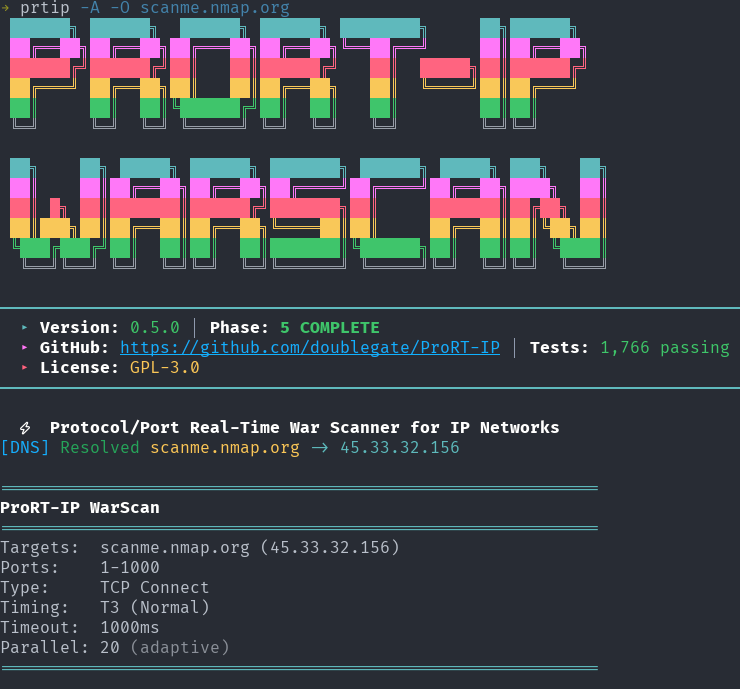
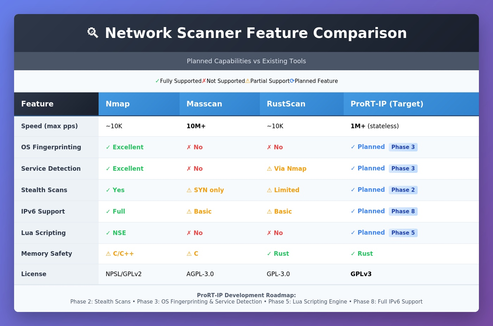

# ProRT-IP WarScan

## High-Performance Network Scanner

<div align="center">
  
</div>

[](https://github.com/doublegate/ProRT-IP/releases/tag/v1.0.0)
[](https://github.com/doublegate/ProRT-IP/actions/workflows/ci.yml)
[](https://github.com/doublegate/ProRT-IP/actions)

[](LICENSE)
[](https://www.rust-lang.org)
[](https://hub.docker.com/r/doublegate/prtip)

**Modern network scanner combining Masscan/ZMap speed with Nmap detection depth.**

---

<div align="center">
  
</div>

## Overview

**ProRT-IP WarScan** is a professional network scanning tool written in Rust that delivers:

- **Speed:** 10M+ packets/second stateless scanning (Masscan/ZMap class)
- **Depth:** Service detection and OS fingerprinting built in (a young, deliberately small probe corpus — see [Service Detection](#service-detection))
- **Safety:** Memory-safe Rust implementation prevents entire vulnerability classes
- **Stealth:** Advanced evasion techniques (timing, decoys, fragmentation, TTL manipulation, idle scans)
- **Modern TUI:** Real-time dashboard with 60 FPS rendering and 4-tab interface
- **Extensibility:** Plugin system with Lua 5.4 sandboxed execution

### Key Capabilities

| Category | Features |
|----------|----------|
| **Scanning** | TCP SYN, Connect, FIN, NULL, Xmas, ACK, Idle/Zombie, UDP |
| **Detection** | Service detection (37 probes, 226 match rules), OS fingerprinting (caller-supplied signature database) |
| **Protocol** | Full IPv4/IPv6 dual-stack, 8 UDP protocol payloads |
| **Performance** | 10M+ pps stateless, adaptive rate limiting (-1.8% overhead) |
| **Evasion** | Packet fragmentation, TTL control, decoys, timing templates (T0-T5) |
| **Output** | Text, JSON, XML, Greppable, PCAPNG, SQLite |
| **Interface** | Production CLI, 60 FPS TUI dashboard |

### Feature Comparison



*Comparison of ProRT-IP WarScan with leading network scanning tools (Nmap, Masscan, ZMap, RustScan)*

---

## Quick Start

### Installation

**Pre-built binaries** (Linux, Windows, macOS):

```bash
# Download latest release
wget https://github.com/doublegate/ProRT-IP/releases/latest/download/prtip-linux-x86_64
chmod +x prtip-linux-x86_64
sudo mv prtip-linux-x86_64 /usr/local/bin/prtip
```

**Build from source:**

```bash
git clone https://github.com/doublegate/ProRT-IP.git
cd ProRT-IP
cargo build --release
sudo setcap cap_net_raw,cap_net_admin=eip target/release/prtip
```

### Basic Usage

```bash
# SYN scan (requires privileges)
prtip -sS -p 80,443 192.168.1.0/24

# Fast scan (100-port priority list)
prtip -F 192.168.1.1

# Service detection
prtip -sV -p 1-1000 scanme.nmap.org

# TUI mode with real-time dashboard
prtip --tui -sS -p 1-1000 192.168.1.0/24
```

---

## Features

### Scan Types

ProRT-IP supports 8 scan types for comprehensive network reconnaissance:

```bash
# TCP Scans
prtip -sS -p 1-1000 target          # SYN scan (stealth, requires root)
prtip -sT -p 1-1000 target          # Connect scan (no privileges required)
prtip -sF -p 1-1000 target          # FIN scan
prtip -sN -p 1-1000 target          # NULL scan
prtip -sX -p 1-1000 target          # Xmas scan
prtip -sA -p 1-1000 target          # ACK scan (firewall detection)

# UDP Scan
prtip -sU -p 53,161,123 target      # Protocol-specific payloads

# Idle/Zombie Scan
prtip -sI zombie_ip target -p 80    # Maximum anonymity
```

### Service Detection

37 embedded protocol probes (25 TCP, 12 UDP) with 226 match rules, covering 96 distinct ports. Detection accuracy is not yet measured.

```bash
prtip -sV -p 22,80,443 target                    # Service detection
prtip -sV --version-intensity 9 target           # Aggressive probing
prtip -sV --tls-cert -p 443 target               # TLS certificate analysis
```

**Protocol-specific parsers:** HTTP, SSH, SMB, MySQL, PostgreSQL with OS version mapping.

### IPv6 Support

Complete dual-stack implementation across all scan types:

```bash
prtip -sS -p 80,443 2001:db8::1                  # IPv6 SYN scan
prtip -sS -6 example.com                         # Force IPv6 resolution
prtip --scan-type discovery 2001:db8::/64        # ICMPv6 + NDP discovery
prtip -sS -D RND:5 -p 80 2001:db8::1             # IPv6 decoy scanning
```

### Evasion Techniques

Advanced IDS/firewall evasion capabilities:

```bash
prtip -sS -f -p 1-1000 target                    # Fragment packets (28-byte)
prtip -sS --mtu 200 target                       # Custom MTU fragmentation
prtip -sS --ttl 32 target                        # TTL manipulation
prtip -sS -D RND:5 target                        # Decoy scanning (5 random)
prtip -sS -g 53 target                           # Source port spoofing (DNS)
prtip -sS --badsum target                        # Bad checksum testing
prtip -T0 -p 80 target                           # Paranoid timing (5min delays)
```

### Terminal User Interface (TUI)

Production-ready real-time dashboard with 60 FPS rendering:

```bash
prtip --tui -sS -p 1-1000 192.168.1.0/24
```

**Dashboard Features:**
- **Port Table:** Real-time port discovery with filtering (state, protocol, search)
- **Service Table:** Live service detection with confidence indicators
- **Metrics Dashboard:** Throughput, ETA, progress percentage, statistics
- **Network Graph:** 60-second sliding window activity visualization

**Performance:** 10K+ events/second, <5ms frame time, 11 production widgets.

### Output Formats

```bash
prtip -p 80 target -oN scan.txt                  # Normal text
prtip -p 80 target -oX scan.xml                  # XML (nmap-compatible)
prtip -p 80 target -oG scan.gnmap                # Greppable
prtip -p 80 target --output json -o scan.json    # JSON
prtip -sS --packet-capture capture.pcapng target # PCAPNG
prtip -sT --with-db results.db target            # SQLite database
```

### Plugin System

Lua 5.4 sandboxed plugins for custom detection and output:

```bash
prtip plugin list                                # List available plugins
prtip plugin load banner-analyzer                # Load specific plugin
prtip -sS --plugin banner-analyzer,ssl-checker target
```

**Plugin types:** Detection (banner analysis), Output (custom formatting), Scan (lifecycle hooks).

---

## Performance

### Benchmarks

| Metric | Value |
|--------|-------|
| **Stateless throughput** | 10M+ packets/second (theoretical) |
| **Stateful throughput** | 72K+ pps (localhost verified) |
| **Full port scan (65535)** | 0.91s (198x faster than baseline) |
| **Service detection overhead** | <10% |
| **Rate limiting overhead** | -1.8% (faster than no limiting) |
| **TUI rendering** | 60 FPS, <5ms frame time |

### Optimization Features

- **O(N) connection tracking:** 50-1000x speedup over naive implementation
- **Zero-copy packet building:** 15% improvement on hot path
- **Batch I/O (sendmmsg/recvmmsg):** 96.87-99.90% syscall reduction on Linux
- **NUMA optimization:** 20-30% improvement on multi-socket systems
- **Memory-mapped I/O:** 77-86% RAM reduction for large scans
- **Adaptive parallelism:** 20-1000 concurrent connections based on target count

---

## Nmap Compatibility

ProRT-IP supports nmap-style syntax for familiar operation:

```bash
# Scan types
prtip -sS -p 80,443 target          # SYN scan
prtip -sT -p 1-1000 target          # Connect scan
prtip -sU -p 53,161 target          # UDP scan

# Port specification
prtip -p- target                    # All 65535 ports
prtip -F target                     # First 100 ports of the priority list
prtip --top-ports 1000 target       # First 1000 of the same list

```

**`-F` and `--top-ports` note.** The port ordering behind these flags is an
**editorial ranking of IANA port assignments, not a measured-frequency ranking**
— ProRT-IP ships no port-frequency data, because no measured dataset it may
redistribute under GPL-3.0 exists (`nmap-services` is NPSL-licensed; scans.io and
Censys are non-commercial only). They therefore select a **different set of ports
than Nmap, Masscan or RustScan at every N**, and ProRT-IP publishes no hit-rate or
coverage figure for them. If a specific port matters, name it with `-p`. The rule
that produces the list is written out in
[`tools/gen-top-ports/RULE.md`](tools/gen-top-ports/RULE.md).

```bash
# Detection
prtip -sV target                    # Service detection
prtip -O target                     # OS fingerprinting
prtip -A target                     # Aggressive (OS + service)

# Output
prtip -oN scan.txt target           # Normal output
prtip -oX scan.xml target           # XML output
prtip -oG scan.gnmap target         # Greppable output

# Timing
prtip -T0 target                    # Paranoid
prtip -T4 target                    # Aggressive (recommended)
```

**Full compatibility matrix:** [docs/14-NMAP-COMPATIBILITY.md](docs/14-NMAP-COMPATIBILITY.md)

---

## System Requirements

### Minimum

- CPU: 2 cores @ 2.0 GHz
- RAM: 2 GB
- Storage: 100 MB
- Network: 100 Mbps

### Recommended

- CPU: 8+ cores @ 3.0 GHz
- RAM: 16 GB
- Storage: 1 GB SSD
- Network: 1 Gbps+

### Supported Platforms

| Platform | Status | Notes |
|----------|--------|-------|
| Linux x86_64 (glibc) | Production | NUMA-optimized, sendmmsg/recvmmsg |
| Windows x86_64 | Production | Requires Npcap |
| macOS Intel (x86_64) | Production | macOS 10.13+ |
| macOS Apple Silicon | Production | Native M1/M2/M3/M4 binary |
| FreeBSD x86_64 | Production | FreeBSD 12+ |

### Build Requirements

- Rust 1.85+ (MSRV for edition 2024)
- libpcap (Linux/macOS) or Npcap (Windows)
- OpenSSL development libraries
- (Optional) hwloc for NUMA optimization

---

## Building from Source

### Linux

```bash
# Install dependencies
sudo apt install libpcap-dev pkg-config      # Debian/Ubuntu
sudo dnf install libpcap-devel               # Fedora
sudo pacman -S libpcap pkgconf               # Arch

# Clone and build
git clone https://github.com/doublegate/ProRT-IP.git
cd ProRT-IP
cargo build --release

# Grant capabilities (instead of root)
sudo setcap cap_net_raw,cap_net_admin=eip target/release/prtip
```

### Windows

```bash
# Install Npcap SDK
# Download from: https://npcap.com/dist/npcap-sdk-1.13.zip
# Set environment: $env:LIB = "C:\path\to\npcap-sdk\Lib\x64;$env:LIB"

cargo build --release
```

### macOS

```bash
brew install libpcap pkgconf
git clone https://github.com/doublegate/ProRT-IP.git
cd ProRT-IP
cargo build --release
```

**Detailed instructions:** [docs/03-DEV-SETUP.md](docs/03-DEV-SETUP.md)

---

## Documentation

### User Guides

- [User Guide](docs/32-USER-GUIDE.md) - Comprehensive usage documentation (2,448 lines)
- [Examples Gallery](docs/34-EXAMPLES-GALLERY.md) - 65 practical scanning scenarios
- [Plugin System Guide](docs/30-PLUGIN-SYSTEM-GUIDE.md) - Plugin development (784 lines)

### Technical References

- [Architecture](docs/00-ARCHITECTURE.md) - System design and module relationships
- [IPv6 Guide](docs/23-IPv6-GUIDE.md) - Complete IPv6 implementation details
- [Service Detection](docs/24-SERVICE-DETECTION-GUIDE.md) - Detection engine internals
- [Rate Limiting](docs/26-RATE-LIMITING-GUIDE.md) - Adaptive rate control
- [TUI Architecture](docs/TUI-ARCHITECTURE.md) - Event-driven TUI design (891 lines)

### Development

- [Roadmap](docs/01-ROADMAP.md) - Development phases and sprint planning
- [Project Status](docs/10-PROJECT-STATUS.md) - Current progress and metrics
- [Benchmarking Guide](docs/31-BENCHMARKING-GUIDE.md) - Performance testing (1,044 lines)

### mdBook Documentation

ProRT-IP includes searchable documentation built with mdBook:

```bash
cd docs/
mdbook serve --open    # Opens browser at http://localhost:3000
```

---

## Development Roadmap

### Current Status

**Version:** v1.0.0 | **Phase 7:** COMPLETE | **Status:** Production Release

| Phase | Status | Key Deliverables |
|-------|--------|------------------|
| Phases 1-3 | Complete | Core infrastructure, scanning, detection |
| Phase 4 | Complete | Zero-copy, NUMA, performance optimization |
| Phase 5 | Complete | IPv6, service detection, idle scan, rate limiting, plugins |
| **Phase 6** | **Complete** | **TUI dashboard, network optimizations, buffer pools** |
| **Phase 7** | **Complete** | **Documentation, packaging, security audit, v1.0.0 release** |
| Phase 8 | Future | Web UI, Desktop GUI, Distributed scanning |

### Future Enhancements

- **Web Interface:** RESTful API with React/Vue frontend
- **Desktop GUI:** Native application (Tauri/iced/egui)
- **Distributed Scanning:** Coordinator/worker architecture for internet-scale operations

**Full roadmap:** [docs/01-ROADMAP.md](docs/01-ROADMAP.md)

---

## Quality Assurance

| Metric | Value |
|--------|-------|
| **Tests** | 2,557 passing (100% success rate) |
| **Coverage** | 51.40% |
| **Fuzz Testing** | 230M+ executions, 0 crashes (5 targets) |
| **CI/CD** | 9/9 workflows passing |
| **Platforms** | Linux, Windows, macOS (Intel + ARM64), FreeBSD |

---

## Contributing

We welcome contributions! See [CONTRIBUTING.md](CONTRIBUTING.md) for guidelines.

### Ways to Contribute

- **Report Bugs:** [Bug Report](https://github.com/doublegate/ProRT-IP/issues/new?template=bug_report.yml)
- **Suggest Features:** [Feature Request](https://github.com/doublegate/ProRT-IP/issues/new?template=feature_request.yml)
- **Write Code:** Check [good first issues](https://github.com/doublegate/ProRT-IP/labels/good-first-issue)
- **Improve Docs:** Documentation contributions always welcome

### Development Standards

- Run `cargo fmt` and `cargo clippy -- -D warnings` before commits
- All PRs must include tests (>80% coverage for new code)
- Follow [Conventional Commits](https://www.conventionalcommits.org/) format

---

## Security & Legal

### Security Policy

Report vulnerabilities via [GitHub Security Advisories](https://github.com/doublegate/ProRT-IP/security/advisories).

See [SECURITY.md](SECURITY.md) for full policy.

### Responsible Use

**IMPORTANT:** Only scan networks you own or have explicit written permission to test.

- Unauthorized scanning may violate laws (CFAA, CMA, etc.)
- Always obtain authorization before testing
- Use for legitimate security research only

---

## License

**GPL-3.0-or-later.** The complete licence text is in [LICENSE](LICENSE); the
copyright notice, acceptable-use terms and third-party statement are in
[NOTICE.md](NOTICE.md).

GPLv3 lets you use, study, modify and distribute this software, provided
derivative works are licensed under GPLv3 as well.

ProRT-IP vendors no third-party data files. Its service-detection corpus and its
`-F` / `--top-ports` ordering are generated from the IANA port registry and
published protocol specifications — see
[ATTRIBUTION.md](crates/prtip-core/data/ATTRIBUTION.md) for per-source provenance,
and [docs/36-REPOSITORY-HISTORY.md](docs/36-REPOSITORY-HISTORY.md) for the record
of the pre-publication history rewrite that removed previously-vendored
NPSL-covered material.

---

## Acknowledgments

ProRT-IP builds on the pioneering work of:

- **[Nmap](https://nmap.org/)** - Gordon "Fyodor" Lyon
- **[Masscan](https://github.com/robertdavidgraham/masscan)** - Robert Graham
- **[RustScan](https://github.com/RustScan/RustScan)** - RustScan Community
- **[ZMap](https://zmap.io/)** - University of Michigan

See [AUTHORS.md](AUTHORS.md) for complete contributor list.

---

## Links

- **GitHub:** <https://github.com/doublegate/ProRT-IP>
- **Issues:** <https://github.com/doublegate/ProRT-IP/issues>
- **Discussions:** <https://github.com/doublegate/ProRT-IP/discussions>
- **Security:** <https://github.com/doublegate/ProRT-IP/security/advisories>
- **Changelog:** [CHANGELOG.md](CHANGELOG.md)

---

**Current Version:** v1.0.0 | **Last Updated:** 2025-01-25
