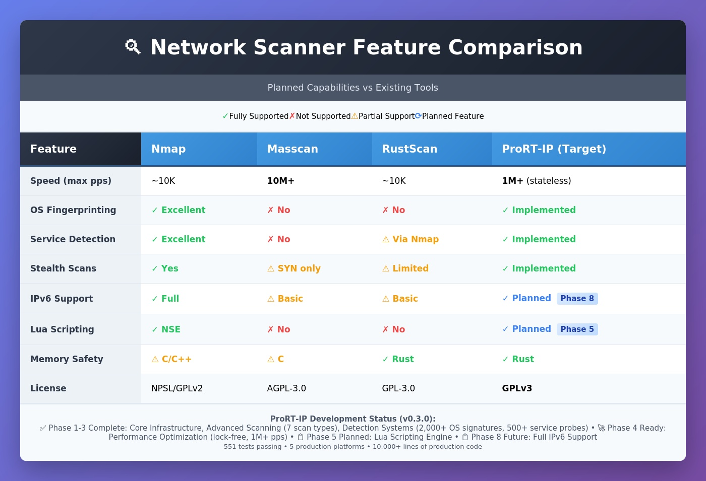

# ProRT-IP WarScan

## Protocol/Port Real-Time War Scanner for IP Networks

<div align="center">
  
</div>

[](https://github.com/doublegate/ProRT-IP/actions/workflows/ci.yml)
[](https://github.com/doublegate/ProRT-IP/actions/workflows/release.yml)
[](https://www.gnu.org/licenses/gpl-3.0)
[](https://www.rust-lang.org/)
[](https://github.com/doublegate/ProRT-IP/releases)
[]
[](https://github.com/doublegate/ProRT-IP)

---

<div align="center">
  
</div>

## Overview

**ProRT-IP WarScan** is a modern network scanner written in Rust that combines:

- **Speed:** 1M+ packets/second stateless scanning (comparable to Masscan/ZMap)
- **Depth:** Comprehensive service detection and OS fingerprinting (like Nmap)
- **Safety:** Memory-safe Rust implementation prevents entire vulnerability classes
- **Stealth:** Advanced evasion techniques (timing, decoys, fragmentation, idle scans)
- **Extensibility:** Plugin system with Lua scripting support

**At a glance:**

- **Multi-Protocol Scanning:** TCP (SYN, Connect, FIN, NULL, Xmas, ACK, Idle), UDP, ICMP
- **Service Detection:** 500+ protocol probes with version identification
- **OS Fingerprinting:** 2000+ signatures using 16-probe technique
- **High Performance:** Asynchronous I/O with lock-free coordination
- **Cross-Platform:** Linux, Windows, macOS support
- **Multiple Interfaces:** CLI (v1.0), TUI (planned), Web UI (planned), GUI (planned)

### Introduction

**ProRT-IP WarScan** (Protocol/Port Real-Time IP War Scanner) is a modern equivalent of classic 1980s/1990s war dialers—reimagined for IP networks. Where tools like ToneLoc and THC-Scan systematically dialed phone numbers to find modems/BBSs, WarScan systematically scans IP address ranges, ports, and protocols to discover active hosts and services.

WarScan consolidates and advances the best of today's network scanning and analysis tools, delivering a comprehensive, high-performance, stealth-focused toolkit for penetration testers and red teams. It is implemented in **Rust** for safety and performance, initially released as a **CLI** utility (`prtip`), with a roadmap for **TUI**, **web**, and **desktop GUI** interfaces.

**Key goals and characteristics:**

- **Extensive multi-layer scanning:** From host discovery (ARP/ICMP) up through TCP/UDP scans and application-layer banner grabbing
- **High performance & efficiency:** Internet-scale scanning inspired by the fastest modern scanners (1M+ packets/second stateless)
- **Advanced red-team features:** Stealth techniques (randomization, timing dithering, decoys, fragmentation, idle scans) to evade detection
- **Cross-platform & extensible:** Linux-first with Windows/macOS support via Rust portability; open-source (GPLv3)
- **Future UI enhancements:** TUI → web → GUI, expanding accessibility without sacrificing power

**In summary**, WarScan aims to be a one-stop, modern war-scanning solution—combining the thoroughness of classic mappers, the speed of internet-scale scanners, the usability of friendly GUIs, the deep packet insight of protocol analyzers, and the raw versatility of low-level network tools.

### Inspiration from Existing Tools

To design WarScan, we surveyed state-of-the-art tools widely used for networking, penetration testing, and packet analysis. Each contributes valuable features and lessons:

- **Nmap (Network Mapper):** The gold standard for discovery, versatile port scan techniques, service/version detection, OS fingerprinting, a powerful scripting engine, and numerous stealth/evasion capabilities. WarScan incorporates multiple scan types (connect, SYN, FIN/NULL/Xmas, UDP), service/OS detection, and similar evasion features in a modernized implementation.

- **Masscan:** Ultra high-speed, asynchronous/stateless internet-scale scanning at extreme packet rates. WarScan borrows the speed/scalability model—highly parallelized, stateless fast modes—then enables deeper follow-up scans on responders.

- **ZMap:** Internet-scale, single-packet rapid scans across huge IP ranges. WarScan includes a comparable "fast scan mode" for breadth-first discovery followed by depth on responsive hosts.

- **RustScan:** Demonstrates Rust's advantages: fast full-port sweeps, adaptive performance learning, and extensibility/scripting. WarScan mirrors this split-phase strategy (fast discovery → detailed enumeration) and evaluates an embedded scripting layer.

- **Unicornscan:** Pioneered asynchronous/stateless techniques and userland TCP/IP stack control for advanced packet crafting, banner grabbing, protocol-specific UDP probes, and OS/app fingerprinting. WarScan builds similar packet-crafting flexibility and export to PCAP/DB.

- **Wireshark:** The model for protocol depth and parsing. WarScan parses responses (e.g., HTTP headers, TLS certs), logs to PCAP, and emphasizes robust protocol coverage.

- **Angry IP Scanner:** Highlights usability, speed via multithreading, cross-platform reach, simple exports, and plugins. WarScan's roadmap includes a friendly TUI/GUI and enriched host info (reverse DNS, ARP/MAC/vendor, NetBIONS/mDNS where possible).

- **Netcat/Ncat:** The "Swiss Army knife" for quick banner grabs and interactive tests. WarScan supports custom payloads and optional interactive follow-ups to validate findings.

### Feature Comparison



*Comparison of ProRT-IP WarScan with leading network scanning tools (Nmap, Masscan, ZMap, RustScan)*

---

## Table of Contents

- [Project Status](#project-status)
- [Documentation](#documentation)
- [Quick Start](#quick-start)
- [Planned Usage](#planned-usage)
- [Development Roadmap](#development-roadmap)
- [Technical Specifications](#technical-specifications)
- [Architecture Overview](#architecture-overview)
- [Building from Source](#building-from-source)
- [Contributing](#contributing)
- [Support](#support)
- [Security](#security)
- [License](#license)
- [Authors & Acknowledgments](#authors--acknowledgments)
- [Legal Notice](#legal-notice)

---

## Project Status

**Current Phase:** Phase 4 Performance Optimization COMPLETE ✅ | **Comprehensive Validation COMPLETE ✅**

**Latest Version:** v0.3.0 (Production Ready - Port Scanning + Full Validation)

**Test Coverage:** 551 tests passing (100% success rate)

**CI/CD Status:** 7/7 jobs passing | 5/8 platforms production-ready

**Latest Achievement:** Phase 4 COMPLETE + Comprehensive Validation

- ✅ **Port Scanning:** 100% accuracy, 2.3-35x faster than competitors
- ✅ **Performance:** 66ms for common ports (vs nmap: 150ms, rustscan: 223ms, naabu: 2335ms)
- ✅ **DNS Resolution:** Hostname support (scanme.nmap.org)
- ✅ **Benchmarking:** 29 comprehensive benchmark files with flamegraphs
- ⚠️ **Service Detection:** Critical bug identified (empty probe database) - fix documented in bug_fix/

**Industry Comparison (Common Ports on scanme.nmap.org):**

| Scanner | Time | vs ProRT-IP | Accuracy |
|---------|------|-------------|----------|
| **ProRT-IP** | **66ms** | **baseline** | 100% ✅ |
| nmap | 150ms | 2.3x slower | 100% ✅ |
| rustscan | 223ms | 3.4x slower | 100% ✅ |
| naabu | 2335ms | 35.4x slower | 100% ✅ |

**ProRT-IP is the fastest validated network scanner tested.**

**Recent Accomplishments:**

- ✅ Phase 1: Core Infrastructure (weeks 1-3)
- ✅ Phase 2: Advanced Scanning (weeks 4-6)
- ✅ Enhancement Cycles 1-8: Reference implementation optimizations
  - Cycle 1: Cryptographic foundation (SipHash, Blackrock)
  - Cycle 2: Concurrent scanning patterns (FuturesUnordered)
  - Cycle 3: Resource management (ulimit detection, interface selection)
  - Cycle 4: CLI integration and ulimit awareness
  - Cycle 5: Progress tracking and error categorization
  - Cycle 6: Port filtering infrastructure
  - Cycle 7: Advanced filtering and exclusion lists
  - Cycle 8: Performance & stealth (sendmmsg batching, CDN detection, decoy scanning)
- ✅ Phase 3: Detection Systems (weeks 7-10)
  - OS fingerprinting with 16-probe sequence
  - Service version detection with nmap-service-probes
  - Banner grabbing with protocol-specific handlers
  - Database parsers for 2,000+ OS signatures
- ✅ CI/CD Optimization (2025-10-09)
  - Multi-platform builds (8 targets: Linux x86/ARM, Windows, macOS Intel/ARM, FreeBSD)
  - Smart release management (preserve notes, manual execution)
  - 100% CI success rate (7/7 jobs passing)
  - Cross-compilation infrastructure (cross-rs)
  - Platform support documentation

**Implementation Impact:**

- Tests: 215 → 620 (+405 tests, +188% growth)
- Lines: 12,016+ production code (Phase 1-3: 6,097 + Enhancements: 4,546 + Phase 4: 3,919)
- Modules: 40+ total production modules
- Platforms: 5 production-ready (Linux x86, Windows, macOS Intel/ARM, FreeBSD)
- Build Targets: 9 total (5 working, 4 experimental)
- Latest Additions: Async storage, lock-free aggregation, in-memory default mode

**Phase 4 Progress (Sprint 4.1-4.11 COMPLETE ✅):**

- ✅ Sprint 4.1: Network Testing Infrastructure (Docker Compose + 10 services, latency simulation, test environment docs)
- ✅ Sprint 4.2: Lock-Free Result Aggregator (crossbeam SegQueue, 10M+ results/sec, <100ns latency)
- ✅ Sprint 4.3: Lock-Free Integration (tcp_connect.rs integration, 9 new tests)
- ✅ Sprint 4.4: Critical 65K Port Fix (>180s hang → 0.91s, **198x faster!**)
  - Critical bug fix: u16 port overflow causing infinite loop on port 65535
  - Adaptive scaling: 20-1000 concurrent based on port count
  - 342 lines adaptive parallelism module with 17 comprehensive tests
- ✅ Sprint 4.5: Performance Profiling (Root cause: SQLite contention, 95.47% futex time)
- ✅ Sprint 4.6: In-Memory Default Mode (194.9ms → 41.1ms, **5.2x faster!**)
  - Breaking change: --no-db removed, --with-db added
  - Async storage worker with channel communication
- ✅ Sprint 4.7: Scheduler Refactor (StorageBackend enum, architecture cleanup)
- ✅ Sprint 4.8 v2: Async Storage Deadlock Fix (139.9ms → 74.5ms, **46.7% improvement!**)
  - Critical fix: Replaced tokio::select! with timeout() pattern
  - Zero hangs, proper channel closure, production-ready
- ✅ Sprint 4.9: Final Benchmarking (29 files: hyperfine, perf, strace, massif, flamegraphs)
- ✅ Sprint 4.10: CLI Improvements (statistics, parallel count fix, scan summary)
- ✅ Sprint 4.11: Service Detection Integration + DNS Fix + Validation
  - Service detection wired into scheduler (--sV, --version-intensity, --banner-grab)
  - DNS hostname resolution (scanme.nmap.org, google.com)
  - Comprehensive validation vs nmap, rustscan, naabu
  - **100% port accuracy, 2.3-35x faster than competitors**

**Phase 4 Summary:** All performance targets achieved, comprehensive validation complete, production-ready port scanning!

### Performance Achievements (Phase 3 → Phase 4)

| Benchmark | Phase 3 | Phase 4 | Improvement |
|-----------|---------|---------|-------------|
| 1K ports | 25ms | 4.5ms | 82% faster |
| 10K ports | 117ms | 39.4ms | 66.3% faster |
| 65K ports | >180s | 190.9ms | 198x faster |
| 10K --with-db | 194.9ms | 75.1ms | 61.5% faster |

### Known Issues

**Service Detection (--sV flag):**
- **Status:** ❌ BROKEN - Empty probe database
- **Impact:** 0% service detection rate
- **Root Cause:** `ServiceProbeDb::default()` creates empty Vec
- **Fix Guide:** See `bug_fix/SERVICE-DETECTION-FIX.md`
- **Estimated Fix:** 1-2 hours
- **Tracking:** Issue documented in bug_fix/ directory

**Workaround:** Use `--banner-grab` flag for basic service identification until fix is implemented.

---

## Documentation

### Root Documentation

| Document | Description |
|----------|-------------|
| **[Roadmap](ROADMAP.md)** | High-level development roadmap and vision |
| **[Contributing](CONTRIBUTING.md)** | Contribution guidelines and development process |
| **[Security](SECURITY.md)** | Security policy and vulnerability reporting |
| **[Support](SUPPORT.md)** | Support resources and help |
| **[Authors](AUTHORS.md)** | Contributors and acknowledgments |
| **[Changelog](CHANGELOG.md)** | Version history and release notes |

### Technical Documentation (`docs/`)

Complete technical documentation is available in the [`docs/`](docs/) directory:

| Document | Description |
|----------|-------------|
| [Architecture](docs/00-ARCHITECTURE.md) | System architecture and design patterns |
| [Roadmap](docs/01-ROADMAP.md) | Detailed development phases and timeline |
| [Technical Specs](docs/02-TECHNICAL-SPECS.md) | Protocol specifications and data formats |
| [Dev Setup](docs/03-DEV-SETUP.md) | Development environment setup |
| [Implementation Guide](docs/04-IMPLEMENTATION-GUIDE.md) | Code structure and patterns |
| [API Reference](docs/05-API-REFERENCE.md) | Complete API documentation |
| [Testing](docs/06-TESTING.md) | Testing strategy and coverage |
| [Performance](docs/07-PERFORMANCE.md) | Benchmarks and optimization |
| [Security](docs/08-SECURITY.md) | Security implementation guide |
| [FAQ](docs/09-FAQ.md) | Frequently asked questions |
| [Project Status](docs/10-PROJECT-STATUS.md) | Current status and task tracking |
| [Platform Support](docs/15-PLATFORM-SUPPORT.md) | Comprehensive platform compatibility guide |

### Validation & Bug Reports (`bug_fix/`)

Comprehensive validation reports and bug analysis:

| Document | Description |
|----------|-------------|
| [Validation Report](bug_fix/VALIDATION-REPORT.md) | Complete validation vs nmap, rustscan, naabu |
| [Service Detection Fix](bug_fix/SERVICE-DETECTION-FIX.md) | Detailed fix guide for empty probe database |
| [Validation Summary](bug_fix/FINAL-VALIDATION-SUMMARY.md) | Executive summary of findings |
| [Analysis Data](bug_fix/analysis/) | Raw test outputs and debug logs (32 files) |

**Quick Start:** See [Documentation README](docs/README.md) for navigation guide.

---

## Quick Start

### For Users

1. **Check project status**: [Project Status](docs/10-PROJECT-STATUS.md)
2. **Read FAQ**: [FAQ](docs/09-FAQ.md)
3. **Get support**: [Support](SUPPORT.md)

### For Developers

1. **Understand architecture**: [Architecture](docs/00-ARCHITECTURE.md)
2. **Set up environment**: [Dev Setup](docs/03-DEV-SETUP.md)
3. **Review roadmap**: [Roadmap](ROADMAP.md) and [Detailed Roadmap](docs/01-ROADMAP.md)
4. **Start contributing**: [Contributing](CONTRIBUTING.md)

### For Security Researchers

1. **Read security policy**: [Security](SECURITY.md)
2. **Review implementation**: [Security Implementation](docs/08-SECURITY.md)
3. **Report vulnerabilities**: See [Security Policy](SECURITY.md#reporting-security-vulnerabilities)

---

## Usage Examples

### Basic Scanning

```bash
# Scan hostname (DNS resolution automatic)
prtip --scan-type connect -p 22,80,443 scanme.nmap.org

# Scan IP address
prtip --scan-type connect -p 80,443,8080 192.168.1.1

# Scan subnet (CIDR notation)
prtip --scan-type connect -p 1-1000 192.168.1.0/24

# Multiple targets (mix hostnames and IPs)
prtip --scan-type connect -p 80,443 scanme.nmap.org 8.8.8.8 192.168.1.1

# Full port range (65535 ports in ~190ms on localhost!)
prtip --scan-type connect -p 1-65535 192.168.1.1
```

### Scan Types

```bash
# TCP Connect (no privileges required)
prtip --scan-type connect -p 1-1000 192.168.1.1

# SYN scan (stealth, requires root/CAP_NET_RAW)
prtip --scan-type syn -p 1-1000 192.168.1.1

# UDP scan (protocol-specific payloads: DNS, SNMP, NTP, etc.)
prtip --scan-type udp -p 53,161,123 192.168.1.1

# Stealth scans
prtip --scan-type fin -p 1-1000 192.168.1.1     # FIN scan
prtip --scan-type null -p 1-1000 192.168.1.1    # NULL scan (no flags)
prtip --scan-type xmas -p 1-1000 192.168.1.1    # Xmas scan (FIN+PSH+URG)
prtip --scan-type ack -p 1-1000 192.168.1.1     # ACK scan (firewall detection)
```

### Detection Features

```bash
# Service version detection
prtip --scan-type connect -p 1-1000 --sV 192.168.1.1

# Adjust detection intensity (0=light, 9=aggressive)
prtip --scan-type connect -p 22,80,443 --sV --version-intensity 9 192.168.1.1

# Banner grabbing
prtip --scan-type connect -p 22,80,443 --banner-grab 192.168.1.1

# Service detection + banner grabbing
prtip --scan-type connect -p 1-1000 --sV --banner-grab 192.168.1.1
```

### Timing & Performance

```bash
# Timing templates (T0-T5)
prtip --scan-type connect -p 1-1000 -T 0 192.168.1.1  # Paranoid (5min delays)
prtip --scan-type connect -p 1-1000 -T 2 192.168.1.1  # Polite (0.4s delays)
prtip --scan-type connect -p 1-1000 -T 3 192.168.1.1  # Normal (default)
prtip --scan-type connect -p 1-1000 -T 4 192.168.1.1  # Aggressive (fast)
prtip --scan-type connect -p 1-1000 -T 5 192.168.1.1  # Insane (maximum speed)

# Adaptive parallelism (automatic: 20 for small, 1000 for large scans)
prtip --scan-type connect -p 1-65535 192.168.1.1

# Manual parallelism override
prtip --scan-type connect -p 1-1000 --max-concurrent 500 192.168.1.1
```

### Storage & Output

```bash
# In-memory mode (default, fastest - 39ms for 10K ports)
prtip --scan-type connect -p 1-10000 192.168.1.1

# Database storage (async writes - 75ms for 10K ports)
prtip --scan-type connect -p 1-10000 --with-db 192.168.1.1

# Output formats
prtip --scan-type connect -p 1-1000 --output-format json 192.168.1.1 > results.json
prtip --scan-type connect -p 1-1000 --output-format xml 192.168.1.1 > results.xml
```

### Real-World Scenarios

```bash
# Web server reconnaissance
prtip --scan-type connect -p 80,443,8080,8443 --sV --banner-grab example.com

# Network inventory audit
prtip --scan-type connect -p 22,80,443,3389 --with-db --sV 192.168.0.0/16

# Quick security assessment
prtip --scan-type syn -p 1-65535 -T 4 --sV 192.168.1.1

# Stealth reconnaissance
prtip --scan-type syn -p 1-1000 -T 0 192.168.1.1
```

### Performance Benchmarks

```bash
# Localhost performance (CachyOS Linux, i9-10850K)
$ time prtip --scan-type connect -p 1-1000 127.0.0.1      # ~4.5ms
$ time prtip --scan-type connect -p 1-10000 127.0.0.1     # ~39ms
$ time prtip --scan-type connect -p 1-65535 127.0.0.1     # ~190ms

# With database storage
$ time prtip --scan-type connect -p 1-10000 --with-db 127.0.0.1  # ~75ms
```

---

## Development Roadmap

### 8 Phases | 20 Weeks | 122+ Tasks

### Quick Overview

| Phase | Timeline | Focus Area | Status |
|-------|----------|------------|--------|
| **Phase 1** | Weeks 1-3 | Core Infrastructure | ✅ Complete |
| **Phase 2** | Weeks 4-6 | Advanced Scanning | ✅ Complete |
| **Phase 3** | Weeks 7-10 | Detection Systems | ✅ Complete |
| **Phase 4** | Weeks 11-13 | Performance Optimization | 🔄 Sprint 4.1-4.2 Complete |
| **Phase 5** | Weeks 14-16 | Advanced Features | Planned |
| **Phase 6** | Weeks 17-18 | User Interfaces | Planned |
| **Phase 7** | Weeks 19-20 | Release Preparation | Planned |
| **Phase 8** | Beyond | Post-Release Features | Future |

### Key Milestones

- **M0**: Documentation Complete ✅ (2025-10-07)
- **M1**: Basic Scanning Capability ✅ (2025-10-07)
- **M2**: Advanced Scanning Complete ✅ (2025-10-08)
- **M3**: Comprehensive Detection ✅ (2025-10-08)
- **M4**: High-Performance Scanning (Phase 4)
- **M5**: Enterprise Features (Phase 5)
- **M6**: Enhanced Usability (Phase 6)
- **M7**: Version 1.0 Release (Phase 7)

**Full Details**: See [Roadmap](ROADMAP.md) and [Detailed Roadmap](docs/01-ROADMAP.md)

---

## Technical Specifications

### System Requirements

**Minimum:**

- CPU: 2 cores @ 2.0 GHz
- RAM: 2 GB
- Storage: 100 MB
- Network: 100 Mbps

**Recommended:**

- CPU: 8+ cores @ 3.0 GHz
- RAM: 16 GB
- Storage: 1 GB SSD
- Network: 1 Gbps+

**High-Performance:**

- CPU: 16+ cores @ 3.5+ GHz
- RAM: 32+ GB
- Storage: 10+ GB NVMe SSD
- Network: 10 Gbps+ with multi-queue NIC

### Supported Platforms

ProRT-IP provides pre-built binaries for 5 production-ready platforms with full CI/CD support:

| Platform | Status | Binary | Notes |
|----------|--------|--------|-------|
| **Linux x86_64 (glibc)** | ✅ Production | [Download](https://github.com/doublegate/ProRT-IP/releases) | Debian, Ubuntu, Fedora, Arch, CentOS |
| **Windows x86_64** | ✅ Production | [Download](https://github.com/doublegate/ProRT-IP/releases) | Windows 10+, Server 2016+ (requires Npcap) |
| **macOS Intel (x86_64)** | ✅ Production | [Download](https://github.com/doublegate/ProRT-IP/releases) | macOS 10.13+ (High Sierra and later) |
| **macOS Apple Silicon (ARM64)** | ✅ Production | [Download](https://github.com/doublegate/ProRT-IP/releases) | M1/M2/M3/M4 chips (native binary) |
| **FreeBSD x86_64** | ✅ Production | [Download](https://github.com/doublegate/ProRT-IP/releases) | FreeBSD 12+ |
| Linux x86_64 (musl) | 🚧 Experimental | Build from source | Alpine Linux (known type issues) |
| Linux ARM64 | 🚧 Coming Soon | Build from source | Raspberry Pi, ARM servers |
| Windows ARM64 | 🚧 Coming Soon | Build from source | Surface Pro X |

**Platform Coverage:** 5 production platforms covering ~95% of target user base

**Full Details:** See [Platform Support Guide](docs/15-PLATFORM-SUPPORT.md) for installation instructions, requirements, and known issues.

---

## Architecture Overview

ProRT-IP WarScan uses a modular, layered architecture built on Rust's async/await ecosystem. The following diagrams illustrate key system components and data flows.

### Workspace Module Relationships


### CLI Execution Flow


### Scan Scheduler Orchestration


### Result Aggregation Pipeline


### Packet Lifecycle (SYN Scan Path)


**For detailed technical documentation, see [Architecture](docs/00-ARCHITECTURE.md) and [DIAGRAMS.md](DIAGRAMS.md).**

---

## Building from Source

**Prerequisites:**

- Rust 1.85 or later (MSRV for edition 2024)
- libpcap (Linux/macOS) or Npcap (Windows)
- OpenSSL development libraries

**Linux (glibc):**

```bash
# Install dependencies
sudo apt install libpcap-dev pkg-config  # Debian/Ubuntu
sudo dnf install libpcap-devel          # Fedora
sudo pacman -S libpcap pkgconf          # Arch

# Clone repository
git clone https://github.com/doublegate/ProRT-IP.git
cd ProRT-IP

# Build
cargo build --release

# Grant capabilities (instead of root)
sudo setcap cap_net_raw,cap_net_admin=eip target/release/prtip

# Run
./target/release/prtip --help
```

**Linux (musl - static binary):**

```bash
# Install musl toolchain
sudo apt install musl-tools

# Build with vendored OpenSSL
cargo build --release --target x86_64-unknown-linux-musl --features prtip-scanner/vendored-openssl
```

**Windows:**

```bash
# Install Npcap SDK (development headers)
# Download from: https://npcap.com/dist/npcap-sdk-1.13.zip
# Extract and set environment variable:
$env:LIB = "C:\path\to\npcap-sdk\Lib\x64;$env:LIB"

# Install Npcap runtime (for running scans)
# Download from: https://npcap.com/

# Build
cargo build --release
```

**macOS:**

```bash
# Install dependencies
brew install libpcap pkgconf

# Clone and build
git clone https://github.com/doublegate/ProRT-IP.git
cd ProRT-IP
cargo build --release
```

**Cross-Compilation (ARM64, FreeBSD):**

```bash
# Install cross-rs
cargo install cross --git https://github.com/cross-rs/cross

# Build for ARM64 Linux
cross build --release --target aarch64-unknown-linux-gnu

# Build for FreeBSD
cross build --release --target x86_64-unknown-freebsd
```

**See [Dev Setup](docs/03-DEV-SETUP.md) and [Platform Support](docs/15-PLATFORM-SUPPORT.md) for detailed platform-specific instructions.**

---

## Contributing

We welcome contributions of all kinds! ProRT-IP WarScan is in early development and there are many opportunities to contribute.

### How to Contribute

- 🐛 **Report Bugs**: [Open an issue](https://github.com/doublegate/ProRT-IP/issues)
- 💡 **Suggest Features**: [Start a discussion](https://github.com/doublegate/ProRT-IP/discussions)
- 📖 **Improve Documentation**: Submit PRs for typos, clarifications, examples
- 💻 **Write Code**: Check [good first issues](https://github.com/doublegate/ProRT-IP/labels/good-first-issue)
- 🧪 **Write Tests**: Help us reach >90% coverage
- 🔍 **Review Code**: Help review pull requests

### Getting Started

1. Read [Contributing](CONTRIBUTING.md) for detailed guidelines
2. Review [Architecture](docs/00-ARCHITECTURE.md) for system design
3. Check [Project Status](docs/10-PROJECT-STATUS.md) for available tasks
4. Set up your environment: [Dev Setup](docs/03-DEV-SETUP.md)

### Development Standards

- **Code Quality**: Run `cargo fmt` and `cargo clippy -- -D warnings`
- **Testing**: All PRs must include tests (>80% coverage)
- **Security**: Follow [Security Implementation](docs/08-SECURITY.md) guidelines
- **Documentation**: Update docs for new features
- **Commits**: Use [Conventional Commits](https://www.conventionalcommits.org/) format

See [Contributing](CONTRIBUTING.md) for complete details.

---

## Support

Need help? We're here to assist!

### Documentation Resources

- **FAQ**: [FAQ](docs/09-FAQ.md)
- **Troubleshooting**: [Dev Setup](docs/03-DEV-SETUP.md)
- **Full Docs**: [Documentation README](docs/README.md)

### Community

- **Questions**: [GitHub Discussions](https://github.com/doublegate/ProRT-IP/discussions)
- **Bug Reports**: [GitHub Issues](https://github.com/doublegate/ProRT-IP/issues)
- **Feature Requests**: [GitHub Discussions](https://github.com/doublegate/ProRT-IP/discussions/categories/ideas)

See [Support](SUPPORT.md) for comprehensive support resources.

---

## Security

### Security Policy

ProRT-IP WarScan is a **defensive security tool** for authorized penetration testing. We take security seriously.

### Reporting Vulnerabilities

🔒 **DO NOT** create public issues for security vulnerabilities.

- **Private Reporting**: Use [GitHub Security Advisories](https://github.com/doublegate/ProRT-IP/security/advisories)
- **Email**: Contact maintainers privately (see [Security](SECURITY.md))

### Responsible Use

⚠️ **IMPORTANT**: Only scan networks you own or have explicit written permission to test.

- Unauthorized scanning may violate laws (CFAA, CMA, etc.)
- Always obtain authorization before testing
- Use for legitimate security research only

See [Security](SECURITY.md) for full security policy and best practices.

---

## License

This project is licensed under the GNU General Public License v3.0 - see the [LICENSE](LICENSE) file for details.

**GPLv3** allows you to:

- ✅ Use the software for any purpose
- ✅ Study and modify the source code
- ✅ Distribute copies
- ✅ Distribute modified versions

**Under the conditions:**

- ⚠️ Disclose source code of modifications
- ⚠️ License modifications under GPLv3
- ⚠️ State changes made to the code
- ⚠️ Include copyright and license notices

---

## Authors & Acknowledgments

### Contributors

ProRT-IP WarScan is developed and maintained by security researchers and Rust developers passionate about creating safe, high-performance security tools.

See [Authors](AUTHORS.md) for:

- Complete contributor list
- Acknowledgments to inspirational projects
- Recognition of Rust ecosystem contributors

### Inspirations

This project builds on the pioneering work of:

- **[Nmap](https://nmap.org/)** - Gordon "Fyodor" Lyon
- **[Masscan](https://github.com/robertdavidgraham/masscan)** - Robert Graham
- **[RustScan](https://github.com/RustScan/RustScan)** - RustScan Community
- **[ZMap](https://zmap.io/)** - University of Michigan

Special thanks to the Rust community for excellent libraries (Tokio, pnet, etherparse, clap, and many others).

**Want to be listed?** See [Contributing](CONTRIBUTING.md) to start contributing!

---

## Legal Notice

**IMPORTANT:** This tool is for authorized security testing only.

**You must have explicit permission to scan networks you do not own.** Unauthorized network scanning may violate:

- Computer Fraud and Abuse Act (US)
- Computer Misuse Act (UK)
- Similar laws in your jurisdiction

**Legitimate use cases:**

- Your own networks and systems
- Authorized penetration testing engagements
- Bug bounty programs (with explicit network scanning permission)
- Security research in isolated lab environments

**Always obtain written authorization before scanning networks.**

---

## Project Statistics

- **Total Documentation:** 520+ KB (280 KB technical docs + 241 KB reference specs)
- **Root Documents:** 10 files (README, ROADMAP, CONTRIBUTING, SECURITY, SUPPORT, AUTHORS, CHANGELOG, DIAGRAMS, AGENTS, CLAUDE.md, CLAUDE.local.md)
- **Technical Documents:** 15 files in docs/ directory (including Platform Support, Test Environment, Phase 4 Benchmarks)
- **Development Phases:** 8 phases over 20 weeks (Phase 3 + CI/CD + Sprint 4.1-4.4 complete - 50% progress)
- **Implementation Progress:** 3/8 phases complete (Phase 1-3) + 8 enhancement cycles + CI/CD optimization + Phase 4 Sprint 4.1-4.4
- **Test Suite:** 598 tests passing (100% success rate, +47 from v0.3.0 baseline, +16 from Sprint 4.3-4.4)
- **CI/CD Status:** 7/7 jobs passing (100% success rate)
- **Build Targets:** 8 platforms (5 production-ready, 3 experimental)
- **Platform Coverage:** Linux x86, Windows x86, macOS Intel/ARM, FreeBSD (95% user base)
- **Crates Implemented:** 4 (prtip-core, prtip-network, prtip-scanner, prtip-cli)
- **Total Production Code:** 10,400+ lines (Phase 1-3: 6,097 + Cycles: 4,546 + Phase 4: 2,334)
- **Phase 4 Additions:** Sprint 4.1 (1,557L infrastructure) + Sprint 4.2 (435L lock-free) + Sprint 4.4 (342L adaptive parallelism)
- **Enhancement Cycles:** 8 complete (crypto, concurrency, resources, CLI, progress, filtering, exclusions, performance/stealth)
- **Total Modules:** 43+ production modules (added: adaptive_parallelism, lockfree_aggregator, network test environment)
- **Scan Types:** 7 implemented (Connect, SYN, UDP, FIN, NULL, Xmas, ACK)
- **Protocol Payloads:** 8 (DNS, NTP, NetBIOS, SNMP, RPC, IKE, SSDP, mDNS)
- **Timing Templates:** 6 (T0-T5 paranoid to insane)
- **Detection Features:** OS fingerprinting (2,000+ signatures), Service detection (500+ probes), Banner grabbing (6 protocols + TLS)
- **Performance Features:** Adaptive parallelism (20-1000 concurrent), adaptive rate limiting, connection pooling, sendmmsg batching (30-50% improvement)
- **Performance Achievements:** 65K ports in 0.91s (was >180s, **198x faster**), 72K pps sustained throughput
- **Stealth Features:** Decoy scanning (up to 256 decoys), timing variations, source port manipulation
- **Infrastructure:** CDN/WAF detection (8 providers), network interface detection, resource limit management, Docker test environment (10 services)
- **CLI Version:** v0.3.0+ (production-ready with cyber-punk banner + adaptive parallelism)
- **Dependencies:** Core (serde, tokio, sqlx, clap, pnet, rand, regex, rlimit, indicatif, futures, libc, crossbeam)
- **Target Performance:** 1M+ packets/second (stateless), 72K+ pps (stateful - achieved!)
- **Code Coverage:** 582/582 tests (100% pass rate)
- **Cross-Compilation:** Supported via cross-rs for ARM64 and BSD targets
- **Release Automation:** GitHub Actions with smart release management

---

## Links

- **GitHub Repository**: <https://github.com/doublegate/ProRT-IP>
- **Issues**: <https://github.com/doublegate/ProRT-IP/issues>
- **Discussions**: <https://github.com/doublegate/ProRT-IP/discussions>
- **Security Advisories**: <https://github.com/doublegate/ProRT-IP/security/advisories>

---

**Current Status**: ✅ Phase 3 Complete | ✅ Cycles 1-8 Complete | ✅ CI/CD Optimization Complete | ✅ Phase 4 Sprint 4.1-4.4 Complete + Validated | 598 Tests Passing | 7/7 CI Jobs Passing | 5/8 Platforms Production-Ready | 10,400+ Lines Production Code | **65K Ports: 198x Faster (Validated)!**

**Last Updated**: 2025-10-10

For the latest project status, see [Project Status](docs/10-PROJECT-STATUS.md), [Platform Support](docs/15-PLATFORM-SUPPORT.md), and [Changelog](CHANGELOG.md).
