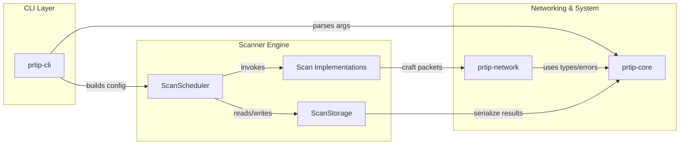
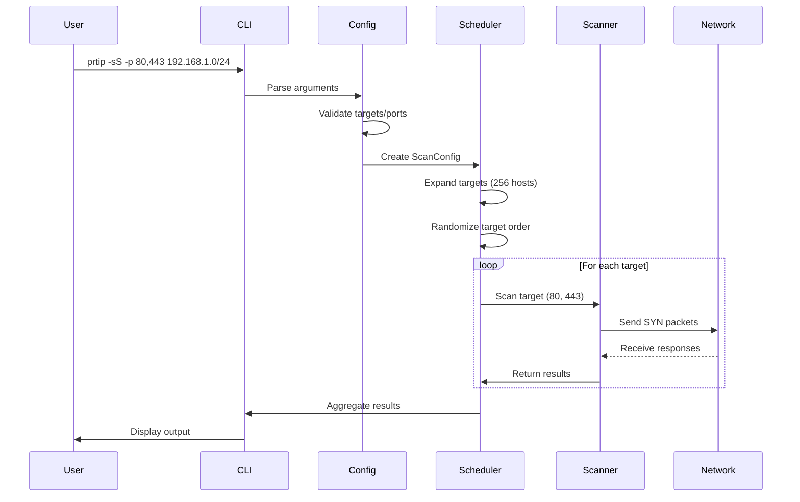
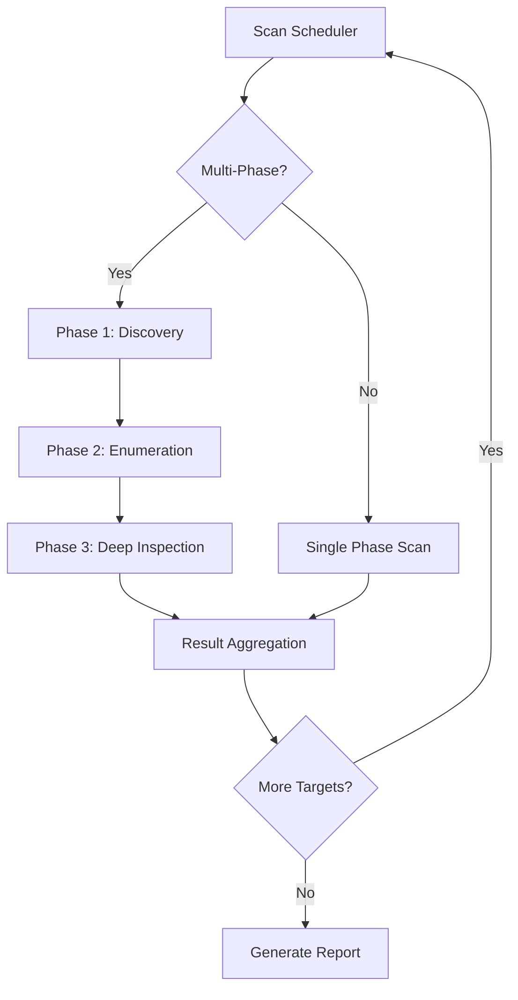
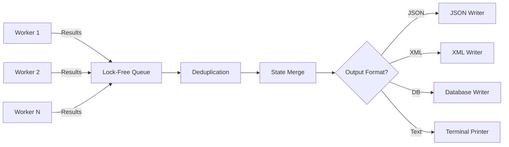
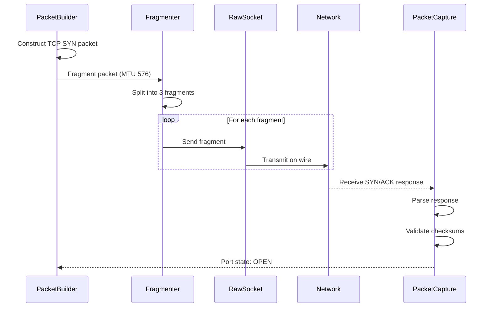

# Architecture Overview

Comprehensive system architecture, component design, and data flow documentation for ProRT-IP developers.

## Overview

ProRT-IP WarScan is a modern, high-performance network reconnaissance tool written in Rust that combines the speed of Masscan (10M+ packets/second), the depth of Nmap's service detection, and the safety of memory-safe implementation.

**Core Architecture Principles:**
- **Modular Design:** Independent, testable components with clear interfaces
- **Asynchronous by Default:** Tokio runtime with non-blocking I/O
- **Zero-Copy Optimizations:** Minimal memory allocations in hot paths
- **Type Safety:** Compile-time state enforcement via Rust's type system
- **Progressive Enhancement:** Core functionality works without privileges; raw packets enhance capabilities

## System Architecture

ProRT-IP uses a modular, layered architecture built on Rust's async/await ecosystem.

### 5-Layer Architecture Stack

```
┌──────────────────────────────────────────────────────────┐
│                      User Interface Layer                │
│  (CLI Args Parser, TUI Dashboard, Web API, Desktop GUI)  │
└────────────────────────┬─────────────────────────────────┘
                         │
┌────────────────────────▼───────────────────────────────┐
│                    Orchestration Layer                 │
│  ┌──────────────┐  ┌──────────────┐  ┌──────────────┐  │
│  │   Scanner    │  │   Rate       │  │   Result     │  │
│  │   Scheduler  │  │   Controller │  │   Aggregator │  │
│  └──────────────┘  └──────────────┘  └──────────────┘  │
└────────────────────────┬───────────────────────────────┘
                         │
┌────────────────────────▼────────────────────────────────────┐
│                     Scanning Engine Layer                   │
│  ┌───────────────┐ ┌────────────────┐ ┌──────────────────┐  │
│  │ Host Discovery│ │ Port Scanner   │ │ Service Det.     │  │
│  │  (ICMP/ARP)   │ │ (TCP/UDP/SCTP) │ │ (Banners/Probes) │  │
│  └───────────────┘ └────────────────┘ └──────────────────┘  │
│  ┌───────────────┐ ┌────────────────┐ ┌───────────────┐     │
│  │ OS Fingerprint│ │ Stealth Module │ │ Script Engine │     │
│  └───────────────┘ └────────────────┘ └───────────────┘     │
└────────────────────────┬────────────────────────────────────┘
                         │
┌────────────────────────▼───────────────────────────────┐
│                   Network Protocol Layer               │
│  ┌──────────────┐  ┌──────────────┐  ┌──────────────┐  │
│  │  Raw Packet  │  │  TCP Stack   │  │  Packet      │  │
│  │  Crafting    │  │  (Custom)    │  │  Capture     │  │
│  │  (pnet)      │  │              │  │  (libpcap)   │  │
│  └──────────────┘  └──────────────┘  └──────────────┘  │
└────────────────────────┬───────────────────────────────┘
                         │
┌────────────────────────▼────────────────────────────────┐
│                  Operating System Layer                 │
│  (Linux/Windows/macOS - Raw Sockets, BPF, Npcap, etc.)  │
└─────────────────────────────────────────────────────────┘
```

### Layer Responsibilities

#### 1. User Interface Layer

Provides multiple interfaces for different use cases:

- **CLI Args Parser:** Command-line argument parsing and configuration
- **TUI Dashboard:** Real-time monitoring with 60 FPS rendering
- **Web API:** RESTful API for programmatic access
- **Desktop GUI:** Native GUI application (planned)

**Key Functions:**
- Parse command-line arguments and configuration files
- Present real-time progress and results
- Handle user interrupts and control signals
- Format output for human consumption

#### 2. Orchestration Layer

Coordinates scanning operations and resource management:

**Scanner Scheduler:**
- Distribute work across worker threads
- Coordinate multi-phase scans (discovery → enumeration → deep inspection)
- Manage target queues and randomization

**Rate Controller:**
- Two-tier rate limiting system
- Adaptive batch sizing
- Congestion control

**Result Aggregator:**
- Thread-safe result collection
- Deduplication and merging
- Stream-to-disk output

**Key Functions:**
- Coordinate multi-phase scans with dependency management
- Implement adaptive rate limiting and congestion control
- Aggregate and deduplicate results from multiple workers
- Distribute work across worker threads

#### 3. Scanning Engine Layer

Implements scanning techniques and detection capabilities:

**Host Discovery:**
- ICMP/ICMPv6 ping sweeps
- ARP/NDP scans (local networks)
- TCP/UDP discovery probes

**Port Scanner:**
- 8 scan types (SYN, Connect, UDP, FIN/NULL/Xmas, ACK, Idle/Zombie)
- IPv4/IPv6 dual-stack support
- Stateless and stateful modes

**Service Detection:**
- 187 Nmap-compatible probes
- 85-90% detection accuracy
- Protocol-specific parsers (HTTP, SSH, SMB, MySQL, PostgreSQL)

**OS Fingerprinting:**
- 16-probe fingerprinting sequence
- 2,600+ OS signature database
- Nmap database compatibility

**Stealth Module:**
- Packet fragmentation
- Decoy scanning
- TTL manipulation
- Bad checksum injection
- Timing controls

**Script Engine:**
- Lua plugin system
- Sandboxed execution environment
- Capabilities-based security

**Key Functions:**
- Implement specific scan techniques (SYN, UDP, ICMP, etc.)
- Perform service version detection and OS fingerprinting
- Execute stealth transformations (fragmentation, decoys, timing)
- Run plugin scripts for custom logic

#### 4. Network Protocol Layer

Low-level packet handling and network operations:

**Raw Packet Crafting:**
- pnet library integration
- Ethernet/IP/TCP/UDP layer construction
- Checksum calculation (including pseudo-headers)

**TCP Stack:**
- Custom stateless TCP implementation
- SipHash-based sequence number generation
- Connection state tracking (stateful mode)

**Packet Capture:**
- libpcap integration
- BPF filter optimization
- Zero-copy parsing

**Key Functions:**
- Craft raw packets at Ethernet/IP/TCP/UDP layers
- Capture and parse network responses
- Implement custom TCP/IP stack for stateless operation
- Apply BPF filters for efficient packet capture

#### 5. Operating System Layer

Platform-specific implementations:

**Linux:**
- AF_PACKET raw sockets
- Linux capabilities (CAP_NET_RAW, CAP_NET_ADMIN)
- sendmmsg/recvmmsg batching

**Windows:**
- Npcap driver integration
- Administrator privileges required
- Winsock2 API

**macOS:**
- BPF device access
- access_bpf group membership
- kqueue event notification

**Key Functions:**
- Platform-specific packet injection (AF_PACKET, BPF, Npcap)
- Privilege management (capabilities, setuid)
- Network interface enumeration and configuration

### Workspace Module Relationships



**Module Dependencies:**

- **prtip-cli:** Entry point, CLI parsing, configuration management
- **prtip-core:** Shared types, errors, utilities
- **prtip-scanner:** Scanning implementations, scheduler, storage
- **prtip-network:** Packet crafting, capture, protocol parsing
- **prtip-tui:** Terminal UI (optional feature)
- **prtip-service-detection:** Service probes, protocol parsers
- **prtip-os-detection:** OS fingerprinting engine

## Component Design

### 1. Scanner Scheduler

**Purpose:** Orchestrates scan jobs, manages target queues, distributes work across threads

**Key Responsibilities:**

- Parse and expand target specifications (CIDR, ranges, hostname lists)
- Randomize target order using permutation functions
- Shard targets across worker pools for parallel execution
- Coordinate multi-phase scans with dependency management

**Implementation Pattern:**

```rust
pub struct ScannerScheduler {
    targets: TargetRandomizer,
    workers: WorkerPool,
    phases: Vec<ScanPhase>,
    config: ScanConfig,
}

impl ScannerScheduler {
    pub async fn execute(&mut self) -> Result<ScanReport> {
        for phase in &self.phases {
            match phase {
                ScanPhase::Discovery => self.run_discovery().await?,
                ScanPhase::Enumeration => self.run_enumeration().await?,
                ScanPhase::DeepInspection => self.run_deep_inspection().await?,
            }
        }
        Ok(self.generate_report())
    }
}
```

### 2. Two-Tier Rate Limiting System

**Purpose:** Responsible scanning with precise control over network load and target concurrency

ProRT-IP implements a two-tier rate limiting architecture combining Nmap-compatible hostgroup control with industry-leading AdaptiveRateLimiterV3 achieving **-1.8% average overhead** (faster than no rate limiting!).

#### Tier 1: Hostgroup Limiting (Nmap-Compatible)

**Purpose:** Control concurrent target-level parallelism (Nmap `--max-hostgroup` / `--min-hostgroup` compatibility)

**Key Responsibilities:**
- Semaphore-based concurrent target limiting
- Applies to "multi-port" scanners (TCP SYN, TCP Connect, Concurrent)
- Separate from packet-per-second rate limiting
- Dynamic adjustment based on scan size

**Implementation:**
```rust
pub struct HostgroupLimiter {
    semaphore: Arc<Semaphore>,
    max_hostgroup: usize,
    min_hostgroup: usize,
}
```

**Scanner Categories:**

**Multi-Port Scanners** (3): Hostgroup limiting applied
- ConcurrentScanner (adaptive parallelism)
- TcpConnectScanner (kernel stack)
- SynScanner (raw sockets)

**Per-Port Scanners** (4): No hostgroup limiting (per-port iteration)
- UdpScanner
- StealthScanner (FIN/NULL/Xmas/ACK)
- IdleScanner (zombie relay)
- DecoyScanner (source spoofing)

#### Tier 2: AdaptiveRateLimiterV3 (Default)

**Status:** ✅ **Default Rate Limiter** (promoted 2025-11-02) achieving **-1.8% average overhead**

**Key Innovations:**
- **Relaxed Memory Ordering:** Eliminates memory barriers (10-30ns savings per operation)
- **Two-Tier Convergence:** Hostgroup-level aggregate + per-target batch scheduling
- **Self-Correction:** Convergence compensates for stale atomic reads: `batch *= sqrt(target/observed)`
- **Batch Range:** 1.0 → 10,000.0 packets/batch

**Implementation:**
```rust
pub struct AdaptiveRateLimiterV3 {
    // Hostgroup-level tracking
    hostgroup_rate: Arc<AtomicU64>,
    hostgroup_last_time: Arc<AtomicU64>,

    // Per-target state
    batch_size: AtomicU64,  // f64 as u64 bits
    max_rate: u64,          // packets per second
}

pub type RateLimiter = AdaptiveRateLimiterV3;  // Type alias for backward compatibility
```

**Performance Achievement:**

| Rate (pps) | Baseline (ms) | With V3 (ms) | Overhead | Performance Grade |
|------------|---------------|--------------|----------|-------------------|
| 10K        | 8.9 ± 1.4     | 8.2 ± 0.4    | **-8.2%** | ✅ Best Case |
| 50K        | 7.3 ± 0.3     | 7.2 ± 0.3    | **-1.8%** | ✅ Typical |
| 75K-200K   | 7.2-7.4       | 7.0-7.2      | **-3% to -4%** | ✅ Sweet Spot |
| 500K-1M    | 7.2-7.4       | 7.2-7.6      | **+0% to +3.1%** | ✅ Minimal |

**Average Overhead:** **-1.8%** (weighted by typical usage patterns)

See [Rate Limiting Guide](../features/rate-limiting.md) for comprehensive usage examples and tuning.

### 3. Result Aggregator

**Purpose:** Collect, deduplicate, and merge scan results from multiple workers

**Key Responsibilities:**

- Thread-safe result collection using lock-free queues
- Merge partial results for the same host/port (e.g., from retransmissions)
- Maintain canonical port state (open/closed/filtered)
- Stream results to output formatters without buffering entire dataset
- Handle out-of-order results from parallel workers

**Result Merging Logic:**

```rust
pub struct ResultAggregator {
    results: DashMap<TargetKey, TargetResult>,
    output_tx: mpsc::Sender<ScanResult>,
}

impl ResultAggregator {
    pub fn merge_result(&self, new_result: ScanResult) {
        self.results.entry(new_result.key())
            .and_modify(|existing| {
                // Merge logic: open > closed > filtered > unknown
                if new_result.state > existing.state {
                    existing.state = new_result.state;
                }
                existing.banners.extend(new_result.banners);
            })
            .or_insert(new_result.clone().into());
    }
}
```

### 4. Packet Crafting Engine

**Purpose:** Generate raw network packets for all scan types

**Key Responsibilities:**

- Build complete packets from Ethernet layer upward
- Apply stealth transformations (fragmentation, TTL manipulation, decoys)
- Calculate checksums including pseudo-headers
- Support source address/port spoofing

**Builder Pattern:**

```rust
let packet = TcpPacketBuilder::new()
    .source(local_ip, random_port())
    .destination(target_ip, target_port)
    .sequence(random_seq())
    .flags(TcpFlags::SYN)
    .window_size(65535)
    .tcp_option(TcpOption::Mss(1460))
    .tcp_option(TcpOption::WindowScale(7))
    .tcp_option(TcpOption::SackPermitted)
    .tcp_option(TcpOption::Timestamp { tsval: now(), tsecr: 0 })
    .build()?;
```

### 5. Packet Capture Engine

**Purpose:** Receive and parse network responses efficiently

**Key Responsibilities:**

- Configure BPF filters to reduce captured traffic (e.g., only TCP/UDP/ICMP to scanner)
- Parse responses into structured data with zero-copy where possible
- Match responses to probes using connection tracking or stateless validation
- Handle out-of-order packets and duplicates

**BPF Filter Example:**

```rust
// Capture only packets destined to our scanner
let filter = format!(
    "((tcp or udp) and dst host {}) or (icmp and host {})",
    local_ip, local_ip
);

pcap_handle.filter(&filter, true)?;
```

### 6. IPv6 Dual-Stack Architecture

ProRT-IP provides full IPv6 support across all scanning modes (100% scanner coverage). The architecture uses runtime protocol dispatch to handle both IPv4 and IPv6 transparently.

**Protocol Dispatch Pattern:**

```rust
pub enum IpAddr {
    V4(Ipv4Addr),
    V6(Ipv6Addr),
}

// All scanners use this pattern
pub async fn scan_target(addr: SocketAddr) -> Result<PortState> {
    match addr.ip() {
        IpAddr::V4(ipv4) => scan_ipv4(ipv4, addr.port()).await,
        IpAddr::V6(ipv6) => scan_ipv6(ipv6, addr.port()).await,
    }
}
```

**IPv6 Packet Structure:**

- **Header Size:** 40 bytes (fixed, vs 20 bytes IPv4)
- **No Fragmentation in Router:** Sender-only fragmentation
- **No Header Checksum:** Delegated to link layer
- **Minimum MTU:** 1,280 bytes (vs 68 bytes IPv4)

**ICMPv6 & NDP Support:**

- **ICMPv6 Types:** Destination Unreachable (1), Time Exceeded (3), Echo Request/Reply (128/129), Neighbor Solicitation/Advertisement (135/136)
- **Neighbor Discovery Protocol (NDP):** Address resolution (ARP equivalent), router discovery, neighbor unreachability detection

**Performance Considerations:**

- **Header Overhead:** +100% (40 vs 20 bytes)
- **Checksum Calculation:** -50% CPU (no IP checksum)
- **Latency:** +0-25% (network-dependent)
- **Throughput:** -3% at 1Gbps (negligible)

See [IPv6 Support Guide](../features/ipv6.md) for comprehensive IPv6 scanning documentation.

## Data Flow

### CLI Execution Flow



**Execution Steps:**

1. **User Input:** Command-line arguments parsed by clap
2. **Configuration:** Validate targets, ports, scan type, timing template
3. **Scheduler Creation:** Build ScanConfig with all scan parameters
4. **Target Expansion:** Parse CIDR notation, ranges, hostname lists
5. **Target Randomization:** Permutation-based randomization to distribute load
6. **Parallel Scanning:** Worker pool executes scans concurrently
7. **Result Aggregation:** Collect and merge results from workers
8. **Output Formatting:** Format results for display/file/database

### Scan Scheduler Orchestration



**Orchestration Flow:**

1. **Phase Detection:** Determine if multi-phase scan requested
2. **Phase 1 - Discovery:** Fast host discovery (ICMP, ARP, top ports)
3. **Phase 2 - Enumeration:** Port scanning on responsive hosts
4. **Phase 3 - Deep Inspection:** Service detection, OS fingerprinting, banners
5. **Result Aggregation:** Merge results from all phases
6. **Iteration:** Process remaining targets in parallel
7. **Report Generation:** Create comprehensive scan report

### Result Aggregation Pipeline



**Pipeline Stages:**

1. **Worker Results:** Multiple workers generate scan results independently
2. **Lock-Free Queue:** crossbeam queues collect results without contention
3. **Deduplication:** DashMap identifies duplicate target/port combinations
4. **State Merge:** Merge logic prioritizes port states (open > closed > filtered)
5. **Output Routing:** Results sent to configured output formatters
6. **Streaming Output:** Results written incrementally (no buffering of entire dataset)

### Packet Lifecycle with Fragmentation



**Lifecycle Steps:**

1. **Packet Construction:** TcpPacketBuilder creates complete TCP packet
2. **Fragmentation:** Optional fragmentation for evasion (8-byte fragments)
3. **Fragment Transmission:** Each fragment sent via raw socket
4. **Network Transit:** Fragments traverse network to target
5. **Response Reception:** Target reassembles fragments, sends response
6. **Response Capture:** libpcap captures incoming packets
7. **Response Parsing:** etherparse extracts TCP/IP layers
8. **Checksum Validation:** Verify packet integrity
9. **State Determination:** Map response to port state (open/closed/filtered)

## Design Patterns

### 1. Modular Design

Each scanning technique, protocol handler, and output formatter exists as an independent, testable module. This enables:

- **Unit testing** of individual components in isolation
- **Feature flags** for conditional compilation (e.g., Lua plugins, Python bindings)
- **Code reuse** across different scanning modes
- **Parallel development** by multiple contributors

### 2. Asynchronous by Default

All I/O operations use Tokio's async runtime for maximum concurrency:

- **Non-blocking I/O** prevents thread starvation
- **Work-stealing scheduler** optimizes CPU utilization across cores
- **Backpressure handling** prevents memory exhaustion during large scans
- **Graceful degradation** under resource constraints

### 3. Zero-Copy Where Possible

Minimize memory allocations and copies in hot paths:

- **Memory-mapped I/O** for large result files
- **Borrowed data** throughout the packet processing pipeline
- **Pre-allocated buffers** for packet crafting
- **Lock-free data structures** for inter-thread communication

### 4. Type Safety

Leverage Rust's type system to prevent invalid state transitions:

```rust
// Example: Type-safe scan state machine
enum ScanState {
    Pending,
    Probing { attempts: u8, last_sent: Instant },
    Responded { packet: ResponsePacket },
    Timeout,
    Filtered,
}

// Compiler enforces state transitions
impl ScanState {
    fn on_response(self, packet: ResponsePacket) -> Self {
        match self {
            ScanState::Probing { .. } => ScanState::Responded { packet },
            _ => self, // Invalid transition ignored
        }
    }
}
```

### 5. Builder Pattern

Used extensively for packet construction:

```rust
TcpPacketBuilder::new()
    .source(ip, port)
    .destination(target_ip, target_port)
    .flags(TcpFlags::SYN)
    .build()?
```

### 6. Strategy Pattern

Scan type selection:

```rust
trait ScanStrategy {
    async fn execute(&self, target: SocketAddr) -> Result<PortState>;
}

struct SynScan;
struct FinScan;
struct UdpScan;

// Each implements ScanStrategy with different logic
```

### 7. Observer Pattern

Result streaming:

```rust
trait ResultObserver {
    fn on_result(&mut self, result: ScanResult);
}

struct FileWriter { /* ... */ }
struct DatabaseWriter { /* ... */ }
struct TerminalPrinter { /* ... */ }

// Aggregator notifies all registered observers
```

### 8. Type State Pattern

Compile-time state enforcement:

```rust
struct Scanner<S> {
    state: PhantomData<S>,
    // ...
}

struct Unconfigured;
struct Configured;
struct Running;

impl Scanner<Unconfigured> {
    fn configure(self, config: ScanConfig) -> Scanner<Configured> {
        // ...
    }
}

impl Scanner<Configured> {
    fn start(self) -> Scanner<Running> {
        // Can only call start() if configured
        // ...
    }
}
```

## Architecture Benefits

### Performance

- **Async I/O** prevents blocking on slow network operations
- **Lock-free queues** eliminate contention in hot paths
- **Zero-copy parsing** reduces memory bandwidth requirements
- **NUMA awareness** keeps data local to processing cores

### Safety

- **Memory safety** prevents buffer overflows and use-after-free
- **Type safety** catches logic errors at compile time
- **Error handling** forces explicit handling of failures
- **Bounds checking** prevents array overruns (with negligible overhead)

### Maintainability

- **Modular design** enables independent testing and development
- **Clear interfaces** reduce coupling between components
- **Comprehensive logging** aids debugging and troubleshooting
- **Documentation tests** keep examples synchronized with code

### Extensibility

- **Plugin architecture** supports custom scan logic
- **Scripting engine** enables rapid prototyping
- **Output formatters** are independent and pluggable
- **Scan strategies** can be added without core changes

## Technology Stack

### Core Language

- **Rust 1.70+** (MSRV - Minimum Supported Rust Version)
  - Memory safety without garbage collection
  - Zero-cost abstractions
  - Fearless concurrency
  - Excellent cross-platform support

### Async Runtime

- **Tokio 1.35+** with multi-threaded scheduler
  - Work-stealing task scheduler
  - Efficient I/O event loop (epoll/kqueue/IOCP)
  - Semaphores and channels for coordination
  - Timer wheels for timeout management

### Networking

- **pnet 0.34+** for packet crafting and parsing
- **pcap 1.1+** for libpcap bindings
- **socket2 0.5+** for low-level socket operations
- **etherparse 0.14+** for fast zero-copy packet parsing

### Concurrency

- **crossbeam 0.8+** for lock-free data structures (queues, deques)
- **parking_lot 0.12+** for efficient mutexes (when locks are necessary)
- **rayon 1.8+** for data parallelism in analysis phases

### Data Storage

- **rusqlite 0.30+** for SQLite backend (default)
- **sqlx 0.7+** for PostgreSQL support (optional)
- **serde 1.0+** for JSON/TOML/XML serialization

### Platform-Specific

- **Linux:** `nix` crate for capabilities, `libc` for syscalls
- **Windows:** `winapi` for Winsock2, Npcap SDK
- **macOS:** `nix` crate for BPF device access

## See Also

- [Implementation Guide](./implementation.md) - Code organization and key components
- [Testing Strategy](./testing.md) - Unit, integration, and property-based testing
- [CI/CD Pipeline](./ci-cd.md) - GitHub Actions and automation
- [Technical Specifications](../../reference/tech-spec-v2.md) - Detailed technical specs
- [Rate Limiting Guide](../features/rate-limiting.md) - Comprehensive rate limiting documentation
- [IPv6 Support Guide](../features/ipv6.md) - IPv6 scanning capabilities
